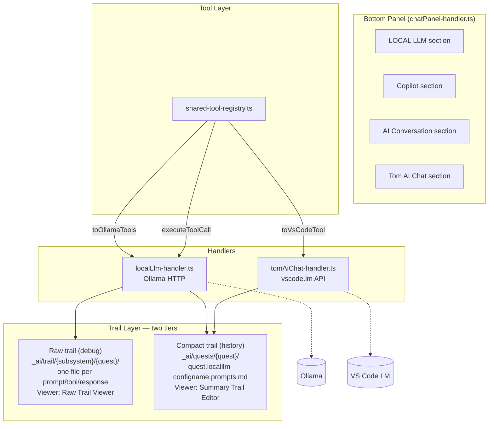
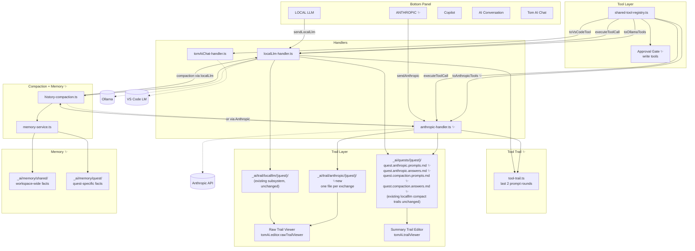
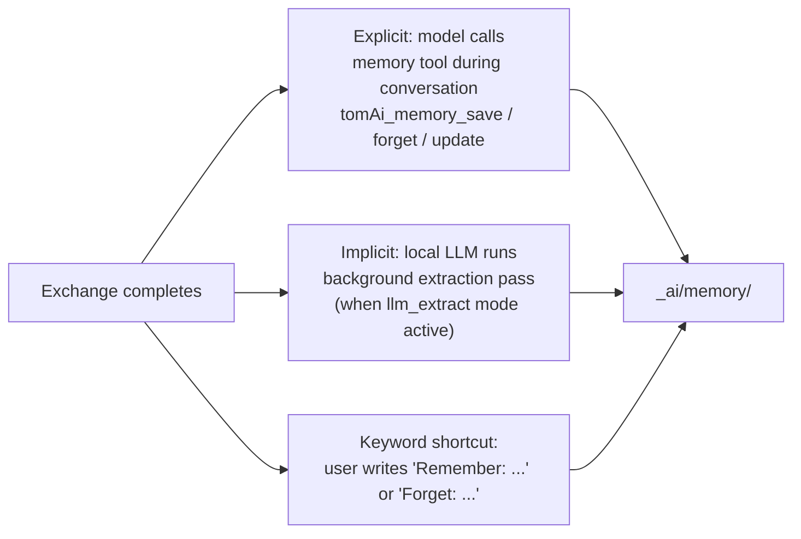
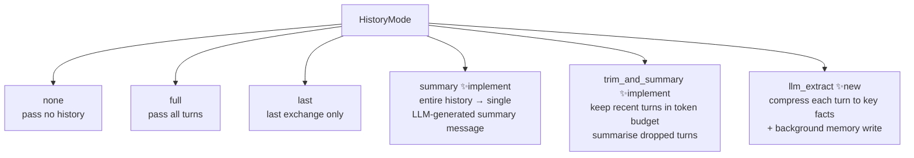
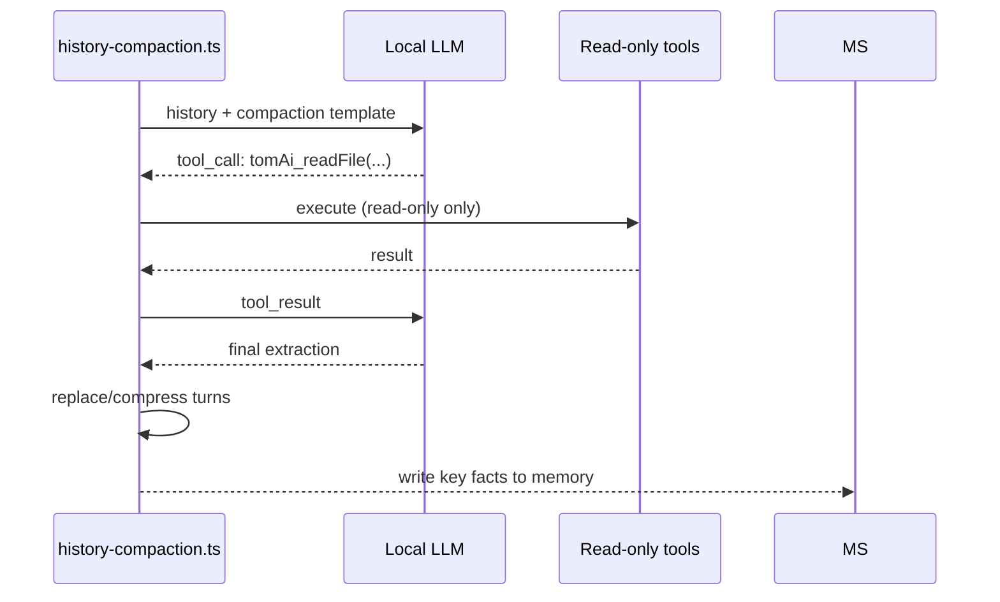
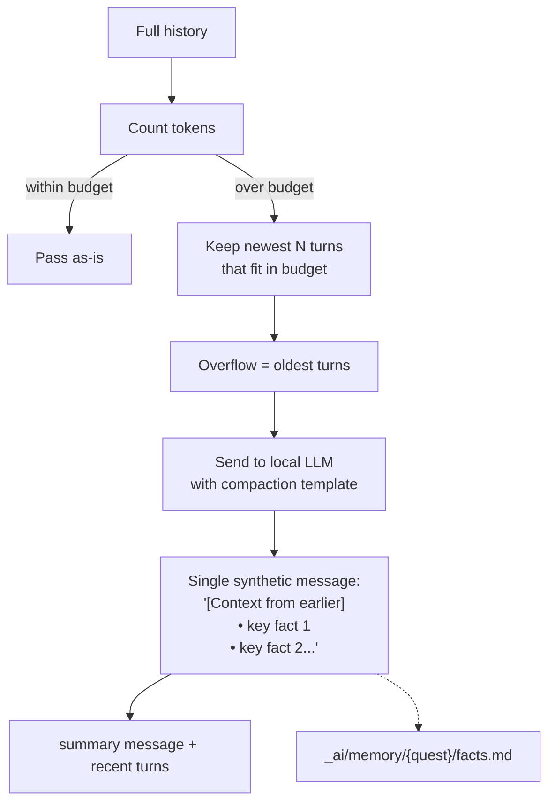
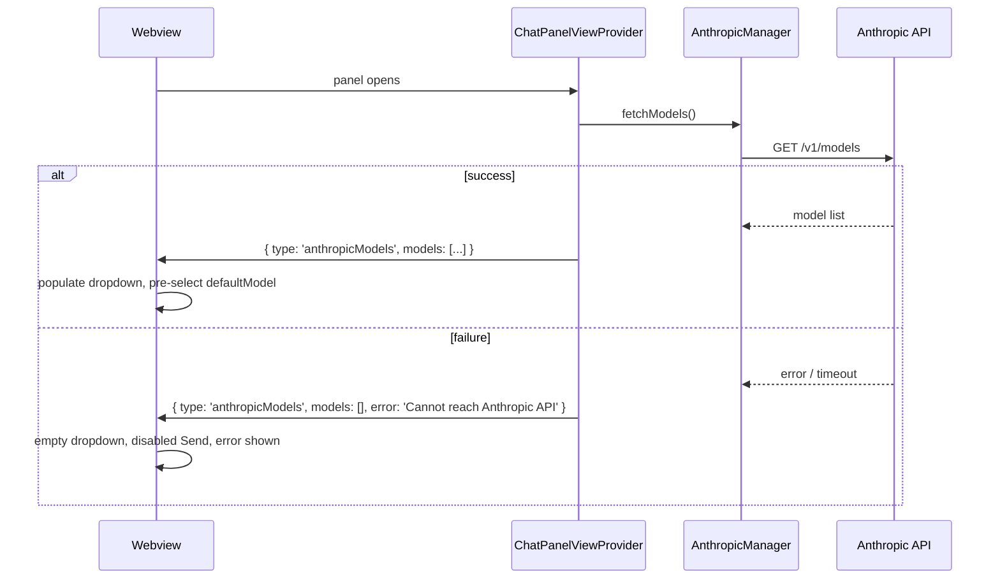
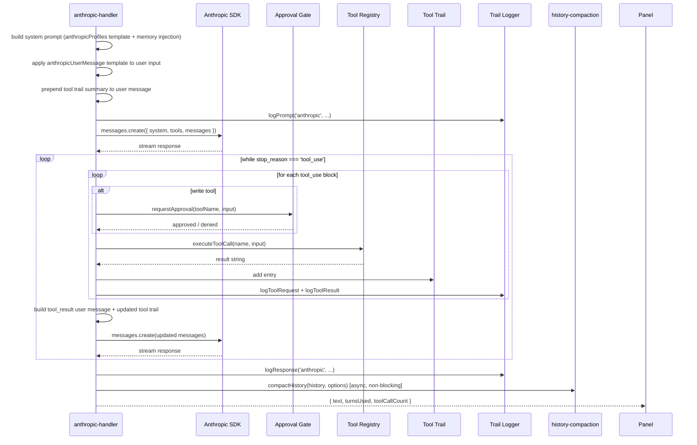
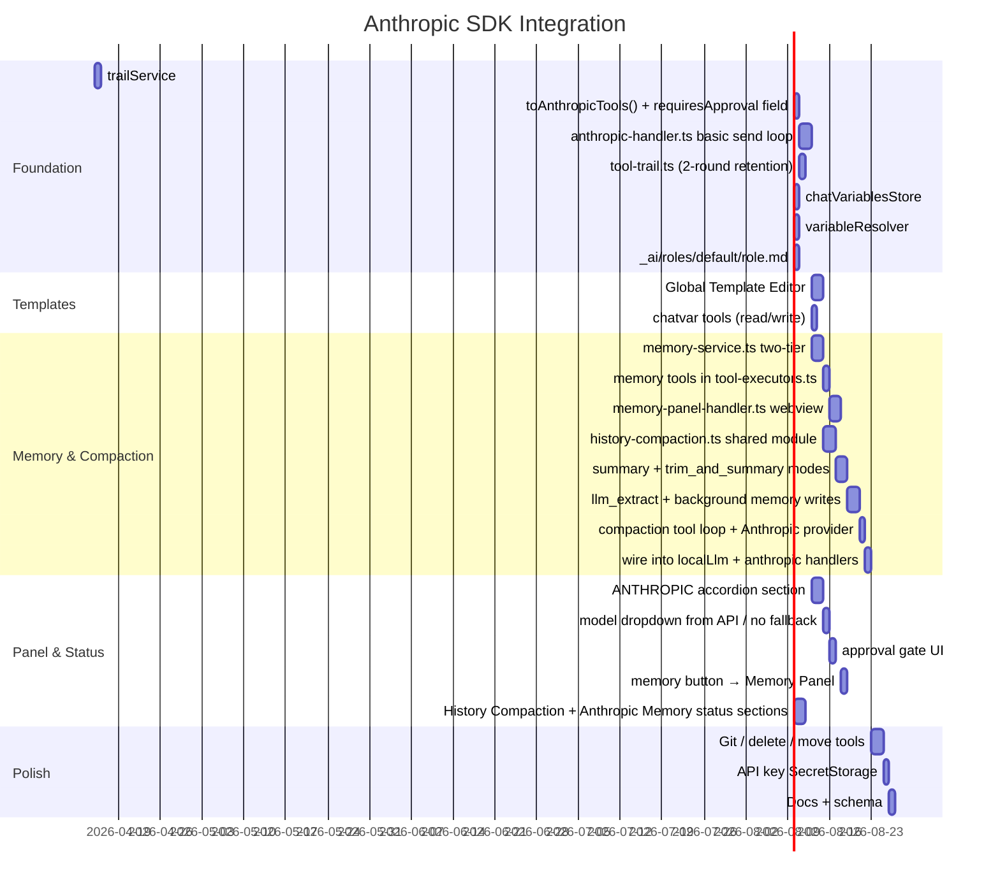

# Anthropic SDK Integration — Specification

**Quest:** vscode_extension  
**Status:** Planning  
**Date:** 2026-04-14  
**Updated:** 2026-04-14 (rev 2)

---

## 1. Overview

The extension currently supports two LLM providers:

- **VS Code LM API** — used by the Tom AI Chat handler (`.chat.md` file flow)
- **Ollama** — used by the Local LLM handler and bottom panel

This specification adds a third provider: **Anthropic SDK** (`@anthropic-ai/sdk`), wired into the same tool registry and trail system as the existing providers, with a new **ANTHROPIC** section in the bottom panel and a model dropdown populated live from the Anthropic API (empty if the API is unreachable — no fallback).

This specification also covers:

- **Trail files** — Anthropic added as a new raw trail subsystem; raw trail enabled by default; cleanup and `.gitignore` fixes
- **Memory system** (`_ai/memory/`) — two-tier: workspace-shared + quest-specific
- **Tool approval** — user confirmation gate for write tools; chat variable writes exempt (panel visibility)
- **Tool trail** — last two prompt rounds of tool calls, always full, prepended to each prompt
- **History compaction** — `summary`/`trim_and_summary`/`llm_extract` modes; Local LLM or Anthropic as compaction provider
- **Four new Global Template Editor categories** — `anthropicProfiles`, `anthropicUserMessage`, `compaction`, `memoryExtraction`
- **Chat variable tools** — `tomAi_chatvar_read` / `tomAi_chatvar_write` (custom.* only); auto-init of `quest` and `role`
- **File-injection placeholders** — `${role-description}`, `${quest-description}`
- **Compaction and memory configuration** — new status page section

---

## 2. Current Architecture



---

## 3. Target Architecture



---

## 4. Trail System

### 4.1 Two-tier trail design

The trail system has always had two distinct tiers that serve different purposes:

| Tier | Location | Format | Viewer | Purpose |
| --- | --- | --- | --- | --- |
| **Raw trail** | `_ai/trail/{subsystem}/{quest}/` | One file per prompt/response/tool call | Raw Trail Viewer (`trailViewer-handler.ts`) | Debugging, full fidelity |
| **Compact trail** | `_ai/quests/{quest}/` | Accumulated `.prompts.md` / `.answers.md` | Summary Trail Editor (`trailEditor-handler.ts`) | History, searchable log |

### 4.2 Raw trail — existing structure and Anthropic addition

The raw trail already uses a subsystem-per-folder structure rooted at `_ai/trail/`. No renaming is needed; `anthropic` is added as a new subsystem alongside the existing ones:

```text
_ai/trail/
    copilot/{quest}/               ← existing
        YYYYMMDD_HHMMSSmmm_prompt_{requestId}.userprompt.md
        YYYYMMDD_HHMMSSmmm_answer_{requestId}.answer.json
        YYYYMMDD_HHMMSSmmm_tool_request_{windowId}.json
        YYYYMMDD_HHMMSSmmm_tool_answer_{windowId}.json

    localllm/{quest}/              ← existing (one subfolder per config name variant)
        YYYYMMDD_HHMMSSmmm_prompt_{requestId}.userprompt.md
        ...

    lm-api/{quest}/                ← existing
        ...

    anthropic/{quest}/             ← ✨ new subsystem, same naming convention
        YYYYMMDD_HHMMSSmmm_prompt_{requestId}.userprompt.md
        YYYYMMDD_HHMMSSmmm_answer_{requestId}.answer.json
        YYYYMMDD_HHMMSSmmm_tool_request_{windowId}.json
        YYYYMMDD_HHMMSSmmm_tool_answer_{windowId}.json
```

Raw trail should be **enabled by default**. The current code checks `raw.enabled === true` which means an absent config value is treated as disabled — this default must be flipped to `raw.enabled !== false` (opt-out, not opt-in). ✨ Code change required in `trailService.ts`.

The path for Anthropic is configured via `tomAi.trail.raw.paths.anthropic` (default: `${ai}/trail/anthropic/${quest}`). Files are **never compacted or summarised** — their purpose is unmodified debugging output.

**Cleanup:** A date-based cleanup already exists in `chatPanel-handler.ts` (`cleanupOldTrailFiles`), triggered once per day per session. It deletes files whose `YYYYMMDD` prefix is older than `cleanupDays` days (configurable in the status page, default: `2`). With the default, today's and yesterday's files are kept; anything older is deleted. This default matches the intended behaviour. The cleanup runs for the Local LLM trail folder; it must be extended to also run for the `anthropic` trail folder. ✨ Code change required.

**`.gitignore` coverage:** The existing root `.gitignore` has `_ai/**/trail/*` which covers only one level below a `trail/` segment. The actual raw file paths `_ai/trail/{subsystem}/{quest}/file` are two levels below `_ai/trail/` and are **not** matched. The gitignore must be updated to `_ai/trail/**` (recursive) to cover all raw trail files. ✨ Code change required.

### 4.3 Compact trail — per quest, naming convention

The compact trail accumulates in the quest folder. The file name encodes the provider and (for Local LLM) the config name:

```text
_ai/quests/vscode_extension/
    vscode_extension.localllm-bomber-qwen3-30b.prompts.md    ← existing, per config
    vscode_extension.localllm-bomber-qwen3-30b.answers.md
    vscode_extension.copilot.prompts.md                       ← existing
    vscode_extension.copilot.answers.md

    vscode_extension.anthropic.prompts.md                     ← new: all Anthropic, per quest only
    vscode_extension.anthropic.answers.md                     ← model/config recorded in entry metadata

    vscode_extension.compaction.prompts.md                    ← new: compaction LLM calls
    vscode_extension.compaction.answers.md
```

Rationale for not naming the Anthropic compact trail by model: model names change frequently and the user wants one place to review all Anthropic interactions for a quest. The model/config in use is stored in the metadata block of each entry.

### 4.4 Trail implementation changes

```typescript
// trailLogging.ts
export type TrailType =
    | 'local'          // Ollama → _ai/trail/localllm/{quest}/ raw + quest compact
    | 'copilot'        // Copilot → _ai/trail/copilot/{quest}/ raw + quest compact
    | 'conversation'
    | 'tomai'
    | 'anthropic'      // ✨ Anthropic → _ai/trail/anthropic/{quest}/ raw + quest compact
    | 'compaction';    // ✨ Compaction LLM → quest compact only (no raw)

// mapTypeToSubsystem additions:
if (type === 'anthropic') {
    return { type: 'anthropic' };    // new subsystem — no model in path/filename
}
if (type === 'compaction') {
    return { type: 'compaction' };   // separate compact trail, no raw trail
}
```

`trailLogging.ts` maps the `'anthropic'` type to a new `'anthropic'` subsystem, routing to `_ai/trail/anthropic/${quest}/` (raw) and `{quest}.anthropic.{prompts|answers}.md` (compact). The Raw Trail Viewer auto-discovers the new subsystem folder; the Summary Trail Editor auto-discovers the new `.md` file pairs.

### 4.5 Trail viewers — two separate UIs

Two purpose-built viewer UIs exist for the trail tiers. Both are extended transparently by the new `anthropic` subsystem.

#### Raw Trail Viewer (`trailViewer-handler.ts`)

**Command:** `tomAi.editor.rawTrailViewer`
**UI type:** Webview panel
**What it shows:** Per-exchange inspection of raw files — subsystem and quest dropdowns, exchanges grouped by `requestId`, side-by-side prompt/answer display, tool request/result files, TODO references extracted from response metadata.
**Discovery:** Scans `_ai/trail/` for all subsystem folders and their quest subfolders. The `anthropic` subsystem appears automatically once the first exchange is logged.

Panel button: **Trail** (icon: `codicon-list-flat`) — present on LOCAL LLM, Copilot, Conversation, and (new) ANTHROPIC sections.

#### Summary Trail Editor (`trailEditor-handler.ts`)

**Provider ID:** `tomAi.trailViewer` (custom text editor)
**Trigger:** Right-click `*.prompts.md` or `*.answers.md` → "Open With" → "Trail Viewer", or the panel's Trail Files button.
**What it shows:** Quest dropdown, chronological entry list parsed from `=== PROMPT/ANSWER ... ===` markers, markdown rendering of selected entry, metadata panel (templateName, comments, references, responseValues).
**Discovery:** Scans `_ai/quests/` for `*.prompts.md` / `*.answers.md` pairs. The new `{quest}.anthropic.prompts.md` and `{quest}.anthropic.answers.md` files appear automatically.

Panel button: **Trail Files** (icon: `codicon-history`) — present on LOCAL LLM, Copilot, and (new) ANTHROPIC sections, opens the compact trail file for the current quest/subsystem.

#### Panel button pattern

Every provider section follows this two-button convention:

| Button label | Icon | Handler action | Opens |
| --- | --- | --- | --- |
| Trail | `codicon-list-flat` | `tomAi.editor.rawTrailViewer` | Raw Trail Viewer |
| Trail Files | `codicon-history` | `vscode.openWith(uri, 'tomAi.trailViewer')` | Summary Trail Editor |

The ANTHROPIC panel follows the same pattern (see §11.3).

---

## 5. Memory System

### 5.1 Quest-based vs workspace-wide memory — arguments

**Arguments for quest-scoped memory (`_ai/memory/{quest}/`):**

- Isolation: facts about `vscode_extension` work (specific files, components, decisions) are irrelevant when working on `tom_forge` or `d4rt`
- Cleaner system prompt injection: only inject memory relevant to the current task
- Aligns with existing patterns: trails, todos, notes are all per quest
- Lifecycle management: memory can be archived or deleted with the quest
- Prevents contradictions: different quests may have conflicting facts about the same files

**Arguments for workspace-wide memory (`_ai/memory/shared/`):**

- Coding preferences apply everywhere: "I prefer functional style", "always use `const`"
- Project conventions span quests: naming conventions, directory patterns, tech stack
- User identity facts: "I am working on a Flutter/Dart VS Code extension, TypeScript for extension code, Dart for client code"
- Avoids duplication: saves writing the same preferences in every quest memory

#### Decision: Two-tier memory

Both are needed. The memory system is organised as two tiers:

```text
_ai/memory/
    shared/                   ← workspace-wide, injected in every session
        preferences.md        ← coding style, language preferences
        conventions.md        ← project-level naming, patterns, architecture
        identity.md           ← who the user is, what the project is
        custom/
            {topic}.md

    {quest}/                  ← quest-specific, injected only when quest is active
        facts.md              ← key facts extracted from conversations
        project-context.md    ← architecture, files, components discussed
        decisions.md          ← decisions made and rationale
        open-issues.md        ← known bugs, blockers, open questions
        history/
            {timestamp}.history.json   ← serialised compacted message arrays
        custom/
            {topic}.md
```

The model and memory tools can write to both tiers. The `tomAi_memory_save` tool accepts a `scope` parameter: `'shared'` or `'quest'` (default: `'quest'`).

### 5.2 System prompt injection

At session start, the handler builds the system prompt by injecting:

1. **Shared memory** — all files in `_ai/memory/shared/`, always
2. **Quest memory** — all files in `_ai/memory/{quest}/` (except `history/`), when a quest is active
3. **Compacted history** — the most recent `{timestamp}.history.json` as the initial messages array

Total injected memory is capped at `memory.maxInjectedTokens` (configurable, default 3000 tokens). If the combined memory exceeds this, shared memory is prioritised, then quest memory files are included newest-first until the budget is used.

### 5.3 Memory vs compacted history vs trail

| | Raw trail | Compact trail | Compacted history | Memory |
| --- | --- | --- | --- | --- |
| Location | `_ai/trail/{subsystem}/{quest}/` | `_ai/quests/{quest}/` | `_ai/memory/{quest}/history/` | `_ai/memory/` |
| Written by | Every exchange, automatically | Every exchange, automatically | Compaction pipeline | Model tools / LLM extraction / user keywords |
| Format | One file per event | Accumulated `.md` log | Serialised message array JSON | Free-form markdown |
| Injected into prompts | No | No | Yes — messages array | Yes — system prompt |
| Compacted/trimmed | No (max entries only) | No (max entries only) | Yes — this IS the compaction output | By model/LLM on update |
| Purpose | Debugging | Searchable history | Multi-session continuity | Long-lived knowledge base |

### 5.4 Memory approach — hybrid

Two mechanisms write to memory simultaneously:



**Explicit (model-driven):** The Anthropic model calls `tomAi_memory_save`, `tomAi_memory_forget`, `tomAi_memory_update` when it decides something is worth persisting. Enabled via `memoryToolsEnabled: true` in the configuration.

**Implicit (background extraction):** When `historyMode` is `llm_extract`, after each exchange the local LLM runs an extraction prompt over the completed turn and appends key facts to `facts.md`. This is non-blocking and does not affect the response latency.

**Keyword triggers:** The handler scans the outgoing user message for `Remember: ...` and `Forget: ...` prefixes and writes/removes the fact directly without involving any model. Configurable on/off.

---

## 6. History Compaction

### 6.1 Modes



`summary` and `trim_and_summary` were declared in the existing `LocalLlmHistoryMode` type but implemented as a fallback to `full`. This spec fills them in. `llm_extract` is new.

### 6.2 Compaction with tool access

The local LLM running compaction can use a restricted read-only tool set. This allows it to verify claims in the conversation ("was this function actually added?") before writing the summary:



The compaction tool set is configured separately (§10) and defaults to read-only file/search tools only.

### 6.3 `trim_and_summary` detail



### 6.4 `llm_extract` detail

After every exchange, each completed turn is replaced with a compressed representation. The raw turn is preserved in the trail (not compacted there).

```text
Turn 13 raw (≈500 tokens):
  user: "Please refactor VariableResolver to support async dynamic keys"
  assistant: "I've updated variableResolver.ts lines 640-688, changed
              resolveDynamicKey() to async, updated all callers, updated
              variableResolver.test.ts with 4 new test cases..."

Turn 13 after llm_extract (≈40 tokens):
  user: "[T13] Refactor VariableResolver: async dynamic keys"
  assistant: "• variableResolver.ts:640-688: resolveDynamicKey() now async
              • 3 callers updated to await
              • variableResolver.test.ts: 4 tests added
              • Breaking: callers must await"
```

### 6.5 `history-compaction.ts` interface

```typescript
export type HistoryMode =
    | 'none' | 'full' | 'last'
    | 'summary'          // whole history → one LLM summary message
    | 'trim_and_summary' // keep recent, summarise overflow
    | 'llm_extract';     // compress each turn individually

export type CompactionLlmProvider = 'localLlm' | 'anthropic';

export interface CompactionOptions {
    mode: HistoryMode;
    maxHistoryTokens?: number;         // for trim_and_summary
    llmProvider: CompactionLlmProvider; // which provider runs compaction
    llmConfigId: string;               // config ID within that provider
    compactionTemplateId?: string;     // Global Template Editor template ID
    memoryTemplateId?: string;         // memory extraction template ID
    compactionTools?: string[];        // tool names for compaction loop (localLlm only)
    compactionMaxRounds?: number;      // default: 1
    memoryPath?: string;               // _ai/memory/ root
    questId?: string;                  // for quest-scoped memory writes
    trailEnabled?: boolean;
    onProgress?: (msg: string) => void;
}

export async function compactHistory(
    history: ConversationMessage[],
    options: CompactionOptions,
): Promise<ConversationMessage[]>
```

---

## 7. Template System

### 7.1 The two template editors — distinction

There are two separate template editing systems with different storage and purpose:

| | Global Template Editor (`globalTemplateEditor-handler.ts`) | Reusable Prompt Editor (`reusablePromptEditor-handler.ts`) |
| --- | --- | --- |
| Storage | `tom_vscode_extension.json` (config file) | Disk files (`.prompt.md`) in scope-based folders |
| Format | JSON objects with typed fields per category | Plain markdown files |
| Scopes | Single (workspace config) | Global / Project / Quest / Scan ancestor |
| Categories | 7 types: copilot, reminder, tomAiChat, localLlm profiles, AI Conversation profiles, timed requests, self-talk | Single type: reusable prompt fragments |
| Use | Invoked by panel/queue machinery as structured config | Pasted into prompts manually or via editor UI |
| Examples | "Code Review" copilot template, LLM profiles | Multi-line boilerplate prompt starters |

**All new machine-invoked templates belong in the Global Template Editor** — they have typed fields and are selected by configuration, not pasted manually. Four new categories are added.

### 7.2 New Global Template Editor categories — four additions

Four new categories are added to `globalTemplateEditor-handler.ts`:

| Category | Used by | Selected in |
| --- | --- | --- |
| `anthropicProfiles` | Anthropic handler — system prompt per profile | ANTHROPIC panel — Profile dropdown |
| `anthropicUserMessage` | Anthropic handler — per-message user turn wrapper | ANTHROPIC panel — Message template dropdown |
| `compaction` | `history-compaction.ts` — LLM compaction pass | Status Page → History Compaction section |
| `memoryExtraction` | `history-compaction.ts` — background memory write pass | Status Page → History Compaction section |

Wherever a template is selectable, the UI provides **Edit / Create / View / Delete** actions for that category — a mini template manager embedded in the selection control, identical to the pattern already used for Local LLM profiles.

#### Category: `anthropicProfiles`

Used by `anthropic-handler.ts`. Selectable in the ANTHROPIC section of the bottom panel (profile dropdown). Defines system prompts and per-profile behaviour overrides for the Anthropic handler — analogous to the existing `localLlm profiles` category.

**Storage pattern (follows Local LLM precedent):** Profile entries are stored in `anthropic.profiles[]` in the workspace config JSON. The Global Template Editor is the editing UI for those entries — there is no separate template file on disk. The `anthropicProfiles` category in the Global Template Editor maps directly to `anthropic.profiles[]`.

Fields per template entry:

```typescript
interface AnthropicProfileTemplate {
    id: string;
    name: string;
    description: string;
    systemPrompt: string;          // injected as system message
    configurationId?: string;      // which AnthropicConfiguration to use
    toolsEnabled?: boolean;
    maxRounds?: number;
    historyMode?: HistoryMode | null;
    isDefault?: boolean;
}
```

#### Category: `compaction`

Used by `history-compaction.ts`. Selectable in the Extension Status Page → History Compaction section.

Fields per template entry:

```typescript
interface CompactionTemplate {
    id: string;
    name: string;
    description: string;
    template: string;      // prompt text — see §7.3 for available placeholders
    targetMode: HistoryMode | 'all';   // which compaction modes use this template
}
```

Default entry:

```json
{
  "id": "default-summary",
  "name": "Default — key facts extraction",
  "description": "Extracts key facts as a bullet list",
  "template": "Extract the key facts from the conversation below.\nFocus on: decisions made, files changed, current state, open issues.\nOutput only a compact bullet list. No preamble.\n\n${compactionHistory}",
  "targetMode": "all"
}
```

#### Category: `memoryExtraction`

Used when the compaction LLM runs background memory building after an exchange. Selectable in the Extension Status Page → History Compaction section.

Fields per template entry:

```typescript
interface MemoryExtractionTemplate {
    id: string;
    name: string;
    description: string;
    template: string;      // see §7.3 for placeholders
    targetFile: string;    // which memory file to write to (e.g. 'facts.md')
    scope: 'quest' | 'shared' | 'both';
}
```

Default entry:

```json
{
  "id": "default-memory",
  "name": "Default — background fact extraction",
  "description": "Extracts facts for quest memory after each exchange",
  "template": "From this conversation exchange, extract new facts worth remembering.\nDo NOT repeat facts already in the existing memory.\nOutput only new facts as a markdown bullet list. If nothing new, output nothing.\n\n### Existing memory:\n${existingMemory}\n\n### Exchange:\n${recentHistory}",
  "targetFile": "facts.md",
  "scope": "quest"
}
```

### 7.3 System prompt vs user prompt — and a fourth template category

#### The distinction

When the Anthropic handler calls `messages.create()`, it sends two conceptually separate pieces of text:

**System prompt** (`system` parameter):

- Sent once per API call, outside the message history
- Defines the AI's persona, role, constraints, tools, and persistent context
- Does not appear in the conversation turns — the model treats it as a standing instruction
- Content: role definition, quest context, memory injection, capability description
- Changes infrequently within a session (only if memory or role updates)
- Supports `cache_control` for prompt caching — ideal for large static blocks like role and quest descriptions

**User prompt** (a `{ role: 'user', content: '...' }` message in the `messages` array):

- The actual message the user typed, sent as part of the conversation turn
- Appears in conversation history and is referenced by later assistant responses
- Can be prefixed with dynamic context (tool trail, per-message instructions)
- Changes every turn

In the current spec, `anthropicProfiles` templates define the **system prompt**. There is no template for the **user prompt** — the user's raw text is sent as-is (with placeholder expansion and the tool trail prefix prepended).

#### Fourth template category: `anthropicUserMessage`

A fourth category handles per-message wrapping of the user's input before it is sent. This is useful for:

- Injecting `${quest-description}` or `${role-description}` **per turn** (if you don't want them in the system prompt)
- Adding task-specific framing: "You are doing a code review. The user's request follows."
- Prefixing with relevant context that changes turn-by-turn (e.g. current file, current selection)

| Category | Sent as | When resolved | Selected in |
| --- | --- | --- | --- |
| `anthropicProfiles` | `system` parameter | Session start (cached if possible) | ANTHROPIC panel — Profile dropdown |
| `anthropicUserMessage` | User turn content | Each outgoing message | ANTHROPIC panel — Message template dropdown |
| `compaction` | Compaction LLM user turn | Each compaction pass | Status Page → History Compaction |
| `memoryExtraction` | Compaction LLM user turn | Each extraction pass | Status Page → History Compaction |

The system prompt is the right place for **stable context** (who you are, what the project is). The user message template is the right place for **per-turn framing** (what you're being asked to do right now, with current file/selection context).

A minimal `anthropicUserMessage` template simply passes through the user's input unchanged:

```text
${userMessage}
```

A richer one adds file context:

```text
${{ editor ? "Current file: " + path.basename(editor.document.fileName) + "\n\n" : "" }}${userMessage}
```

Fields per template entry:

```typescript
interface AnthropicUserMessageTemplate {
    id: string;
    name: string;
    description: string;
    template: string;   // must contain ${userMessage}; all standard placeholders available
    isDefault?: boolean;
}
```

The `${userMessage}` placeholder is the raw text the user typed. It is a **universal placeholder** — registered in `buildVariableMap()` like all other built-in placeholders, but resolves to `""` when not in a user message template expansion context (i.e. in system prompts, compaction templates, or memory extraction templates it simply produces an empty string). The tool trail prefix is appended after template expansion, so it always appears regardless of the template.

### 7.4 Placeholder additions for compaction and memory templates

The existing placeholder system (`variableResolver.ts`) is rich but lacks compaction-specific context values. These are added as caller-provided `options.values` overrides at compaction time, following the same pattern as `${originalPrompt}` in copilot templates:

**Compaction template placeholders** (in addition to all existing universal placeholders):

| Placeholder | Content | Available in |
| --- | --- | --- |
| `${compactionHistory}` | The raw history text being compacted | All compaction modes |
| `${turnCount}` | Number of turns in the history | All compaction modes |
| `${tokenEstimate}` | Approximate token count of history | All compaction modes |
| `${compactionMode}` | Which mode is running (summary/trim/extract) | All compaction modes |
| `${turnsDropped}` | Number of turns being dropped (trim_and_summary) | trim_and_summary only |
| `${keptTurnCount}` | Number of turns retained (trim_and_summary) | trim_and_summary only |
| `${turnIndex}` | Index of current turn being extracted | llm_extract only |

**Memory extraction template placeholders**:

| Placeholder | Content |
| --- | --- |
| `${recentHistory}` | The completed exchange (user + assistant turn) |
| `${existingMemory}` | Current content of the target memory file |
| `${memoryFilePath}` | Absolute path of the target memory file |
| `${memoryScope}` | `'quest'` or `'shared'` |

All standard placeholders (`${quest}`, `${git.branch}`, `${date}`, `${workspaceFolder}`, etc.) remain available in compaction and memory templates.

### 7.5 New universal placeholders — file-injection

Two new placeholders are added to `variableResolver.ts` (`buildVariableMap`) that inject the **content** of files rather than a path or simple string. They resolve against the current `role` and `quest` chat variable values.

| Placeholder | Resolves to | File read |
| --- | --- | --- |
| `${role-description}` | Full content of the active role definition | `_ai/roles/${role}/role.md` |
| `${quest-description}` | Full content of the active quest overview | `_ai/quests/${quest}/overview.${quest}.md` |

Resolution rules:

- If `role` is empty or the file does not exist, `${role-description}` resolves to `""`.
- If `quest` is empty or the overview file does not exist, `${quest-description}` resolves to `""`.
- Files are read synchronously at variable-map build time (same as all other built-in placeholders).
- These placeholders are available in **all** prompt template contexts — system prompts, compaction templates, memory extraction templates, copilot answer templates, etc.

Typical usage in a system prompt template:

```text
${{ vars["role-description"] ? "## Your role\n" + vars["role-description"] + "\n" : "" }}
${{ vars["quest-description"] ? "## Current quest\n" + vars["quest-description"] + "\n" : "" }}
```

Or as static placeholders when the surrounding text handles the empty case:

```text
${role-description}
${quest-description}
```

Implementation note: the `rolesPath` and `questsPath` placeholders already exist in `variableResolver.ts`. The new placeholders build on those paths and add a file-read step.

---

## 8. Tool System Extensions

### 8.1 Write tool approval gate

All write tools (`readOnly: false`) require explicit user confirmation before execution. A `requiresApproval` flag is added to `SharedToolDefinition` (defaults to `true` for write tools):

```typescript
export interface SharedToolDefinition<TInput = Record<string, unknown>> {
    // ...existing fields...
    readOnly: boolean;
    requiresApproval?: boolean;   // true by default for !readOnly
}
```

When a write tool is requested, the panel receives an `anthropicToolApproval` message and shows an inline approval bar:

```text
⚠️  Claude wants to run: tomAi_editFile
    src/handlers/variableResolver.ts — replace 3 lines

    [Allow]  [Allow All this session]  [Deny]  [Deny All this session]
```

"Allow All" and "Deny All" set a per-session bypass. Both reset at session end. The `toolApprovalMode` config field controls the default: `'always'` (prompt every time), `'session'` (prompt once per tool per session), `'never'` (auto-allow all — not recommended).

Individual tools can opt out of the approval gate by setting `requiresApproval: false` explicitly. This is appropriate for write tools that have their own visibility mechanism — for example, `tomAi_chatvar_write` updates the Chat Variables panel in real time, so the user can observe every change without an approval dialog (see §8.5).

### 8.2 Memory tools

New tools in `tool-executors.ts`, active when `memoryToolsEnabled: true`:

| Tool | Scope param | readOnly | Purpose |
| --- | --- | --- | --- |
| `tomAi_memory_save` | `'quest'` / `'shared'` | No | Append fact to named memory file |
| `tomAi_memory_update` | `'quest'` / `'shared'` | No | Replace section in memory file |
| `tomAi_memory_forget` | `'quest'` / `'shared'` | No | Delete fact or section |
| `tomAi_memory_read` | `'quest'` / `'shared'` / `'all'` | Yes | Read memory file contents |
| `tomAi_memory_list` | `'quest'` / `'shared'` / `'all'` | Yes | List memory files |

All memory write tools are subject to the approval gate (§8.1).

### 8.3 Missing tools for a complete coding companion

| Gap | Proposed tool | Priority | Notes |
| --- | --- | --- | --- |
| Structured git operations | `tomAi_git` (status/diff/log/blame) | High | `runCommand` is a workaround but unstructured |
| File delete | `tomAi_deleteFile` | Medium | |
| File move / rename | `tomAi_moveFile` | Medium | |
| VS Code diagnostics for one file | `tomAi_getFileErrors` | High | `getErrors` is workspace-wide |
| Current editor selection/context | `tomAi_getEditorContext` | Medium | Useful without file read |
| Show diff view | `tomAi_showDiff` | Low | |
| Run tests | `tomAi_runTests` | Medium | Structured test results |

### 8.4 Compaction tool set (separate from main tool set)

The compaction LLM has its own restricted tool set, configured in the `compaction` config section. This applies when `llmProvider` is `localLlm`; when Anthropic is the compaction provider, the Anthropic configuration's `enabledTools` is used instead. Default is read-only file access:

```json
"compaction.enabledTools": [
  "tomAi_readFile", "tomAi_listDirectory",
  "tomAi_findFiles", "tomAi_findTextInFiles", "tomAi_getErrors"
]
```

No write tools, no shell execution, no web access in the default compaction tool set.

### 8.5 Chat variable tools

Chat variables provide persistent, per-window key-value state that flows into every prompt template via `${quest}`, `${role}`, `${custom.KEY}`, etc. They are stored in `_ai/chat_variables/{workspace}.{window}.chatvariable.yaml` and managed by the **Chat Variables Editor** (`chatVariablesEditor-handler.ts`, command `tomAi.editor.chatVariables`).

The editor shows built-in fields, a custom key-value table, and a change log that records the source and request ID of every write. LLMs can read the current state and update values to steer later prompts — for example, setting `custom.progressSummary` after each coding turn, or reading `quest` to orient themselves at session start.

#### Variable schema

| Field | Type | Placeholder | Description |
| --- | --- | --- | --- |
| `quest` | string | `${quest}` | Active quest identifier |
| `role` | string | `${role}` | AI role/persona name |
| `activeProjects` | string[] | `${activeProjects}` | Joined by `", "` in templates |
| `todo` | string | `${todo}` | Current todo text or ID |
| `todoFile` | string | `${todoFile}` | Active todo file name or `"all"` |
| `custom.*` | string | `${custom.KEY}` | Arbitrary user/LLM-defined values |

Custom values can be accessed with or without the `custom.` prefix: `${custom.myKey}` and `${myKey}` resolve to the same value.

#### Auto-initialisation of `quest` and `role`

When a chat variable file is first created (new window or new workspace), two defaults are applied automatically by `ChatVariablesStore`:

- **`quest`** is set to the workspace name derived from the open `.code-workspace` file (the same logic as `detectQuestFromWorkspace()` already in `chatPanel-handler.ts`). If no `.code-workspace` is open, `quest` remains empty.
- **`role`** is set to `"default"`, pointing to `_ai/roles/default/role.md`. A `default` role file should be created as the baseline role definition.

The user can change either value at any time in the Chat Variables Editor. The auto-initialisation only applies when the value is currently empty (it does not overwrite a user-set value). ✨ Code change required in `chatVariablesStore.ts`.

#### New tools

| Tool | `readOnly` | Approval | Purpose |
| --- | --- | --- | --- |
| `tomAi_chatvar_read` | Yes | No | Read one or all chat variables |
| `tomAi_chatvar_write` | No | **No** | Set one or more chat variable values |

`tomAi_chatvar_write` sets `requiresApproval: false` despite being a write tool. The Chat Variables panel shows every change in real time — including the old value, new value, source, and request ID in the change log. This live visibility is the oversight mechanism: the user can monitor what the LLM is doing and correct any unintended writes immediately using the editor, without blocking each write with an approval dialog. This is intentional by design.

**`tomAi_chatvar_read`** input/output:

```typescript
// Input
{ key?: string }  // omit to return all variables

// Output
{
  quest: string;
  role: string;
  activeProjects: string[];
  todo: string;
  todoFile: string;
  custom: Record<string, string>;
}
// When key is provided, returns only that variable's current value.
```

**`tomAi_chatvar_write`** input:

```typescript
{
  variables: Record<string, string>;
  // Keys must be plain strings (no "custom." prefix needed).
  // The tool maps them to custom.{key} automatically.
  // Built-in variables (quest, role, activeProjects, todo, todoFile)
  // are rejected — those are user-only fields.
}
```

The tool enforces a server-side allowlist: any key that matches a built-in variable name is rejected with an error. All accepted keys are written under the `custom.*` namespace. This means the LLM cannot change panel state (quest dropdown, role, todo picker) — those remain under user control via the Chat Variables Editor.

Each write is logged to the change log with `source: 'anthropic'` (or `'localLlm'` when called from compaction) and the current request ID. The `ChangeSource` type in `chatVariablesStore.ts` is extended to include `'anthropic'`.

> **Design note:** Built-in variables (`quest`, `role`, `activeProjects`, `todo`, `todoFile`) affect panel behaviour and are set by the user. Custom variables (`custom.*`) are the LLM's scratchpad — free to read and write, visible in the panel change log, and never affect UI state.

---

## 9. Tool Trail (Debug Log)

A lightweight in-memory log of tool calls from the **last two user prompts**, prepended to every outgoing message so the LLM has immediate context on what it just did. Separate from the persistent trail files.

**Retention policy:** tool call entries are grouped by prompt round. After each exchange completes, entries older than the last two prompt rounds are discarded. The tool trail is **never compacted** — it is always injected in full. There is no token limit or LLM compaction step; keeping two rounds is what controls the size naturally.

**Result truncation:** each tool result is truncated to `toolTrailMaxResultChars` characters before storage. This prevents a single large tool output (e.g. reading a big file) from bloating the injected block. The truncation is a simple string cut — configurable in the status page, default 500.

```typescript
interface ToolTrailEntry {
    timestamp: string;          // HH:MM:SS
    round: number;              // prompt round number (increments per user message)
    toolName: string;
    inputSummary: string;       // key input fields, truncated to toolTrailMaxResultChars
    result: string;             // tool output, truncated to toolTrailMaxResultChars
    durationMs: number;
    error?: string;
}

class ToolTrail {
    private entries: ToolTrailEntry[] = [];
    readonly maxResultChars: number;   // from config: toolTrailMaxResultChars, default 500
    readonly keepRounds: number;       // from config: toolTrailKeepRounds, default 2

    add(entry: ToolTrailEntry): void
    evictOldRounds(): void             // called after each exchange; keeps last keepRounds
    toSummaryString(): string          // injected before each outgoing message
    clear(): void
}
```

Injected before each outgoing prompt as a system note:

```text
[Tool history — last 2 prompts]
12:34:01 R1 readFile(src/handlers/foo.ts:1-50)      1240 chars
12:34:02 R1 findTextInFiles("class FooBar")          3 matches
12:34:05 R2 editFile(src/handlers/foo.ts)            OK
12:34:06 R2 readFile(src/handlers/foo.ts:45-60)      320 chars
12:34:08 R2 getErrors()                              0 errors
```

When there are no tool calls in the last two rounds (e.g. pure Q&A turn), the block is omitted entirely.

---

## 10. Compaction Configuration — Status Page Section

A new "History Compaction" section is added to `statusPage-handler.ts`, following the pattern of the existing "LLM Configurations" section.

```text
History Compaction
├── Compaction LLM provider    <select>   ← 'Local LLM' | 'Anthropic'
├── Compaction LLM config      <select>   ← configurations[] of selected provider
├── Compaction template        <select> [Edit] [+] [🗑]  ← 'compaction' category templates
├── Memory extraction template <select> [Edit] [+] [🗑]  ← 'memoryExtraction' category templates
├── Compaction tool set        [Edit ▼]   ← tool checklist (Local LLM only; hidden for Anthropic)
├── Compaction max rounds      <input>    ← default: 1
├── Max history tokens         <input>    ← token budget for trim_and_summary
├── Tool trail max result chars<input>    ← truncation per tool output (default: 500)
├── Trail cleanup days         <input>    ← days to keep raw trail files (default: 2, already in status page)
└── Background extraction      <toggle>   ← implicit llm_extract memory writes
```

The template `<select>` controls include inline **Edit / Create / Delete** buttons — clicking Edit or Create opens the Global Template Editor focused on the relevant category.

Additionally, the Anthropic status page section includes:

```text
Anthropic — Memory
├── Memory tools enabled       <toggle>   ← expose memory read/write tools to model
├── Memory extraction template <select> [Edit] [+] [🗑]  ← same 'memoryExtraction' list
├── Auto-extract mode          <select>   ← which history modes trigger background extraction
└── Max injected memory tokens <input>    ← default: 3000
```

---

## 11. Bottom Panel — ANTHROPIC Section

### 11.1 Model dropdown — no fallback

The model dropdown is populated **only** from `anthropic.models.list()`. If the call fails for any reason (no API key, network error, service down), the dropdown is empty and the Send button is disabled with a status message. **There is no hardcoded fallback list.**



### 11.2 Memory button

The **Memory button** (`🧠 Memory`) in the panel toolbar opens a **dedicated Memory Panel** — a webview showing the current memory state with inline editing:

```text
Memory Panel (webview)
├── Scope tabs: [Shared memory] [Quest: vscode_extension]
├── File list (left): facts.md | project-context.md | decisions.md | open-issues.md | custom/...
├── Content view (right): rendered markdown, editable
└── Toolbar: [+ New file] [Save] [Delete file] [Open in editor]
```

This is NOT a simple folder reveal — it is a purpose-built viewer because:

- Memory files need to show shared and quest tiers together
- The user should be able to add/edit/delete facts without leaving the chat flow
- The model may have just written something and the user wants to review/correct it immediately

A secondary entry point: the [Open in editor] button in the memory panel opens the file in the standard VS Code editor for full editing capability.

### 11.3 UI structure

```text
ANTHROPIC section (accordion)
├── Toolbar row 1
│   ├── <select id="anthropic-model">       ← from API, empty if unavailable
│   ├── <select id="anthropic-profile">     ← from config
│   ├── <select id="anthropic-config">      ← from config
│   ├── [+] [✏️] [🗑️] profile buttons
│   └── 🔑 API key status dot (green/red)
├── Toolbar row 2
│   ├── [Preview]
│   ├── [Send to Anthropic]   (primary, disabled if no model selected)
│   ├── [Trail]               ← opens Raw Trail Viewer for anthropic subsystem (codicon-list-flat)
│   ├── [Trail Files]         ← opens Summary Trail Editor for {quest}.anthropic.*.md (codicon-history)
│   ├── [🧠 Memory]           ← opens Memory Panel webview
│   └── [✕ Clear]
├── <textarea id="anthropic-text">
└── Status line: model · history mode · last N tool calls · session turns
```

### 11.4 Message protocol

```text
Webview → extension:
  { type: 'sendAnthropic', text, model, profile, config }
  { type: 'refreshAnthropicModels' }
  { type: 'clearAnthropicHistory' }
  { type: 'openAnthropicMemory' }
  { type: 'anthropicToolApprovalResponse', toolId, approved, approveAll }

Extension → webview:
  { type: 'anthropicModels', models: AnthropicModel[], error?: string }
  { type: 'anthropicProfiles', profiles, configurations }
  { type: 'anthropicToken', token }
  { type: 'anthropicToolApproval', toolId, toolName, inputSummary }
  { type: 'anthropicResult', text, turnsUsed, toolCallCount }
  { type: 'anthropicError', message }
```

---

## 12. Anthropic Handler

### 12.1 Tool-call loop



### 12.2 Configuration interfaces

```typescript
interface AnthropicConfiguration {
    id: string;
    name: string;
    model: string;
    maxTokens: number;                   // default: 8192
    temperature?: number;                // 0–1
    enabledTools: string[];
    memoryToolsEnabled: boolean;
    historyMode: HistoryMode;
    maxHistoryTokens: number;
    maxRounds: number;
    toolApprovalMode: 'always' | 'session' | 'never';
    memoryExtractionTemplateId?: string; // which memoryExtraction template to use
    promptCachingEnabled?: boolean;      // default: false; adds cache_control to system blocks
    isDefault?: boolean;
}

// AnthropicProfile uses the same shape as AnthropicProfileTemplate (§7.2).
// Profiles are stored in anthropic.profiles[] in the workspace config JSON;
// the Global Template Editor 'anthropicProfiles' category is the editing UI for them.
// (Follows Local LLM precedent — no separate template file on disk.)
type AnthropicProfile = AnthropicProfileTemplate;
```

---

## 13. File Change Summary

| File | Change |
| --- | --- |
| `tools/shared-tool-registry.ts` | Add `toAnthropicTools()`, add `requiresApproval` field |
| `tools/tool-executors.ts` | Add memory tools, chatvar tools, git tool, file delete/move |
| `managers/chatVariablesStore.ts` | Add `'anthropic'` to `ChangeSource` type; auto-init `quest` from workspace name and `role` to `"default"` when empty |
| `utils/variableResolver.ts` | Add `${role-description}`, `${quest-description}` (file-injection), and `${userMessage}` (universal, empty by default) to `buildVariableMap()` |
| `.gitignore` | Fix `_ai/**/trail/*` → `_ai/trail/**` to cover `{subsystem}/{quest}/` depth |
| `_ai/roles/default/role.md` | **New** — default role definition file |
| `handlers/anthropic-handler.ts` | **New** — full Anthropic handler |
| `handlers/globalTemplateEditor-handler.ts` | Add `anthropicProfiles`, `anthropicUserMessage`, `compaction`, `memoryExtraction` template categories |
| `services/history-compaction.ts` | **New** — shared compaction module (all modes + tool loop) |
| `services/memory-service.ts` | **New** — two-tier memory read/write |
| `services/memory-panel-handler.ts` | **New** — Memory Panel webview |
| `services/tool-trail.ts` | **New** — session ring buffer |
| `handlers/chatPanel-handler.ts` | Add ANTHROPIC accordion section |
| `handlers/statusPage-handler.ts` | Add "History Compaction" + "Anthropic — Memory" sections |
| `services/trailLogging.ts` | Add `'anthropic'` and `'compaction'` trail types; add `tomAi.trail.raw.paths.anthropic` config key |
| `services/trailService.ts` | Map `anthropic` subsystem to `_ai/trail/anthropic/${quest}/` (raw) and `{quest}.anthropic.*.md` (compact); flip raw trail default to opt-out; extend cleanup to `anthropic` folder |
| `handlers/localLlm-handler.ts` | Wire `summary`/`trim_and_summary`/`llm_extract` to shared module |
| `types/webviewMessages.ts` | Add anthropic + approval + memory message types |
| `extension.ts` | Register anthropic manager, memory service |
| `tom_vscode_extension.json` _(schema)_ | Add `anthropic`, `compaction`, `memory` sections; add `trail.raw.paths.anthropic` |
| `_ai/trail/anthropic/` | **New** subsystem folder (created on first use, same structure as existing subsystems) |
| `_ai/memory/` | **New** folder tree (created on first use) |

---

## 14. Configuration Schema

### `anthropic` section

`apiKeyEnvVar` names the environment variable that holds the actual API key. The handler reads `process.env[config.apiKeyEnvVar]` at runtime — no key material is ever stored in the config file. To use a different env var name (e.g. `TOM_ANTHROPIC_KEY`), change this field.

```json
"anthropic": {
  "apiKeyEnvVar": "ANTHROPIC_API_KEY",
  "configurations": [
    {
      "id": "default",
      "name": "Sonnet — balanced",
      "model": "claude-sonnet-4-6",
      "maxTokens": 8192,
      "temperature": 0.5,
      "enabledTools": [
        "tomAi_readFile", "tomAi_listDirectory", "tomAi_findFiles",
        "tomAi_findTextInFiles", "tomAi_fetchWebpage", "tomAi_getErrors",
        "tomAi_chatvar_read",
        "tomAi_memory_read", "tomAi_memory_list"
      ],
      "memoryToolsEnabled": false,
      "historyMode": "last",
      "maxHistoryTokens": 16000,
      "maxRounds": 20,
      "toolApprovalMode": "always",
      "promptCachingEnabled": false,
      "transport": "direct",
      "isDefault": true
    },
    {
      "id": "opus-deep",
      "name": "Opus — deep work",
      "model": "claude-opus-4-6",
      "maxTokens": 16000,
      "temperature": 0.3,
      "enabledTools": [
        "tomAi_readFile", "tomAi_listDirectory", "tomAi_findFiles",
        "tomAi_findTextInFiles", "tomAi_runCommand", "tomAi_editFile",
        "tomAi_multiEditFile", "tomAi_createFile", "tomAi_getErrors",
        "tomAi_fetchWebpage", "tomAi_git",
        "tomAi_chatvar_read", "tomAi_chatvar_write",
        "tomAi_memory_read", "tomAi_memory_list",
        "tomAi_memory_save", "tomAi_memory_update", "tomAi_memory_forget"
      ],
      "memoryToolsEnabled": true,
      "historyMode": "trim_and_summary",
      "maxHistoryTokens": 32000,
      "maxRounds": 40,
      "toolApprovalMode": "session",
      "memoryExtractionTemplateId": "default-memory",
      "promptCachingEnabled": true,
      "transport": "agentSdk",
      "agentSdk": {
        "permissionMode": "default",
        "settingSources": [],
        "maxTurns": 40
      },
      "isDefault": false
    }
  ],
  "profiles": [
    {
      "label": "Research",
      "systemPrompt": null,
      "configurationId": "default",
      "isDefault": true
    },
    {
      "label": "Code Edit",
      "systemPrompt": "You are an expert software engineer. Make precise, minimal changes. Always read a file before editing it.",
      "configurationId": "opus-deep"
    }
  ]
}
```

### `compaction` section

```json
"compaction": {
  "llmProvider": "localLlm",
  "llmConfigId": "default",
  "compactionTemplateId": "default-summary",
  "memoryExtractionTemplateId": "default-memory",
  "enabledTools": [
    "tomAi_readFile", "tomAi_listDirectory",
    "tomAi_findFiles", "tomAi_findTextInFiles", "tomAi_getErrors"
  ],
  "compactionMaxRounds": 1,
  "maxHistoryTokens": 8000,
  "toolTrailMaxResultChars": 500,
  "toolTrailKeepRounds": 2,
  "backgroundExtractionEnabled": true
}
```

### `trail.raw` additions

```json
"tomAi.trail.raw": {
  "enabled": true,
  "maxEntries": 1000,
  "paths": {
    "localLlm": "${ai}/trail/localllm/${quest}",
    "copilot":  "${ai}/trail/copilot/${quest}",
    "lmApi":    "${ai}/trail/lm-api/${quest}",
    "anthropic": "${ai}/trail/anthropic/${quest}"
  }
}
```

### `memory` section

```json
"memory": {
  "enabled": true,
  "path": "_ai/memory",
  "injectIntoSystemPrompt": true,
  "maxInjectedTokens": 3000,
  "keywordTriggers": {
    "remember": true,
    "forget": true
  }
}
```

---

## 15. Implementation Phases



---

## 16. Open Questions

### Decided — no longer blocking

The following were open during design and have been resolved in this document:

- **Tool approval UX** → inline approval bar (non-blocking), `Allow All / Deny All` session bypass. `tomAi_chatvar_write` exempt.
- **Memory file granularity** → free-form filenames under `_ai/memory/{scope}/`; model chooses topic file name.
- **Compaction max rounds** → configurable (`compactionMaxRounds`, default 1).
- **`llm_extract` memory scope** → determined by `memoryExtraction` template's `scope` field.
- **Shared Ollama/Anthropic history** → deferred to a future `ConversationSession` abstraction; not blocking this release.
- **API key storage** → the API key is read from an environment variable at runtime. The config file stores only the env var name (`apiKeyEnvVar`, default `"ANTHROPIC_API_KEY"`). No key material ever appears in the config file.
- **Prompt caching** → opt-in `promptCachingEnabled` per `AnthropicConfiguration` (default `false`). When enabled, the handler adds `cache_control` to system message blocks (role description, quest description, memory injection). Useful for long system prompts that are stable across turns.
- **Profile storage pattern** → follows Local LLM precedent. Profiles are stored in `anthropic.profiles[]` in the workspace config JSON. The Global Template Editor `anthropicProfiles` category is the editing UI for those entries — `AnthropicProfile` and `AnthropicProfileTemplate` are the same type (§12.2).
- **`${userMessage}` scope** → added to `buildVariableMap()` as a universal placeholder. Resolves to the raw user input when the caller provides it; resolves to `""` in all other contexts (system prompts, compaction templates, memory extraction templates).
- **Transport choice (direct API vs Claude Agent SDK)** → opt-in per `AnthropicConfiguration` via a `transport` field (`'direct'` default, `'agentSdk'` alternative). `'agentSdk'` routes through `@anthropic-ai/claude-agent-sdk`, inherits auth from the host Claude Code installation, and delegates the tool-use loop, prompt caching, and context compaction to the SDK. Trail logging, placeholder resolution, profiles, memory tools, and the approval gate UI remain in-extension regardless of transport. See §18.

### Still open

_All open questions have been resolved. See "Decided" list above._

---

## 17. Implementation Plan

### How to work through this

**One phase per session.** Steps within a phase are dependency-ordered and must be done in sequence — the code from Step N is imported by Step N+1. Do not start Phase N+1 until the "Phase N complete when:" criteria at the bottom of the phase pass.

**How to start a session:** paste the phase block into a new Claude Code session (Opus 4.6 recommended for Phases 3–5). The model should read every file listed under "Read first" in the first step before writing any code, then work through the steps in order.

**Phase dependency:** Phases 1 → 2 → 3 and 1 → 2 → 4 are sequential. Phase 3 and Phase 4 are independent of each other (both depend on Phase 2). Phase 5 is a polish pass and can be started any time after Phase 1.

Status legend: `[ ]` not started · `[x]` done

---

### Phase 1 — Foundation

Delivers: Anthropic subsystem in trail, tool registry ready, basic send loop, tool trail, chat variable auto-init, new placeholders, default role file.

---

**Step 1.1 — [ ] `.gitignore`: fix trail depth gap**

- **Spec:** §4.2 (raw trail paths and cleanup), §14 (`trail.raw` additions)
- **Read first:** `.gitignore` lines 275–295 (current trail patterns)
- Find the block containing `_ai/**/trail/*` (around line 281)
- Replace `_ai/**/trail/*` with `_ai/trail/**` so the two-level `_ai/trail/{subsystem}/{quest}/` depth is covered
- Keep the `!` exception lines below it — update their patterns if necessary so `.gitkeep`, `*.answers.md`, `*.prompts.md` are still unignored under the new glob

---

**Step 1.2 — [ ] `services/trailService.ts`: add `anthropic` subsystem + flip raw trail default**

- **Spec:** §4.1 (trail table, Viewer column), §4.2 (raw trail, default on, cleanup), §14 (`trail.raw` config additions)
- **Read first:** `src/services/trailService.ts` (full file — focus on `TrailSubsystem` type, `getSubsystemPath()`, `isEnabled()`, `writeRawPrompt/Answer/ToolRequest/ToolResult` signatures); `src/handlers/chatPanel-handler.ts` lines 320–345 (the `cleanupOldTrailFiles()` function)
- Add `'anthropic'` to the `TrailSubsystem` union type
- Add path template in `getSubsystemPath()` (around line 224): `'${ai}/trail/anthropic/${quest}'`
- Flip raw trail default in `isEnabled()`: change `getRawConfig().enabled === true` to `getRawConfig().enabled !== false`
- Extend `cleanupOldTrailFiles()` in `chatPanel-handler.ts` to also scan and delete files under `_ai/trail/anthropic/` — it currently only handles `localllm`, `copilot`, and `lm-api` subsystem folders

---

**Step 1.3 — [ ] `tools/shared-tool-registry.ts`: `requiresApproval` field + `toAnthropicTools()`**

- **Spec:** §8.1 (approval gate, `requiresApproval` flag), §12.1 (tool-call loop uses `toAnthropicTools`)
- **Read first:** `src/tools/shared-tool-registry.ts` (full file — `SharedToolDefinition` interface at lines 21–50, `toOllamaTools()` at lines 81–96, `executeToolCall()` at lines 127–141)
- Add `requiresApproval?: boolean` to `SharedToolDefinition` after `readOnly`
- Add `toAnthropicTools(tools: SharedToolDefinition[], predicate: (t: SharedToolDefinition) => boolean): Anthropic.Tool[]` — mirror the shape of `toOllamaTools()` but output Anthropic format:

  ```typescript
  { name, description, input_schema: { type: 'object', ...t.inputSchema } }
  ```

- Note: `tomAi_chatvar_write` will be set `requiresApproval: false` when it is added in Step 2.2

---

**Step 1.4 — [ ] `services/tool-trail.ts`: new file**

- **Spec:** §9 (full section — `ToolTrailEntry`, `ToolTrail` class, injected format, retention policy)
- **Read first:** nothing (new file — §9 is the complete spec)
- Create `src/services/tool-trail.ts`
- Implement `ToolTrailEntry` interface and `ToolTrail` class exactly as in §9:
  - Constructor: `maxResultChars` (default 500) and `keepRounds` (default 2) from config
  - `add(entry)` — truncates `inputSummary` and `result` to `maxResultChars` before storing
  - `evictOldRounds()` — removes entries whose `round` is not in the last `keepRounds` distinct round values
  - `toSummaryString()` — returns the formatted block from §9; returns `""` when `entries` is empty
  - `clear()`

---

**Step 1.5 — [ ] `managers/chatVariablesStore.ts`: extend `ChangeSource` + auto-init**

- **Spec:** §8.5 (`ChangeSource`, auto-init of `quest` and `role`)
- **Read first:** `src/managers/chatVariablesStore.ts` (full file — `ChangeSource` type line ~22, constructor, `restore()`, `set()`, `persist()`); `src/handlers/chatPanel-handler.ts` line ~205 (`detectQuestFromWorkspace()` — the logic to extract workspace name)
- Add `'anthropic'` to the `ChangeSource` union
- After `restore()` loads variables: if `quest` is empty, derive it from the open `.code-workspace` filename (same logic as `detectQuestFromWorkspace()` — extract the stem of the `.code-workspace` file path); set with `source: 'user'`
- If `role` is empty after restore: set `role = 'default'` with `source: 'user'`
- Both defaults apply only when the value is currently empty — never overwrite a user-set value

---

**Step 1.6 — [ ] `utils/variableResolver.ts`: three new placeholders**

- **Spec:** §7.5 (`${role-description}`, `${quest-description}`), §7.3 (`${userMessage}` — universal, resolves to `""` by default)
- **Read first:** `src/utils/variableResolver.ts` lines 291–400 (`buildVariableMap()` body, the tier structure, and where `rolesPath`/`questsPath` are populated via `WsPaths.getResolverVariables()`); `src/utils/workspacePaths.ts` (`getResolverVariables()` to confirm `rolesPath` and `questsPath` key names)
- In `buildVariableMap()` add:
  1. `'role-description'` — read `${rolesPath}/${vars.role}/role.md` synchronously; `""` if `role` empty or file absent
  2. `'quest-description'` — read `${questsPath}/${vars.quest}/overview.${vars.quest}.md`; `""` if `quest` empty or file absent
  3. `'userMessage'` — value `""` by default; callers inject the real value by passing it as an override in `resolver.resolve(template, extraVars)` (or equivalent options parameter) when expanding an `anthropicUserMessage` template

---

**Step 1.7 — [ ] `_ai/roles/default/role.md`: create default role file**

- **Spec:** §8.5 (auto-init sets `role` to `"default"`), §7.5 (`${role-description}` reads this file)
- **Read first:** check whether `_ai/roles/` directory already contains any role files to understand the expected style
- Create `_ai/roles/default/role.md` with a concise baseline persona:

  ```markdown
  You are a helpful, precise AI assistant embedded in a VS Code development environment.
  You have access to tools for reading and editing files, searching the codebase, and running commands.
  Always read a file before editing it. Prefer minimal, targeted changes.
  ```

---

**Step 1.8 — [ ] `handlers/anthropic-handler.ts`: basic send loop (no memory, no compaction yet)**

- **Spec:** §12.1 (full sequence diagram), §12.2 (`AnthropicConfiguration`, `AnthropicProfile` interfaces), §11.4 (message protocol — `sendAnthropic`, `anthropicToolApproval`, etc.), §8.1 (approval gate), §9 (tool trail injection point), §14 (`anthropic` config section, `apiKeyEnvVar`)
- **Read first:** `src/handlers/localLlm-handler.ts` lines 839–994 (`ollamaGenerateWithTools()` — the tool loop pattern to mirror); `src/tools/shared-tool-registry.ts` (`executeToolCall()` signature); `src/services/trailService.ts` (`writeRawPrompt`, `writeRawAnswer`, `writeRawToolRequest`, `writeRawToolResult` signatures); `src/types/webviewMessages.ts` (existing message types to understand the shape before adding new ones)
- Create `src/handlers/anthropic-handler.ts`
- `AnthropicHandler` singleton:
  - Constructor: reads `anthropic.apiKeyEnvVar` from `TomAiConfiguration`; creates `new Anthropic({ apiKey: process.env[apiKeyEnvVar] })`
  - `fetchModels()` — calls `this.client.models.list()`; returns model array or `{ models: [], error }` on failure
  - `sendMessage(userText, profile, configuration, tools)`:
    1. Build system prompt string from `profile.systemPrompt`
    2. Expand `anthropicUserMessage` template via `variableResolver` with `userMessage: userText`
    3. Prepend `toolTrail.toSummaryString()` prefix to the expanded user message (omit if empty)
    4. Log prompt: `trailService.writeRawPrompt('anthropic', quest, ...)`
    5. Call `this.client.messages.create({ system, tools: toAnthropicTools(tools, pred), messages })`
    6. Tool-call loop: on `stop_reason === 'tool_use'`, for each `tool_use` block — check `requiresApproval`, send `anthropicToolApproval` to panel and await response if needed, call `executeToolCall()`, add `ToolTrailEntry`, log via `trailService.writeRawToolRequest/Result`; build `tool_result` user message; repeat
    7. Log response: `trailService.writeRawAnswer('anthropic', quest, ...)`
    8. `toolTrail.evictOldRounds()`
    9. Return `{ text, turnsUsed, toolCallCount }`
  - Tool approval awaits a `Promise` that is resolved by a `handleApprovalResponse(toolId, approved)` method, called when the panel sends back `anthropicToolApprovalResponse`

**Phase 1 complete when:** a message typed into the (not-yet-built) ANTHROPIC panel textarea can be sent via `AnthropicHandler.sendMessage()`, tool calls execute and return results, raw trail files appear under `_ai/trail/anthropic/{quest}/`, and opening the extension in a workspace automatically sets `quest` and `role` in the chat variables file.

---

### Phase 2 — Templates

Delivers: all four Global Template Editor categories wired up; chat variable read/write tools.

---

**Step 2.1 — [ ] `handlers/globalTemplateEditor-handler.ts`: four new template categories**

- **Spec:** §7.1 (two editors distinction), §7.2 (all four categories — `anthropicProfiles`, `anthropicUserMessage`, `compaction`, `memoryExtraction` — their interfaces and storage pattern), §14 (`anthropic.userMessageTemplates[]`, `compaction.templates[]`, `compaction.memoryExtractionTemplates[]` config keys)
- **Read first:** `src/handlers/globalTemplateEditor-handler.ts` (full file — `TemplateCategory` union at line ~27, `CATEGORY_LABELS` map at line ~36, `_getItemsForCategory()` at line ~131); `src/utils/tomAiConfiguration.ts` (how config paths are structured, to confirm where `anthropic.profiles[]` and `compaction.*` live)
- Add the four names to the `TemplateCategory` union
- Add entries in `CATEGORY_LABELS`:

  ```text
  anthropicProfiles:    'Anthropic — Profiles'
  anthropicUserMessage: 'Anthropic — User Message'
  compaction:           'Compaction'
  memoryExtraction:     'Memory Extraction'
  ```

- Add `case` branches in `_getItemsForCategory()` mapping each category to its config array:
  - `anthropicProfiles` → `anthropic.profiles[]`
  - `anthropicUserMessage` → `anthropic.userMessageTemplates[]`
  - `compaction` → `compaction.templates[]`
  - `memoryExtraction` → `compaction.memoryExtractionTemplates[]`
- Add the new config array keys (`userMessageTemplates`, `compaction.templates`, `compaction.memoryExtractionTemplates`) to the TypeScript config type and to `tom_vscode_extension.json` (partial schema update — full schema pass is Step 5.3)

---

**Step 2.2 — [ ] `tools/tool-executors.ts`: chat variable tools**

- **Spec:** §8.5 (`tomAi_chatvar_read` / `tomAi_chatvar_write` input/output shapes, allowlist enforcement, `requiresApproval: false` rationale)
- **Read first:** `src/tools/tool-executors.ts` (any three existing tool definitions for pattern — focus on input schema shape and how `execute` returns a string result); `src/managers/chatVariablesStore.ts` (`setCustomBulk()` signature, getter methods for built-in fields)
- Add `tomAi_chatvar_read`: `readOnly: true`, `requiresApproval: false`; input `{ key?: string }`; returns JSON string of all variables when `key` omitted, or the single value when `key` is given; reads via `ChatVariablesStore.instance`
- Add `tomAi_chatvar_write`: `readOnly: false`, `requiresApproval: false`; input `{ variables: Record<string, string> }`; reject built-in key names (`quest`, `role`, `activeProjects`, `todo`, `todoFile`) with an error listing what was rejected; accepted keys written via `ChatVariablesStore.instance.setCustomBulk(entries, 'anthropic', requestId)`
- After adding `tomAi_chatvar_write`, go back to `shared-tool-registry.ts` and set its `requiresApproval: false` (as noted in Step 1.3)

**Phase 2 complete when:** the Global Template Editor opens for each of the four new categories and allows creating/editing/deleting entries; `tomAi_chatvar_read` returns current variable state when called; `tomAi_chatvar_write` updates custom variables and rejects built-in keys.

---

### Phase 3 — Memory & Compaction

Delivers: two-tier memory read/write; memory tools; Memory Panel webview; history compaction module with all modes.

---

**Step 3.1 — [ ] `services/memory-service.ts`: new file**

- **Spec:** §5 (memory system overview), §5.1 (shared memory), §5.2 (quest memory), §11.2 (what the Memory Panel shows — drives the API shape needed)
- **Read first:** `src/utils/fsUtils.ts` (`safeWriteFile`, `safeReadFile` or equivalent helpers to use); `src/utils/workspacePaths.ts` (how workspace root and `_ai/` path are resolved, to anchor memory paths correctly); `src/managers/chatVariablesStore.ts` (file persistence pattern to mirror)
- Create `src/services/memory-service.ts` — `TwoTierMemoryService` singleton:
  - Paths: `_ai/memory/shared/` and `_ai/memory/${quest}/`
  - `read(scope, file)` → string or `""`
  - `write(scope, file, content)` — creates folder on first use
  - `append(scope, file, content)`
  - `replaceSection(scope, file, heading, newContent)` — replace a named markdown heading's content block
  - `delete(scope, file)`
  - `list(scope)` → `string[]` of filenames
  - `readAll(scope: 'quest' | 'shared' | 'all')` → concatenated content for injection
  - `injectForSystemPrompt(maxTokens)` → formatted block respecting token budget

---

**Step 3.2 — [ ] `tools/tool-executors.ts`: memory tools**

- **Spec:** §8.2 (tool table — names, scope param, readOnly, purpose)
- **Read first:** `src/tools/tool-executors.ts` (two or three existing write-tool definitions for pattern); `src/services/memory-service.ts` (Step 3.1 — method signatures)
- Add all five tools: `tomAi_memory_save`, `tomAi_memory_update`, `tomAi_memory_forget`, `tomAi_memory_read`, `tomAi_memory_list`
- Write tools (`save`, `update`, `forget`): `requiresApproval: true` (default gate)
- Read tools: `requiresApproval: false`
- All route through `TwoTierMemoryService.instance`

---

**Step 3.3 — [ ] `services/memory-panel-handler.ts`: new webview**

- **Spec:** §11.2 (Memory Panel layout — tabs, file list, content view, toolbar)
- **Read first:** `src/handlers/trailEditor-handler.ts` (the Summary Trail Editor — closest existing webview panel in structure, use as the pattern for a two-pane webview); `src/extension.ts` (how commands and providers are registered, to know where to add the new registration)
- Create `src/services/memory-panel-handler.ts` as a `WebviewViewProvider`
- Webview: scope tabs `[Shared memory]` `[Quest: {quest}]`, file list (left pane), editable content view (right pane)
- Toolbar actions: `[+ New file]` `[Save]` `[Delete file]` `[Open in editor]`
- Register command `tomAi.panel.memory` in `extension.ts`
- The `openAnthropicMemory` panel message (§11.4) triggers `vscode.commands.executeCommand('tomAi.panel.memory')`

---

**Step 3.4 — [ ] `services/history-compaction.ts`: new file — all modes**

- **Spec:** §6 (full section), §6.5 (`CompactionOptions`, `CompactionResult`, `compactHistory` export), §7.2 (`compaction` and `memoryExtraction` template categories), §7.4 (compaction-specific template placeholders)
- **Read first:** `src/handlers/localLlm-handler.ts` lines 839–994 (any existing inline compaction logic to replace); `src/utils/variableResolver.ts` (how `resolve(template, extraVars)` is called, to pass `compactionHistory`, `recentHistory`, etc.); `src/services/memory-service.ts` (Step 3.1 — `append()` for `llm_extract` writes)
- Create `src/services/history-compaction.ts` implementing `compactHistory(history, options)`:
  - `none` → return history unchanged
  - `full` → return history unchanged (no trimming)
  - `last` → return last `options.maxRounds` turns
  - `summary` → call compaction LLM with `compaction` template; return 2-turn replacement `[user: summary, assistant: Understood]`
  - `trim_and_summary` → drop oldest turns beyond token budget; generate summary of dropped portion; prepend as first turn
  - `llm_extract` → per-turn extraction: call memory LLM with `memoryExtraction` template; write results via `TwoTierMemoryService`; return history trimmed to `maxRounds`
  - LLM dispatch: `options.llmProvider === 'anthropic'` → call `AnthropicHandler` (internal, no tool loop, no trail write); `'localLlm'` → call Ollama directly

---

**Step 3.5 — [ ] Wire compaction into `anthropic-handler.ts` + `localLlm-handler.ts`**

- **Spec:** §12.1 (sequence diagram — `compactHistory` called async after trail log), §6.5 (`CompactionOptions` fields to populate from config)
- **Read first:** `src/handlers/anthropic-handler.ts` (Step 1.8 — the `sendMessage()` post-loop section); `src/handlers/localLlm-handler.ts` (post-exchange section after the tool loop)
- In `anthropic-handler.ts` `sendMessage()`: after `trailService.writeRawAnswer(...)`, call `compactHistory(history, options)` — fire and forget (`void compactHistory(...)`) — store the resolved result back into session history for the next turn
- In `localLlm-handler.ts`: same pattern post-exchange, replacing any existing inline compaction logic with a call to `compactHistory()`

**Phase 3 complete when:** memory files are created and read by the LLM via tools; the Memory Panel opens, shows files from both scopes, and allows editing; history compaction runs in `last` mode (simplest to verify) and correctly trims the message array.

---

### Phase 4 — Panel & Status Page

Delivers: full ANTHROPIC accordion in the bottom panel; model dropdown from API; tool approval UI; Memory button; History Compaction and Memory sections in the Status Page.

---

**Step 4.1 — [ ] `handlers/chatPanel-handler.ts`: ANTHROPIC accordion section**

- **Spec:** §11 (full section), §11.3 (UI structure — toolbar rows, select IDs, button labels), §11.4 (complete message protocol both directions)
- **Read first:** `src/handlers/chatPanel-handler.ts` — read the entire LOCAL LLM accordion section (the longest existing section — it is the exact structural pattern to mirror for ANTHROPIC); `src/types/webviewMessages.ts` (existing message types before adding new ones); `src/handlers/trailViewer-handler.ts` and `src/handlers/trailEditor-handler.ts` (to confirm the command names for `[Trail]` and `[Trail Files]` buttons)
- Add ANTHROPIC accordion HTML (§11.3 layout):
  - Row 1: `<select id="anthropic-model">`, `<select id="anthropic-profile">`, `<select id="anthropic-config">`, profile `[+][✏️][🗑️]` buttons, API key status dot
  - Row 2: `[Preview]`, `[Send to Anthropic]`, `[Trail]`, `[Trail Files]`, `[🧠 Memory]`, `[✕ Clear]`
  - `<textarea id="anthropic-text">`
  - Status line
- Wire all inbound message handlers from §11.4 (`sendAnthropic`, `refreshAnthropicModels`, `clearAnthropicHistory`, `openAnthropicMemory`, `anthropicToolApprovalResponse`)
- On panel load: trigger `refreshAnthropicModels` → `AnthropicHandler.fetchModels()` → send `{ type: 'anthropicModels', models, error? }` to webview
- `[Trail]` button: `vscode.commands.executeCommand('tomAi.editor.rawTrailViewer', { subsystem: 'anthropic' })`
- `[Trail Files]`: open Summary Trail Editor filtered to `{quest}.anthropic.*` files
- Add new message types to `src/types/webviewMessages.ts` for all §11.4 protocol entries

---

**Step 4.2 — [ ] Model dropdown: `AnthropicHandler.fetchModels()`, no fallback**

- **Spec:** §11.1 (sequence diagram — success and failure paths, no hardcoded fallback)
- **Read first:** `src/handlers/anthropic-handler.ts` (Step 1.8 — `fetchModels()` is already stubbed there); `src/handlers/chatPanel-handler.ts` (Step 4.1 — the message handler for `refreshAnthropicModels` just wired)
- In `fetchModels()`: call `this.client.models.list()`; on success return array sorted by `created` descending; on any error return `{ models: [], error: 'Cannot reach Anthropic API' }`
- In the webview: `anthropicModels` message with empty `models` array → grey out `<select id="anthropic-model">`, disable Send button, show error text inline; non-empty → populate normally and pre-select `defaultModel`

---

**Step 4.3 — [ ] Tool approval UI in the webview (`anthropicToolApproval` messages)**

- **Spec:** §8.1 (approval bar format — the exact text and four button labels), §11.4 (`anthropicToolApproval` and `anthropicToolApprovalResponse` message shapes)
- **Read first:** `src/handlers/anthropic-handler.ts` (Step 1.8 — the `handleApprovalResponse()` method and the `Promise` the send loop awaits); `src/handlers/chatPanel-handler.ts` (Step 4.1 — where `anthropicToolApproval` message is dispatched to the webview)
- On receiving `anthropicToolApproval` in the webview JS: insert the approval bar HTML above the textarea showing `toolName` and `inputSummary`
- Wire four buttons → send `anthropicToolApprovalResponse` with correct `{ toolId, approved, approveAll }` values
- "Allow All this session": set a session flag that auto-approves subsequent approval requests (no bar shown); "Deny All this session": same but auto-denies
- Both session flags reset on `clearAnthropicHistory`

---

**Step 4.4 — [ ] `handlers/statusPage-handler.ts`: History Compaction + Anthropic Memory sections**

- **Spec:** §10 (full Status Page section layout — both "History Compaction" and "Anthropic — Memory" subsections with all their controls)
- **Read first:** `src/handlers/statusPage-handler.ts` — read the existing "LLM Configurations" section (the pattern for provider select + config select + template selects with inline Edit/Create/Delete buttons that open the Global Template Editor)
- Add "History Compaction" section with all controls from §10: compaction LLM provider select, config select, template selects (compaction + memoryExtraction, each with `[Edit]` `[+]` `[🗑]`), tool set edit button, numeric inputs (`compactionMaxRounds`, `maxHistoryTokens`, `toolTrailMaxResultChars`, `trailCleanupDays`), background extraction toggle
- Add "Anthropic — Memory" section: memory tools toggle, extraction template select with buttons, auto-extract mode select, max injected tokens input
- The Edit/Create/Delete buttons open `globalTemplateEditor-handler.ts` focused on the relevant category — reuse the same `openTemplateEditor(category)` call pattern already in the status page

**Phase 4 complete when:** the ANTHROPIC accordion is fully visible in the panel; the model dropdown populates from the API (or shows an error with Send disabled); tool approval bars appear and correctly block or allow execution; the Memory button opens the Memory Panel; the Status Page shows both new sections with working selects and numeric inputs.**

---

### Phase 5 — Polish

Delivers: supplementary tools (git, delete, move); `promptCachingEnabled` support; full JSON schema; documentation.

---

**Step 5.1 — [ ] `tools/tool-executors.ts`: `tomAi_git`, `tomAi_deleteFile`, `tomAi_moveFile`**

- **Spec:** §8.3 (missing tools table — gap description, priority, notes)
- **Read first:** `src/tools/tool-executors.ts` (existing `tomAi_runCommand` tool — it's the pattern for shell execution; also any existing file-write tool for the `requiresApproval` pattern)
- `tomAi_git`: input `{ subcommand: 'status' | 'diff' | 'log' | 'blame', args?: string[] }`; runs `git ${subcommand} ${args.join(' ')}` via `child_process.execFile`; `readOnly: true`, `requiresApproval: false`
- `tomAi_deleteFile`: input `{ path: string }`; deletes via `fs.promises.unlink`; `readOnly: false`, `requiresApproval: true`
- `tomAi_moveFile`: input `{ from: string, to: string }`; renames via `fs.promises.rename`; `readOnly: false`, `requiresApproval: true`

---

**Step 5.2 — [ ] `handlers/anthropic-handler.ts`: `promptCachingEnabled` support**

- **Spec:** §12.2 (`promptCachingEnabled` field in `AnthropicConfiguration`), §16 (prompt caching decision — `cache_control` on system message blocks)
- **Read first:** `src/handlers/anthropic-handler.ts` (Step 1.8 — the system prompt build section); Anthropic SDK type definitions for `TextBlockParam` with `cache_control` (confirm the exact shape: `{ type: 'ephemeral' }`)
- When `configuration.promptCachingEnabled === true`, send the system prompt as an array of `TextBlockParam` objects instead of a plain string
- Place `cache_control: { type: 'ephemeral' }` on the last block only (the one most likely to be a cache boundary — the memory injection block after Phase 3 is complete, or the profile system prompt block before Phase 3)
- When `promptCachingEnabled` is `false` (default), send system prompt as a plain string — no behaviour change

---

**Step 5.3 — [ ] Schema: `tom_vscode_extension.json` + config file**

- **Spec:** §14 (full config schema — all sections: `anthropic`, `compaction`, `memory`, `trail.raw.paths.anthropic`)
- **Read first:** `tom_ai/vscode/tom_vscode_extension/package.json` (the `contributes.configuration` block — understand how existing config keys are declared and whether there is a separate JSON schema file or it is inline in `package.json`); search for `tom_vscode_extension.json` to find the schema file location
- Declare all new config keys with correct types, defaults, and descriptions matching §14:
  - `anthropic.apiKeyEnvVar` (string, default `"ANTHROPIC_API_KEY"`)
  - `anthropic.configurations[]` (full `AnthropicConfiguration` shape)
  - `anthropic.profiles[]` / `anthropic.userMessageTemplates[]`
  - `compaction.*` section
  - `memory.*` section
  - `tomAi.trail.raw.paths.anthropic`

---

**Step 5.4 — [ ] Documentation: `doc/` updates**

- **Spec:** §7.3 (`${userMessage}` placeholder), §7.5 (`${role-description}`, `${quest-description}`)
- **Read first:** `tom_ai/vscode/tom_vscode_extension/doc/file_and_prompt_placeholders.md` (already updated with file-injection placeholders — add `${userMessage}` row to the universal placeholders table)
- Add `${userMessage}` to the placeholder table in `file_and_prompt_placeholders.md`: resolves to raw user input in `anthropicUserMessage` template context; empty string elsewhere
- Create `tom_ai/vscode/tom_vscode_extension/doc/anthropic_handler.md` with quick-start content: set `ANTHROPIC_API_KEY` env var, create a profile via Global Template Editor, enable memory tools in config, overview of the four template categories

**Phase 5 complete when:** `tomAi_git` returns `git status` output; `tomAi_deleteFile` and `tomAi_moveFile` prompt for approval and execute; a request with `promptCachingEnabled: true` sends `cache_control` on the system block (verify in the raw trail); the `tom_vscode_extension.json` schema provides IntelliSense for all new config keys.

---

### Phase 6 — Claude Agent SDK Transport

Delivers: per-configuration opt-in to route requests through `@anthropic-ai/claude-agent-sdk` (inherits auth from the host Claude Code install; delegates tool-use loop, prompt caching, and compaction to the SDK). Direct-SDK path from Phases 1–5 remains default and untouched. Design reference: §18.

---

**Step 6.1 — [ ] Dependency: add `@anthropic-ai/claude-agent-sdk`**

- **Spec:** §18.1 (motivation), §18.9 (dependency + auth detection)
- **Read first:** `tom_ai/vscode/tom_vscode_extension/package.json` (the `dependencies` block — confirm the `@anthropic-ai/sdk` pin style and match it)
- Add `@anthropic-ai/claude-agent-sdk` to `dependencies` (pin latest compatible)
- Run `npm install` and verify `node_modules/@anthropic-ai/claude-agent-sdk/dist/sdk.d.ts` exists
- Do not import it from any runtime file yet — that happens in Step 6.3

---

**Step 6.2 — [ ] Config shapes: `transport`, `agentSdk` sub-object**

- **Spec:** §14 (updated example), §18.2 (field semantics)
- **Read first:** `src/handlers/anthropic-handler.ts` (the `AnthropicConfiguration` interface at the top) and `src/config/tom_vscode_extension.schema.json` (the `anthropicConfiguration` definition)
- Add to `AnthropicConfiguration` TS interface:
  - `transport?: 'direct' | 'agentSdk'` (default `'direct'` at read-time)
  - `agentSdk?: { permissionMode?: 'default' | 'acceptEdits' | 'plan' | 'bypassPermissions'; settingSources?: Array<'user' | 'project' | 'local'>; maxTurns?: number }`
- Mirror both in `tom_vscode_extension.schema.json` `anthropicConfiguration` definition — same enums, same defaults, plus `description` strings
- Do **not** remove or rename any existing fields — direct-transport users keep the same config

---

**Step 6.3 — [ ] New file `src/handlers/agent-sdk-transport.ts`**

- **Spec:** §18.5 (routing), §18.7 (event → trail mapping), §18.4 (what is bypassed)
- **Read first:** `src/handlers/anthropic-handler.ts` (especially the `send()` method's tool-use loop, the trail-logging call sites, and `AnthropicSendResult`); `node_modules/@anthropic-ai/claude-agent-sdk/dist/sdk.d.ts` (confirm the exact `query()` signature and the `SDKUserMessage` / `SDKAssistantMessage` / `SDKResultMessage` shapes)
- Export class `AgentSdkTransport` with method `async send(options: AnthropicSendOptions): Promise<AnthropicSendResult>` — same signature as the direct path
- Inside `send()`:
  - Build system prompt from `profile.systemPrompt` + `${...}` resolution (reuse `resolveVariables`). **Do not** call `buildSystemSegments` or inject memory into the system prompt — agent pulls memory through tools.
  - Build the user message via `buildUserMessage()` (same as direct path — `anthropicUserMessage` template expansion applies)
  - Convert `options.tools` (`SharedToolDefinition[]`) to MCP tool defs via a new helper `toMcpTools()` (Step 6.4)
  - Call `query({ prompt: userMessage, options: { systemPrompt, mcpServers: { 'tom-ai': { type: 'sdk', tools: mcpTools } }, permissionMode: cfg.agentSdk?.permissionMode ?? 'default', maxTurns: cfg.agentSdk?.maxTurns ?? cfg.maxRounds, canUseTool, settingSources: cfg.agentSdk?.settingSources ?? [] } })`
  - Iterate the async stream. For each message type:
    - `'user'` / `'assistant'` → append to raw trail via existing `logPrompt` / `logResponse` helpers (mark `subsystem: 'anthropic'`)
    - `'result'` → capture final text, `stop_reason`, and token counts; build `AnthropicSendResult`
  - `canUseTool` callback: route to the same approval gate as direct path (reuse `AnthropicToolApprovalRequest` + `handleApprovalResponse`). Return `{ behavior: 'allow', updatedInput: input }` on approval, `{ behavior: 'deny', message: ... }` on deny.

---

**Step 6.4 — [ ] Tool adapter: `SharedToolDefinition[]` → MCP tool defs**

- **Spec:** §18.3 (reused), §18.5 (tool adapter)
- **Read first:** `src/tools/tool-executors.ts` (`SharedToolDefinition` shape, `execute()` signature) and the Agent SDK `tool()` / `createSdkMcpServer()` helpers in `sdk.d.ts`
- Add `toMcpTools(tools: SharedToolDefinition[])` — maps each shared tool to `tool(name, description, inputSchema, handler)` where `handler` calls the shared tool's `execute()` and wraps the string result in the MCP content-block shape `{ content: [{ type: 'text', text: result }] }`
- Tools keep running in-extension (same process, same workspace access) — the MCP layer is purely for transport to the agent
- Memory tools (`tomAi_memory_*`) are included iff `configuration.memoryToolsEnabled === true` or the cross-config default enables them — identical filter to direct path

---

**Step 6.5 — [ ] Route in `AnthropicHandler.send()`**

- **Spec:** §18.5 (routing)
- **Read first:** `src/handlers/anthropic-handler.ts` (the `send()` entry point)
- Early in `send()`, branch: if `configuration.transport === 'agentSdk'`, delegate to `AgentSdkTransport.send(options)` and return its result
- All existing direct-path code stays below the branch, unchanged
- Both branches share the same pre-send steps: keyword-trigger extraction (`applyKeywordTriggers`), trail `start` entry, tool filtering by `enabledTools`
- Post-send: both branches share the same trail `end` entry and `finalize()` summary

---

**Step 6.6 — [ ] Status page editor: transport radio + field visibility**

- **Spec:** §18.8 (status page editor)
- **Read first:** `src/handlers/statusPage-handler.ts` (the `renderAnthropicConfigForm` function and existing field-grouping pattern; also the `AVAILABLE_LLM_TOOLS` section)
- Add a **Transport** radio group: `Direct API` / `Claude Agent SDK`
- When `Claude Agent SDK` is selected:
  - Grey out and disable: `apiKeyEnvVar` (shown read-only as "inherited from Claude Code"), `promptCachingEnabled`, `historyMode`, `maxHistoryTokens`
  - Show a collapsible **Agent SDK** group containing: `permissionMode` (dropdown), `settingSources` (checkbox trio: user / project / local), `maxTurns` (number)
- When `Direct API` is selected, hide the Agent SDK group and re-enable the direct-only fields
- No data loss: the form preserves values of hidden fields so switching back keeps them

---

**Step 6.7 — [ ] Panel auth indicator: Agent SDK dot**

- **Spec:** §18.6 (auth status)
- **Read first:** `src/handlers/chatPanel-handler.ts` (the existing 🔑 env-var dot rendering and the panel-ready handshake)
- Add a 🤖 dot next to the 🔑 dot in the ANTHROPIC panel toolbar, shown only when at least one configuration has `transport: 'agentSdk'`
- Detection: at extension activation, `execFile('claude', ['--version'])` with a 500ms timeout — green dot if exit code 0, red if not found or non-zero
- Re-check on panel reload and when the user saves a configuration

---

**Step 6.8 — [ ] Docs: transport section in `anthropic_handler.md`**

- **Spec:** §18.1–§18.4 (user-facing summary)
- **Read first:** `tom_ai/vscode/tom_vscode_extension/doc/anthropic_handler.md` (existing quick-start)
- Add a new section **Choosing a transport** after §2 (configuration):
  - Table: `transport: 'direct'` vs `transport: 'agentSdk'` — auth source, caching, compaction, cost model
  - Note that `apiKeyEnvVar`, `promptCachingEnabled`, `historyMode`, `maxHistoryTokens` are ignored under `agentSdk`
  - Note that `_ai/memory/` is still written via tools — only the system-prompt memory injection is dropped
- Add a troubleshooting bullet: "Agent SDK dot is red" → install Claude Code CLI and run `claude login` or `claude setup-token`

---

**Phase 6 complete when:** a configuration with `transport: 'agentSdk'` successfully completes a multi-turn tool-use request without an `ANTHROPIC_API_KEY` being set (auth flows through the host Claude Code install); the approval gate still prompts for write-tool calls on that transport; raw trail entries for the agentSdk path are indistinguishable in shape from direct-path entries (same `subsystem: 'anthropic'`, same request/response ordering); switching a configuration from `direct` to `agentSdk` in the status page editor preserves all direct-only field values.

---

### Sequencing notes

- **Phases 1 → 2** must be done first; nothing else compiles without the registry changes and handler stub from Phase 1.
- **Phase 3** (memory + compaction) and **Phase 4** (panel UI) both depend on Phase 2 but are independent of each other.
- **Phase 5** is a polish pass; Step 5.3 (schema) is worth doing early in development to get config file IntelliSense, but it does not block any runtime feature.
- **Phase 6** is independent of Phases 3–5; it only needs Phase 2's tool registry and Phase 1's trail. It can be done at any point after Phase 2, but Phase 5's schema work is a useful prerequisite (the new `transport` and `agentSdk` fields land in the same schema file).
- Within each phase, steps are listed in dependency order — do not reorder them.

---

## 18. Claude Agent SDK Transport (Alternative Backend)

This chapter describes a second backend behind the Anthropic panel: the **Claude Agent SDK** (`@anthropic-ai/claude-agent-sdk`). The existing direct-API path (Phases 1–5) is the default; Agent SDK is per-configuration opt-in via a `transport` field. Both paths share the same `AnthropicSendOptions` / `AnthropicSendResult` contract so the panel, profiles, tool registry, and trail are transport-agnostic.

### 18.1 Motivation

The direct Anthropic SDK (`@anthropic-ai/sdk`) requires its own API key and bills against a separate Anthropic account. The Claude Agent SDK wraps Claude Code's own invocation machinery and inherits whatever authentication the host Claude Code installation already holds — API key, Claude Pro/Max subscription via OAuth, Amazon Bedrock, or Google Vertex. For users who already pay for Claude Code, this removes the second billing surface.

Beyond auth, the Agent SDK delegates the tool-use loop, context-window compaction, and prompt caching to the SDK itself. Our Phase 1–5 code reimplements those features against the raw API. Routing through the Agent SDK lets us retire the reimplementations on a per-configuration basis while keeping the direct path available for users who want fine-grained control or who are on a dedicated API key.

### 18.2 Configuration

A new field on `AnthropicConfiguration`:

```ts
transport?: 'direct' | 'agentSdk';  // default 'direct'
```

Plus an optional `agentSdk` sub-object with SDK-specific knobs:

```ts
agentSdk?: {
    permissionMode?: 'default' | 'acceptEdits' | 'plan' | 'bypassPermissions';
    settingSources?: Array<'user' | 'project' | 'local'>;  // default []
    maxTurns?: number;                                     // overrides maxRounds
};
```

When `transport === 'agentSdk'`:

- `apiKeyEnvVar` is ignored — the SDK picks up credentials from the host Claude Code install.
- `promptCachingEnabled` is ignored — the SDK handles caching internally.
- `historyMode`, `maxHistoryTokens` are ignored — the SDK handles compaction internally.
- `maxRounds` is used as the fallback for `agentSdk.maxTurns` when the latter is absent.
- `enabledTools` is honored — tools are still filtered per configuration, then exposed to the agent via an in-process MCP server.
- `toolApprovalMode` is honored via the SDK's `canUseTool` callback.
- `memoryToolsEnabled` and memory tools behave identically (the tools run in-extension; the agent calls them over MCP).

### 18.3 What is reused from the direct-SDK implementation

The following subsystems remain in-extension and apply to both transports unchanged:

- **Raw trail** (§4) — every SDK message (user, assistant, result) is logged with `subsystem: 'anthropic'` using the existing `logPrompt` / `logResponse` helpers.
- **Tool trail / summary trail** (§4) — tool calls and their results flow through the same retention window.
- **Placeholder resolution** — `resolveVariables()` expands `${userMessage}`, `${role-description}`, `${quest-description}`, `${{ }}` JS expressions, etc., before the user message is handed to the SDK.
- **Profiles** (§7.2) — `profile.systemPrompt` becomes the SDK's `options.systemPrompt`.
- **`anthropicUserMessage` template** — expanded before the SDK is invoked (same code path as direct).
- **Memory tools** (§5 `tomAi_memory_*`) — exposed to the agent via MCP; the agent reads/writes memory through the same `TwoTierMemoryService`.
- **Approval gate UI** (§8.1) — intercepted via the SDK's `canUseTool` callback; emits the same `AnthropicToolApprovalRequest` to the panel and awaits the same `handleApprovalResponse`.
- **Keyword triggers** (§5.4) — `Remember:` / `Forget:` are applied to the user text before either transport is invoked.
- **Panel status line** (§11.3) — model, history mode (or `"SDK-managed"` on `agentSdk`), last N tool calls, session turns.
- **Bottom panel ANTHROPIC accordion** (§11) — transport selection is invisible to the end user once the configuration is chosen.

### 18.4 What is dropped or bypassed when `transport === 'agentSdk'`

- **`history-compaction.ts` invocations** for this configuration — the SDK compacts.
- **Prompt-caching segment logic** (`buildSystemSegments` / `buildSystemParam` cache_control path) — the SDK caches.
- **Manual tool-use `while (turn < maxRounds)` loop** in `AnthropicHandler.send()` — replaced with `for await (const msg of query(...))`.
- **System-prompt memory injection** (§5.2) — the agent pulls memory through `tomAi_memory_read` / `_list` on demand. The memory _tools_ remain; only the injection into the system prompt is dropped.

Cross-configuration memory writes and background memory extraction (§6 `llm_extract`) are likewise unnecessary on the `agentSdk` path — the SDK's own session handling covers the summarize-then-inject loop. They are not invoked when `transport === 'agentSdk'`.

### 18.5 Handler routing

`AnthropicHandler.send()` branches at the top on `configuration.transport`:

```ts
send(options) {
    applyKeywordTriggers(options.userText);
    trail.logStart(options);
    if (options.configuration.transport === 'agentSdk') {
        return this.agentSdkTransport.send(options);
    }
    // existing direct-path tool-use loop...
}
```

`AgentSdkTransport.send()` returns an `AnthropicSendResult` with the same fields (`text`, `turnsUsed`, `toolCallCount`, `stopReason`) so downstream callers (the panel, `finalize()`) are transport-agnostic.

Tool registration lives in `toMcpTools()` (Step 6.4): each `SharedToolDefinition` becomes an SDK `tool(name, description, inputSchema, handler)` where the handler calls the shared tool's `execute()` and wraps the string output in the MCP `{ content: [{ type: 'text', text }] }` shape. Tools still run **in-extension** — the MCP layer is a transport for tool-call messages to and from the agent, not a security boundary crossing.

### 18.6 Auth status indicator

The ANTHROPIC panel toolbar gets a second status dot next to the existing 🔑 (env-var) dot:

- 🤖 **green** — `claude --version` succeeded at activation time (Agent SDK path is usable).
- 🤖 **red** — `claude` binary not found on PATH, or `claude --version` exited non-zero.
- 🤖 **hidden** — no configuration has `transport: 'agentSdk'` (keeps the toolbar clean for direct-only users).

Detection is a single `child_process.execFile('claude', ['--version'], { timeout: 500 })` at activation and on configuration save. We do _not_ poll or retry — red dot means "reload the window after fixing `claude login`."

### 18.7 Event → trail mapping

The SDK's async iterable yields typed messages. We map each to the trail shape the raw-trail viewer already knows:

| SDK message                          | Trail action                                                  |
|--------------------------------------|---------------------------------------------------------------|
| `SDKUserMessage`                     | `logPrompt` with `phase: 'user'`                              |
| `SDKAssistantMessage`                | `logResponse` with `phase: 'assistant'`, content blocks as-is |
| Tool use inside an assistant message | Tool trail entry (same shape as direct path)                  |
| Tool result (follow-up user turn)    | Tool trail entry update with output                           |
| `SDKResultMessage`                   | `logResponse` with `phase: 'final'`, include usage totals     |

The summary trail (§4.3) sees no shape change — its producer reads from the raw trail.

### 18.8 Status page editor

The configuration editor (status page → LLM Configurations → Anthropic) gets a **Transport** radio group: `Direct API` / `Claude Agent SDK`.

- Selecting **Direct API** shows all existing fields from Phases 1–5. No change.
- Selecting **Claude Agent SDK**:
  - Greys out and disables (but preserves values of): `apiKeyEnvVar`, `promptCachingEnabled`, `historyMode`, `maxHistoryTokens`.
  - Replaces `apiKeyEnvVar` with a read-only label: _"Auth inherited from Claude Code install (see 🤖 dot)."_
  - Shows a collapsible **Agent SDK** group: `permissionMode` dropdown, `settingSources` tri-checkbox, `maxTurns` number input (placeholder text: _"Leave blank to use `maxRounds`."_).

Switching back to **Direct API** restores all previously set direct-only field values — the form never discards data. The `transport` field itself is always visible regardless of selection.

### 18.9 Dependencies and footprint

- Add `@anthropic-ai/claude-agent-sdk` to `dependencies`. Keep `@anthropic-ai/sdk` — both coexist.
- No new runtime requirement for users on the direct path. Users on the `agentSdk` path need the `claude` CLI available and authenticated (same requirement Claude Code itself imposes).
- New file: `src/handlers/agent-sdk-transport.ts` (transport class + event pump + `toMcpTools()` helper).
- Modified files: `anthropic-handler.ts` (branch + field types), `statusPage-handler.ts` (editor UI), `chatPanel-handler.ts` (🤖 dot), `tom_vscode_extension.schema.json` (new fields), `doc/anthropic_handler.md` (transport section), `package.json` (dependency).

### 18.10 Cost and behavior matrix

| Aspect              | `transport: 'direct'`                              | `transport: 'agentSdk'`                       |
|---------------------|----------------------------------------------------|-----------------------------------------------|
| Auth source         | `ANTHROPIC_API_KEY` env var                        | Host Claude Code install (key / OAuth / cloud)|
| Billing             | Separate Anthropic account                         | Host Claude Code billing                      |
| Tool-use loop       | Our `while`-loop in `anthropic-handler.ts`         | SDK-managed                                   |
| Context compaction  | Our `history-compaction.ts` (§6)                   | SDK-managed                                   |
| Prompt caching      | Our `cache_control` logic (§5.2)                   | SDK-managed                                   |
| Memory injection    | Into system prompt at send time (§5.2)             | Pulled by agent via tools on demand           |
| Memory writes       | Via `tomAi_memory_*` tools (same for both)         | Via `tomAi_memory_*` tools (same for both)    |
| Trail entries       | `subsystem: 'anthropic'`                           | `subsystem: 'anthropic'` (same shape)         |
| Approval gate       | In-handler intercept before `execute()`            | `canUseTool` callback before `execute()`      |
| Model dropdown      | Live from `anthropic.models.list()` (§2)           | Live from `anthropic.models.list()` (same)    |
| Panel status line   | `model · historyMode · last N tools · turns`       | `model · SDK-managed · last N tools · turns`  |

### 18.11 Interactive questions (`AskUserQuestion`)

The Agent SDK exposes a built-in `AskUserQuestion` tool (available on the `agentSdk` transport when `useBuiltInTools: true`). Its input shape:

```ts
{ questions: Array<{
    question: string;
    header?: string;        // short label, defaults to ''
    multiSelect?: boolean;  // defaults to false
    options?: Array<{ label: string; description?: string }>;
}> }   // 1–4 questions; the SDK auto-adds an "Other" entry
```

In a headless extension host there is no TTY, so the SDK auto-allows the call and the unanswered questions surface as the turn's final text, stalling the run. The extension intercepts the call in the `canUseTool` callback:

- **Pure logic** lives in `src/services/agent-sdk-questions.ts` (imports `vscode` only as a type, so it runs under `node --test`). Exports: `isAskUserQuestionTool`, `parseAskUserQuestionInput`, `summarizeQuestions`, `formatInteractiveAnswers`, `collectInteractiveAnswers`, plus `ASK_USER_QUESTION_TOOL_NAME`, `OTHER_OPTION_LABEL`, `DEFAULT_INTERACTIVE_QUESTIONS_TEMPLATE`.
- **Collection** (`collectInteractiveAnswers`) shows one VS Code QuickPick per question through the `UserPrompter` seam (`tools/user-interaction-tools.ts`), honouring `multiSelect`. An `"Other…"` entry falls through to an input box for free text. Any dismissal returns `null`.
- **Round-trip:** answers are returned as the tool result via `{ behavior: 'deny', message }` — the SDK feeds `message` back to the model. When interception is off or answers are `null`, the fallback template (`interactiveQuestionsTemplateId`, body may reference `${questions}`) or the built-in default is returned instead, instructing the agent to proceed autonomously.

**Configuration.** Per-profile (`anthropicProfile`): `allowInteractiveQuestions` (boolean) and `interactiveQuestionsTemplateId` (string, id into `anthropic.interactiveQuestionsTemplates`). The template store mirrors `transportRetry`. A new Global Template Editor category `interactiveQuestions` ("Anthropic — Interactive Questions") manages the fallback templates.

**Limitation.** `canUseTool` is not fired under `permissionMode === 'bypassPermissions'` (forced by `toolApprovalMode: 'never'`), so interactive questions require `toolApprovalMode: 'default'`/`'auto'` to take effect.

Touched files: `services/agent-sdk-questions.ts` (new) + test, `handlers/agent-sdk-transport.ts`, `handlers/anthropic-handler.ts`, `handlers/globalTemplateEditor-handler.ts`, `tools/user-interaction-tools.ts` (export `liveUserPrompter`), `utils/sendToChatConfig.ts`, `config/tom_vscode_extension.schema.json`.
