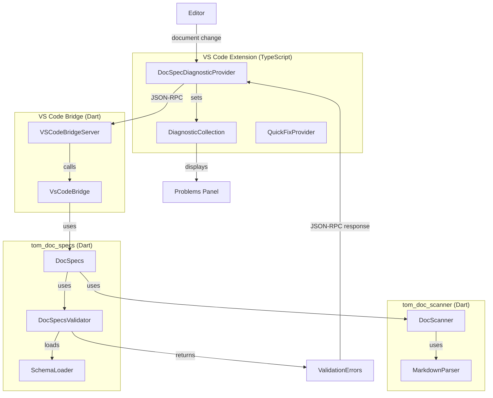
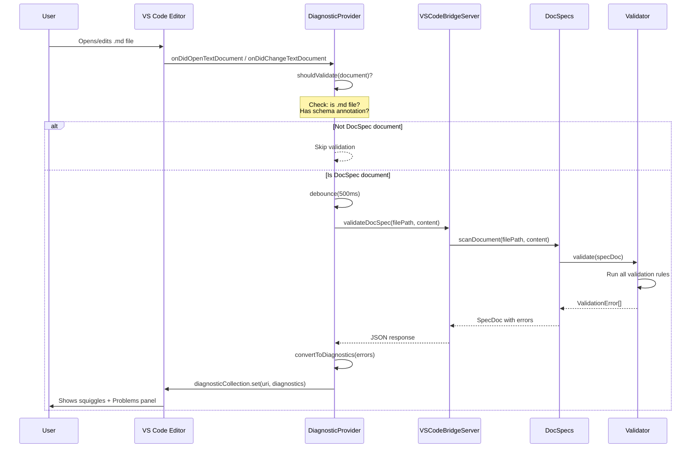
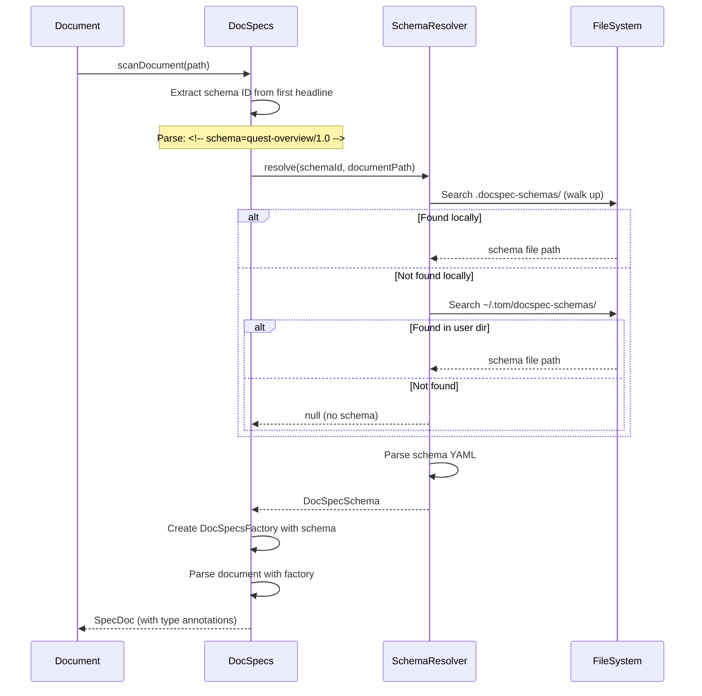
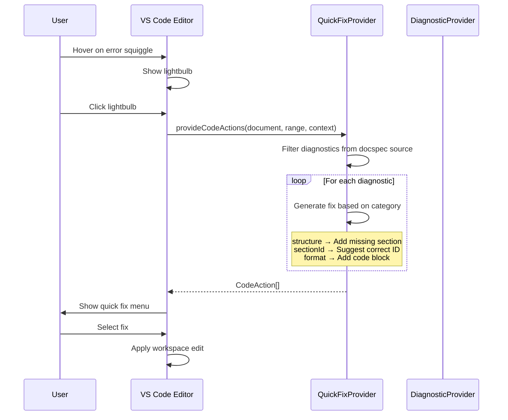

# DocSpecs Linter Design

This document describes the design for integrating DocSpecs validation into the VS Code extension as real-time linting.

## 1. Overview

The DocSpecs linter provides real-time validation of markdown documents that use DocSpec schemas. It displays validation errors in the VS Code Problems panel and underlines issues in the editor.

### Goals

- Real-time validation as user types (debounced)
- Display errors with accurate line numbers
- Support all DocSpecs validation categories
- Provide quick fixes where possible
- Zero configuration for schema-annotated documents

### Non-Goals (Future Work)

- IntelliSense/autocomplete for section IDs
- Go-to-definition for section references
- Full Language Server Protocol (LSP) implementation

---

## 2. Architecture



---

## 3. Component Responsibilities

### 3.1 VS Code Extension Layer

#### DocSpecDiagnosticProvider (`src/linter/docspecDiagnosticProvider.ts`)

**Responsibilities:**
- Listen to document open/change/save events
- Filter to DocSpec-eligible documents (`.md` files with schema annotation)
- Debounce validation requests (500ms default)
- Call bridge to perform validation
- Convert validation results to VS Code Diagnostics
- Update DiagnosticCollection

**Key Methods:**
```typescript
class DocSpecDiagnosticProvider {
  private diagnosticCollection: vscode.DiagnosticCollection;
  private debounceTimers: Map<string, NodeJS.Timeout>;
  
  activate(context: vscode.ExtensionContext): void;
  validateDocument(document: vscode.TextDocument): Promise<void>;
  private shouldValidate(document: vscode.TextDocument): boolean;
  private convertToDiagnostics(errors: ValidationError[]): vscode.Diagnostic[];
  dispose(): void;
}
```

#### QuickFixProvider (`src/linter/docspecQuickFixProvider.ts`)

**Responsibilities:**
- Provide code actions for diagnostics
- Generate quick fixes (add missing section, fix ID pattern)
- Register as CodeActionProvider for markdown files

### 3.2 Bridge Layer

#### VsCodeBridge (`tom_vscode_bridge/lib/script_api.dart`)

New method to expose:

```dart
/// Validates a DocSpec document and returns validation errors.
/// 
/// [filePath] - Absolute path to the markdown file
/// [content] - Optional document content (for unsaved documents)
/// [schemaId] - Optional schema ID override
/// 
/// Returns a list of validation error maps with keys:
/// - message: String
/// - lineNumber: int?
/// - sectionId: String?
/// - category: String
/// - severity: String (error|warning|info|hint)
Future<List<Map<String, dynamic>>> validateDocSpec({
  required String filePath,
  String? content,
  String? schemaId,
});
```

### 3.3 Validation Layer

#### DocSpecs (`tom_doc_specs/lib/src/doc_specs.dart`)

Existing API - no changes needed:
- `scanDocument()` - Parses and validates
- `loadSchema()` - Loads schema definition
- `validate()` - Validates against schema

#### DocSpecsValidator (`tom_doc_specs/lib/src/validation/validator.dart`)

Existing implementation - produces `ValidationError` objects with:
- Line numbers (1-based)
- Section IDs
- Error categories
- Descriptive messages

---

## 4. Data Models

### 4.1 ValidationError (Dart)

```dart
class ValidationError {
  final String message;
  final int? lineNumber;      // 1-based line number
  final String? sectionId;
  final ValidationErrorCategory category;
}

enum ValidationErrorCategory {
  general,
  schemaDeclaration,
  sectionType,
  sectionId,
  structure,
  countLimit,
  nestingDepth,
  tags,
  textContent,
  format,
  forEach,
  aiValidation,
}
```

### 4.2 Bridge Response Format (JSON)

```json
{
  "errors": [
    {
      "message": "Required section 'Scope' is missing",
      "lineNumber": 1,
      "sectionId": null,
      "category": "structure",
      "severity": "error"
    },
    {
      "message": "Section 'overview' appears out of order",
      "lineNumber": 15,
      "sectionId": "overview",
      "category": "structure",
      "severity": "error"
    }
  ],
  "schemaId": "quest-overview/1.0",
  "valid": false
}
```

### 4.3 VS Code Diagnostic

```typescript
interface DocSpecDiagnostic extends vscode.Diagnostic {
  range: vscode.Range;           // Line range in editor
  message: string;               // Error message
  severity: vscode.DiagnosticSeverity;
  source: 'docspec';             // Identifies our linter
  code?: string;                 // Error category
  relatedInformation?: vscode.DiagnosticRelatedInformation[];
}
```

### 4.4 Category to Severity Mapping

| ValidationErrorCategory | DiagnosticSeverity |
|------------------------|-------------------|
| schemaDeclaration | Error |
| sectionType | Error |
| sectionId | Error |
| structure | Error |
| countLimit | Error |
| nestingDepth | Warning |
| tags | Warning |
| textContent | Warning |
| format | Error |
| forEach | Error |
| aiValidation | Information |
| general | Error |

---

## 5. Key Flows

### 5.1 Document Validation Flow



### 5.2 Schema Resolution Flow



### 5.3 Quick Fix Flow



---

## 6. Implementation Plan

### Phase 1: Basic Validation (MVP)

1. **Add bridge method** (`tom_vscode_bridge`)
   - `validateDocSpec()` method in VsCodeBridge
   - Convert ValidationError to JSON response

2. **Create DiagnosticProvider** (`tom_vscode_extension`)
   - Basic event listeners
   - Bridge communication
   - Diagnostic conversion

3. **Register provider** in extension activation

**Files to create/modify:**

| File | Action |
|------|--------|
| `tom_vscode_bridge/lib/script_api.dart` | Add `validateDocSpec()` method |
| `tom_vscode_extension/src/linter/docspecDiagnosticProvider.ts` | Create new file |
| `tom_vscode_extension/src/extension.ts` | Register provider |

### Phase 2: Enhanced UX

1. **Debouncing** - 500ms delay after typing stops
2. **Document filtering** - Only validate files with schema annotation
3. **Incremental validation** - Cache schema, only re-parse document
4. **Status bar indicator** - Show validation status

### Phase 3: Quick Fixes

1. **QuickFixProvider** implementation
2. **Fix generators** for common errors:
   - Missing required section
   - Incorrect section order
   - Invalid ID format

### Phase 4: Performance

1. **Background validation** - Use worker if available
2. **Incremental parsing** - Only re-parse changed sections
3. **Schema caching** - Don't reload unchanged schemas

---

## 7. File Structure

```
tom_vscode_extension/
├── src/
│   ├── linter/
│   │   ├── docspecDiagnosticProvider.ts   # Main diagnostic provider
│   │   ├── docspecQuickFixProvider.ts     # Quick fix code actions
│   │   ├── docspecValidationService.ts    # Bridge communication
│   │   └── types.ts                       # TypeScript interfaces
│   └── extension.ts                       # Register providers

tom_vscode_bridge/
├── lib/
│   ├── script_api.dart                    # Add validateDocSpec()
│   └── vscode_api/
│       └── linter_helpers.dart            # Validation helpers
```

---

## 8. Configuration

### Extension Settings

```json
{
  "tom.linter.docspec.enabled": {
    "type": "boolean",
    "default": true,
    "description": "Enable DocSpec document validation"
  },
  "tom.linter.docspec.debounceMs": {
    "type": "number",
    "default": 500,
    "description": "Delay before validation after typing stops"
  },
  "tom.linter.docspec.validateOnSave": {
    "type": "boolean",
    "default": true,
    "description": "Validate documents on save"
  },
  "tom.linter.docspec.validateOnOpen": {
    "type": "boolean",
    "default": true,
    "description": "Validate documents when opened"
  }
}
```

---

## 9. Error Model

### Error Sources

1. **Schema not found** - Warning, document still shown as-is
2. **Parse error** - Error, cannot validate further
3. **Validation error** - Error/Warning based on category
4. **Bridge communication error** - Internal error, logged

### Error Display

```
┌─────────────────────────────────────────────────────────────┐
│ PROBLEMS                                                     │
├─────────────────────────────────────────────────────────────┤
│ ⊗ overview.my_quest.md                                      │
│   ├─ ⊗ Line 1: Missing required field 'schema' in headline │
│   ├─ ⊗ Line 15: Required section 'Scope' is missing        │
│   └─ ⚠ Line 23: Section 'implementation' has 3 children    │
│                  of type 'task', but max-count is 2         │
└─────────────────────────────────────────────────────────────┘
```

---

## 10. Testing Strategy

### Unit Tests

- Diagnostic conversion (ValidationError → Diagnostic)
- Debounce logic
- Document filtering (shouldValidate)
- Quick fix generation

### Integration Tests

- End-to-end validation flow
- Schema resolution
- Bridge communication

### Test Files

Create test fixtures in `tom_vscode_extension/test/fixtures/`:
- `valid_document.md` - No errors expected
- `missing_schema.md` - Schema declaration error
- `missing_sections.md` - Structure errors
- `invalid_ids.md` - Section ID errors

---

## 11. Dependencies

### tom_vscode_extension

- `vscode` - VS Code API (DiagnosticCollection, CodeActionProvider)
- Existing bridge communication infrastructure

### tom_vscode_bridge

- `tom_doc_specs` - Validation engine
- `tom_doc_scanner` - Markdown parsing

### tom_doc_specs

No new dependencies - uses existing validation infrastructure.

---

## 12. Related Documents

- [Quest Overview: Tom Linter](../../../../_ai/quests/tom_lint/overview.tom_lint.md)
- [Quest Overview: DocSpecs](../../../../_ai/quests/doc_specs/overview.doc_specs.md)
- [DocSpecs Specification](../../../../_ai/quests/doc_specs/doc_specs_specification.md)
- [VS Code Extension Architecture](./vs_code_extension.md)
