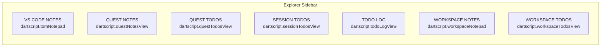
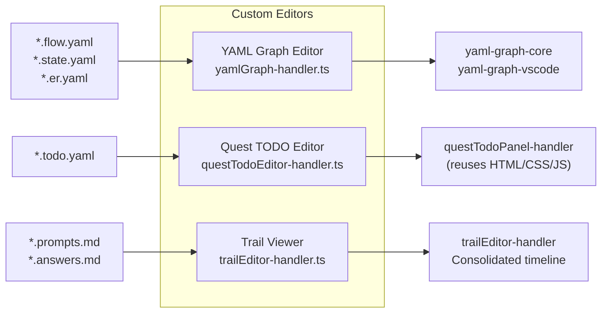
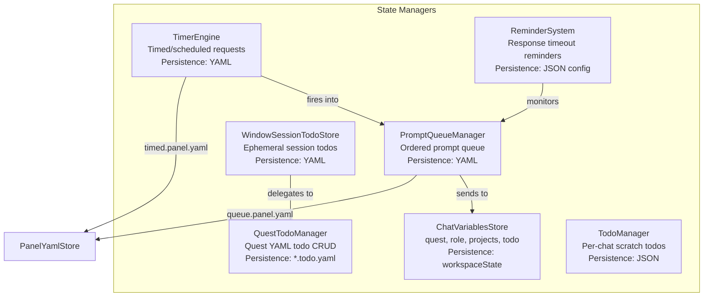
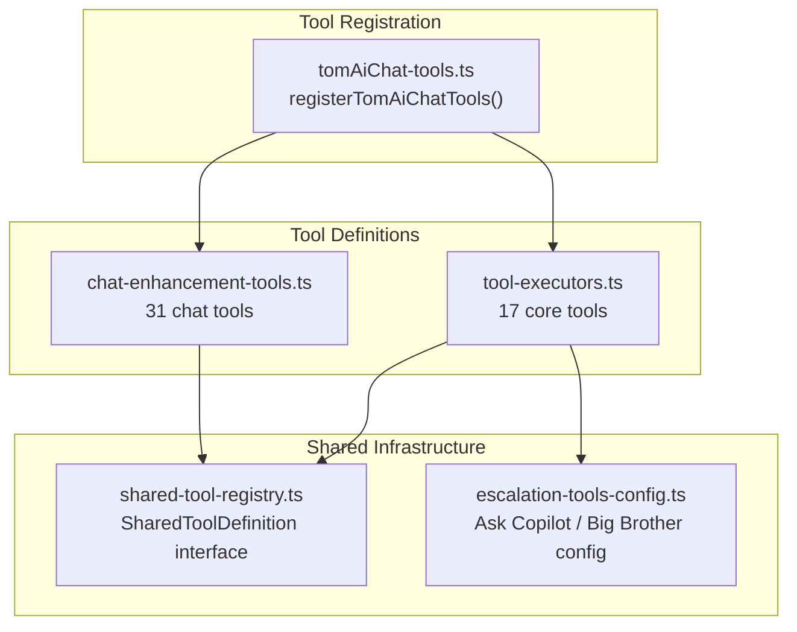
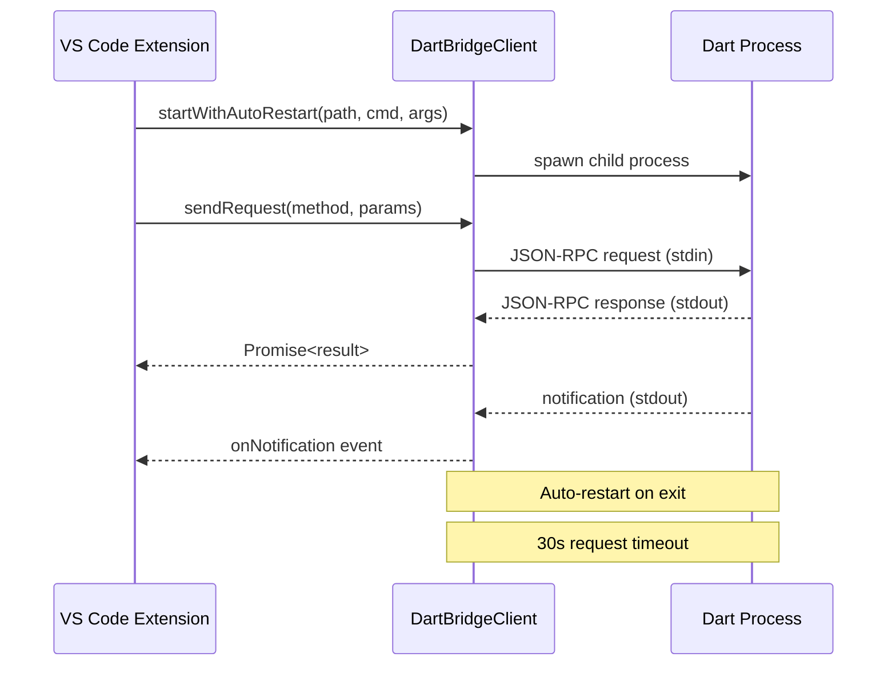
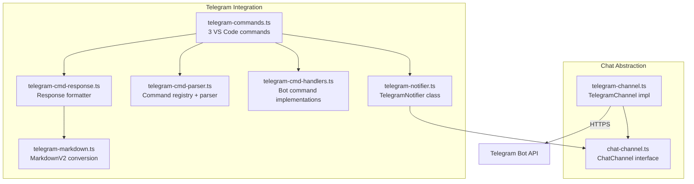
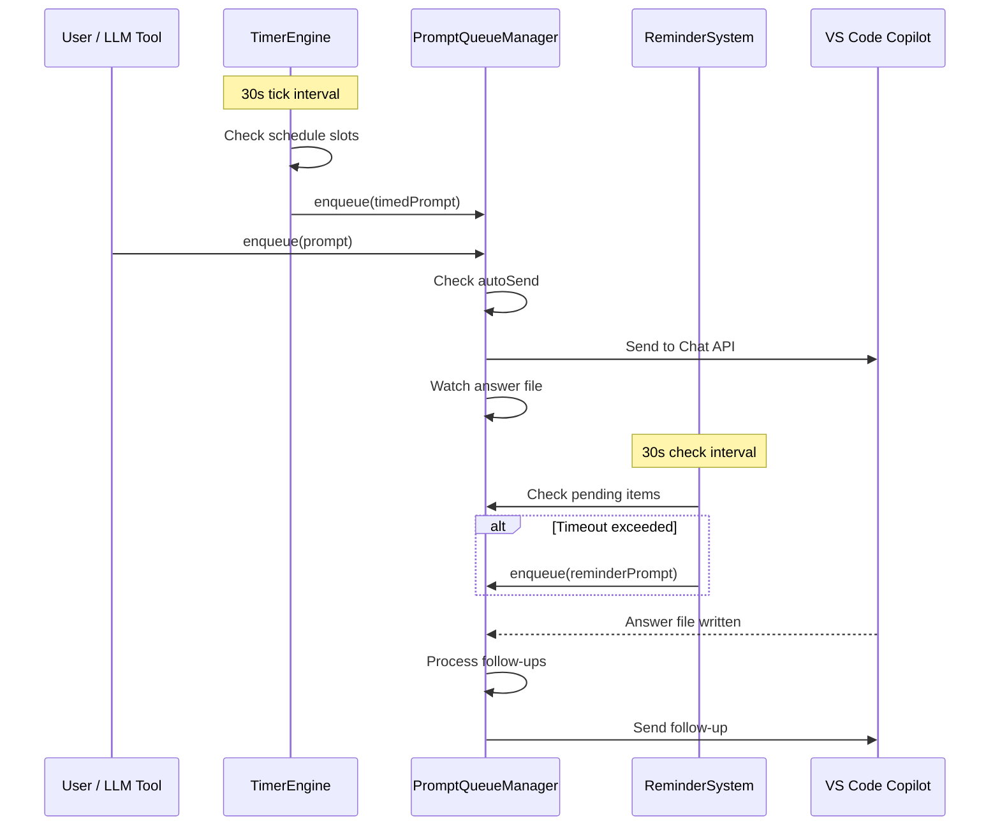
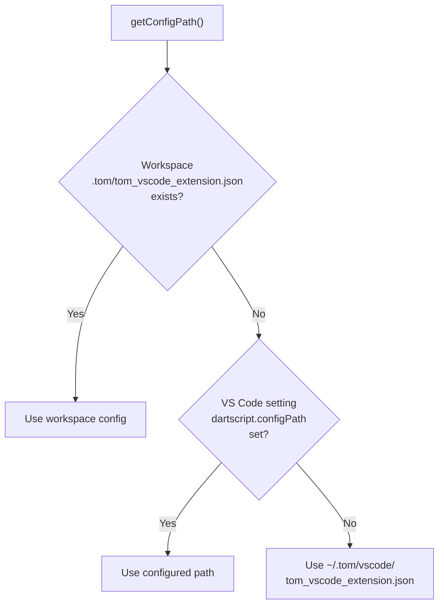
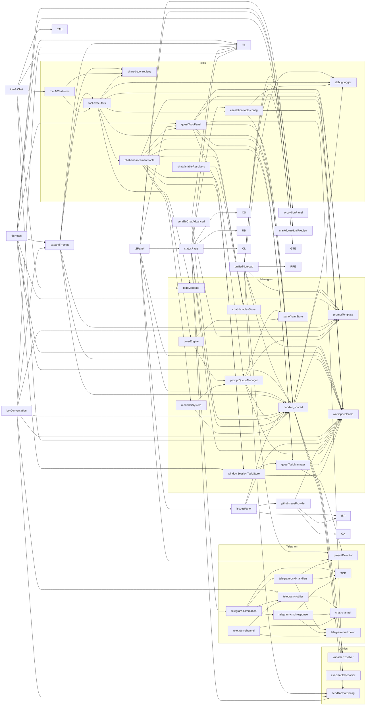

# DartScript VS Code Extension — Architecture Analysis

**Extension:** `dartscript-vscode` v0.1.0  
**Entry Point:** `src/extension.ts`  
**Config File:** `.tom/tom_vscode_extension.json`

---

## Table of Contents

1. [High-Level Architecture](#1-high-level-architecture)
2. [Activation Flow](#2-activation-flow)
3. [Source File Inventory](#3-source-file-inventory)
4. [Explorer Sidebar Views](#4-explorer-sidebar-views)
5. [Bottom Panel Views](#5-bottom-panel-views)
6. [Custom Editors](#6-custom-editors)
7. [Standalone Webview Panels](#7-standalone-webview-panels)
8. [Commands](#8-commands)
9. [Chord Menus & Keybindings](#9-chord-menus--keybindings)
10. [Reusable UI Components](#10-reusable-ui-components)
11. [Manager Singletons](#11-manager-singletons)
12. [LM Tools & Chat Variables](#12-lm-tools--chat-variables)
13. [Bridge & Telegram Communication](#13-bridge--telegram-communication)
14. [Timed Requests & Prompt Queue](#14-timed-requests--prompt-queue)
15. [Configuration System](#15-configuration-system)
16. [Filename Patterns](#16-filename-patterns)
17. [Dependency Map](#17-dependency-map)

---

## 1. High-Level Architecture

```mermaid
graph TB
    subgraph "VS Code Extension Host"
        EXT["extension.ts<br/>Activation & Registration"]
        
        subgraph "UI Layer"
            EXP["Explorer Sidebar<br/>7 webview views"]
            T2["@CHAT Bottom Panel<br/>Accordion notepad"]
            T3["@WS Bottom Panel<br/>Accordion: Tasks/Logs/Settings/Issues/Tests/QuestTodo"]
            CE["Custom Editors<br/>YAML Graph, Quest TODO, Trail Viewer"]
            WP["Standalone Webview Panels<br/>6 editors + Status Page"]
        end
        
        subgraph "Command Layer"
            CMD["74 Commands"]
            CHORD["6 Chord Menus"]
            SM["State Machines"]
            COMB["Combined Commands"]
        end
        
        subgraph "Manager Layer"
            CVS["ChatVariablesStore"]
            PQM["PromptQueueManager"]
            TE["TimerEngine"]
            RS["ReminderSystem"]
            QTM["QuestTodoManager"]
            WSTS["WindowSessionTodoStore"]
            TM["TodoManager"]
        end
        
        subgraph "Tool Layer"
            LMT["47 Language Model Tools"]
            CVR["5 Chat Variable Resolvers"]
            STR["SharedToolRegistry"]
            ESC["Escalation Tools Config"]
        end
        
        subgraph "Infrastructure"
            BRIDGE["DartBridgeClient<br/>JSON-RPC over stdin/stdout"]
            TELE["Telegram Subsystem<br/>Bot API + Command Registry"]
            TRAIL["Trail Logger<br/>Timestamped files"]
            PT["Prompt Template Engine<br/>Variable resolution"]
        end
        
        subgraph "Utilities"
            WP_U["WsPaths<br/>Central path registry"]
            PD["ProjectDetector"]
            VR["VariableResolver"]
            STC["SendToChatConfig"]
            PYS["PanelYamlStore"]
            ER["ExecutableResolver"]
            DL["DebugLogger"]
        end
    end
    
    subgraph "External"
        DART["Dart Bridge Process"]
        OLLAMA["Ollama Server"]
        GH["GitHub API"]
        TGAPI["Telegram Bot API"]
        COPILOT["VS Code Copilot"]
        LMAPI["VS Code LM API"]
    end
    
    EXT --> CMD & CHORD & SM & COMB
    EXT --> EXP & T2 & T3 & CE & WP
    EXT --> CVS & PQM & TE & RS
    EXT --> LMT & CVR
    
    T2 --> PT & TRAIL
    T3 --> QTM & WSTS
    
    CMD --> BRIDGE & TELE & TRAIL
    LMT --> STR
    
    BRIDGE --> DART
    TELE --> TGAPI
    LMT --> OLLAMA
    LMT --> COPILOT
    LMT --> LMAPI
    CMD --> GH
```



---

## 2. Activation Flow

```mermaid
flowchart TD
    A["Extension Activates"] --> B["Init Debug Logger"]
    B --> C["Install Global Instrumentation<br/>(wrap registerCommand, registerWebviewViewProvider)"]
    C --> D{"`.tom/` folder exists?"}
    
    D -->|No| MIN["MINIMAL MODE<br/>registerCommands (basic)<br/>registerChordMenuCommands<br/>registerCombinedCommands<br/>registerStateMachineCommands<br/>registerMinimalModePanels"]
    
    D -->|Yes| E["FULL MODE"]
    E --> F["Initialize Bridge Client"]
    F --> G["Register Commands (35)"]
    G --> H["Register Chord Menus (6)"]
    H --> I["Register Commandline Commands"]
    I --> J["Register Combined Commands"]
    J --> K["Register State Machine Commands"]
    K --> L["Register DS Notes Views (12 sidebar views)"]
    L --> M["Register Unified Notepad (@CHAT panel)"]
    M --> N["Register T3 Panel (@WS panel)"]
    N --> O["Register Editor Commands<br/>(ChatVars, Context, Template,<br/>Reusable, Queue, Timed)"]
    O --> P["Register Custom Editors<br/>(YAML Graph, Quest TODO, Trail)"]
    P --> Q["Register Trail Viewer Commands"]
    Q --> R["Register TODO Log View"]
    R --> S["Auto-start Bridge"]
    S --> T["Auto-start CLI Server (if configured)"]
    T --> U["Auto-start Telegram (if configured)"]
    U --> V["Init SendToChatAdvancedManager"]
    V --> W["Init PromptExpanderManager<br/>Register Local LLM context menu cmds"]
    W --> X["Init BotConversationManager"]
    X --> Y["Init ChatVariablesStore<br/>Init WindowSessionTodoStore"]
    Y --> Z["Init PromptQueueManager<br/>Init TimerEngine<br/>Init ReminderSystem"]
    Z --> AA["Register LM Tools (47)<br/>Initialize Tool Descriptions"]
    AA --> AB["Register Chat Variable Resolvers (5)"]
```

---

## 3. Source File Inventory

**81 TypeScript files** organized as:

| Directory | Count | Purpose |
|-----------|-------|---------|
| `src/` | 3 | Entry point, bridge client, tests |
| `src/handlers/` | 59 | UI panels, commands, editors, templates, telegram |
| `src/handlers/chat/` | 3 | Chat channel abstraction (interface + Telegram impl) |
| `src/managers/` | 7 | State singletons (queue, timer, todos, variables) |
| `src/tools/` | 6 | LM tool definitions and registration |
| `src/utils/` | 7 | Shared utilities (paths, config, resolver, logging) |

### Handler Files by Size (lines)

| File | Lines | Purpose |
|------|-------|---------|
| `unifiedNotepad-handler.ts` | 4162 | T2 @CHAT accordion panel |
| `questTodoPanel-handler.ts` | 3806 | Quest/session todo panel (embeddable) |
| `dsNotes-handler.ts` | 3416 | 12 sidebar webview providers |
| `statusPage-handler.ts` | 2741 | Status page + embedded status HTML |
| `botConversation-handler.ts` | 2246 | Multi-turn AI conversation orchestrator |
| `expandPrompt-handler.ts` | 1884 | Local LLM prompt expansion |
| `issuesPanel-handler.ts` | 1636 | GitHub issues panel (embeddable) |
| `queueEditor-handler.ts` | 1473 | Prompt queue webview editor |
| `timedRequestsEditor-handler.ts` | 1257 | Timed requests webview editor |
| `trailViewer-handler.ts` | 1210 | Trail viewer commands & exchange parser |
| `tomAiChat-handler.ts` | 1203 | Tom AI Chat (VS Code LM API) |
| `t3Panel-handler.ts` | 1094 | T3 @WS accordion panel |
| `globalTemplateEditor-handler.ts` | 1061 | Prompt template editor |
| `trailEditor-handler.ts` | 1014 | Trail custom editor for consolidated files |
| `handler_shared.ts` | 956 | Shared utilities (bridge, config, templates) |
| `reusablePromptEditor-handler.ts` | 935 | Reusable prompt .md editor |
| `commandline-handler.ts` | 929 | Custom CLI commandlines |
| `sendToChatAdvanced-handler.ts` | 848 | Template-based send-to-chat |
| `contextSettingsEditor-handler.ts` | 742 | Context & settings webview editor |

### Manager Files

| File | Lines | Purpose |
|------|-------|---------|
| `promptQueueManager.ts` | 933 | Ordered prompt queue with auto-send |
| `questTodoManager.ts` | 923 | CST-preserving YAML todo CRUD |
| `timerEngine.ts` | 422 | Timed/scheduled request firing |
| `chatVariablesStore.ts` | 238 | Chat variable state singleton |
| `reminderSystem.ts` | 253 | Response timeout reminders |
| `todoManager.ts` | 230 | Per-chat-session scratch todos |
| `windowSessionTodoStore.ts` | 207 | Window-scoped session todos |

### Tool Files

| File | Lines | Purpose |
|------|-------|---------|
| `chat-enhancement-tools.ts` | 1643 | 31 chat enhancement LM tools |
| `tool-executors.ts` | 1240 | 17 core tool implementations |
| `escalation-tools-config.ts` | 296 | Ask Copilot / Ask Big Brother config |
| `shared-tool-registry.ts` | 130 | Unified tool definition interface |
| `chatVariableResolvers.ts` | 97 | 5 chat variable resolvers |
| `tomAiChat-tools.ts` | 36 | VS Code LM tool registration wrapper |

### Utility Files

| File | Lines | Purpose |
|------|-------|---------|
| `workspacePaths.ts` | — | Central path registry (`WsPaths`) |
| `variableResolver.ts` | — | Template variable resolution |
| `sendToChatConfig.ts` | — | Config loading & `SendToChatConfig` class |
| `projectDetector.ts` | — | Workspace project scanning |
| `panelYamlStore.ts` | — | YAML persistence for panel state |
| `executableResolver.ts` | — | Binary path resolution |
| `debugLogger.ts` | — | Console/output channel logging |

---

## 4. Explorer Sidebar Views

All registered in `dartscript-explorer` view container.



| View ID | Name | Handler File | Icon | Description |
|---------|------|-------------|------|-------------|
| `dartscript.tomNotepad` | VS CODE NOTES | `dsNotes-handler.ts` | `$(note)` | Persistent scratch pad with template support |
| `dartscript.questNotesView` | QUEST NOTES | `dsNotes-handler.ts` | `$(book)` | Quest-specific markdown notes file |
| `dartscript.questTodosView` | QUEST TODOS | `dsNotes-handler.ts` + `questTodoPanel-handler.ts` | `$(checklist)` | Quest todo YAML editor |
| `dartscript.sessionTodosView` | SESSION TODOS | `dsNotes-handler.ts` + `questTodoPanel-handler.ts` | `$(clock)` | Window-scoped session todos |
| `dartscript.todoLogView` | TODO LOG | `todoLogPanel-handler.ts` | `$(history)` | Trail exchanges referencing todos |
| `dartscript.workspaceNotepad` | WORKSPACE NOTES | `dsNotes-handler.ts` | `$(file-text)` | Workspace-level markdown notes |
| `dartscript.workspaceTodosView` | WORKSPACE TODOS | `dsNotes-handler.ts` + `questTodoPanel-handler.ts` | `$(tasklist)` | Workspace-level todo YAML |

### Additional DS Notes Views (registered but used inside panels)

| View ID | Name | Used In | Purpose |
|---------|------|---------|---------|
| `dartscript.guidelinesNotepad` | Guidelines | @WS panel | Browse `_copilot_guidelines/` |
| `dartscript.notesNotepad` | Documentation | @WS panel | Project documentation |
| `dartscript.localLlmNotepad` | Local LLM | @CHAT panel | Ollama prompt interface |
| `dartscript.conversationNotepad` | AI Conversation | @CHAT panel | Multi-turn conversation |
| `dartscript.copilotNotepad` | Copilot | @CHAT panel | Copilot integration |
| `dartscript.tomAiChatNotepad` | Tom AI Chat | @CHAT panel | Tom AI chat interface |

---

## 5. Bottom Panel Views

### @CHAT Panel (`dartscript.chatPanel`)


**Handler:** `unifiedNotepad-handler.ts` (4162 lines)  
**View ID:** `dartscript.chatPanel`  
**Key features:**
- Accordion layout with collapsible sections
- Each section has a text area + template picker + send button
- Writes prompt trail files to `_ai/trail/`
- Writes consolidated trail to quest folder
- Manages answer file watching
- Draft persistence via `workspaceState`

### @WS Panel (`dartscript.wsPanel`)


**Handler:** `t3Panel-handler.ts` (1094 lines)  
**View ID:** `dartscript.wsPanel`  
**Key features:**
- Composes embedded fragments from: `issuesPanel-handler`, `questTodoPanel-handler`, `statusPage-handler`
- Guidelines browser for `_copilot_guidelines/`
- Embedded status page settings
- GitHub issues CRUD
- Quest todo management

---

## 6. Custom Editors

File-bound editors that open automatically for matching file patterns.

| viewType | displayName | File Patterns | Priority | Handler |
|----------|-------------|---------------|----------|---------|
| `yamlGraph.editor` | YAML Graph Editor | `*.flow.yaml`, `*.state.yaml`, `*.er.yaml` | default | `yamlGraph-handler.ts` |
| `questTodo.editor` | Quest TODO Editor | `*.todo.yaml` | option | `questTodoEditor-handler.ts` |
| `trailViewer.editor` | Trail Viewer | `*.prompts.md`, `*.answers.md` | default | `trailEditor-handler.ts` |



---

## 7. Standalone Webview Panels

Command-opened panels (not file-bound).

| Panel | viewType | Command | Handler |
|-------|----------|---------|---------|
| Status Page | `tomStatusPage` | `dartscript.showStatusPage` | `statusPage-handler.ts` |
| Prompt Trail Viewer | `dartscript.trailViewer` | `dartscript.openTrailViewer` | `trailViewer-handler.ts` |
| Prompt Queue | `dartscript.queueEditor` | `dartscript.openQueueEditor` | `queueEditor-handler.ts` |
| Timed Requests | `dartscript.timedRequestsEditor` | `dartscript.openTimedRequestsEditor` | `timedRequestsEditor-handler.ts` |
| Prompt Template Editor | `dartscript.globalTemplateEditor` | `dartscript.openGlobalTemplateEditor` | `globalTemplateEditor-handler.ts` |
| Reusable Prompt Editor | `dartscript.reusablePromptEditor` | `dartscript.openReusablePromptEditor` | `reusablePromptEditor-handler.ts` |
| Context & Settings | `dartscript.contextSettingsEditor` | `dartscript.openContextSettingsEditor` | `contextSettingsEditor-handler.ts` |
| Chat Variables | `chatVariablesEditor` | `dartscript.openChatVariablesEditor` | `chatVariablesEditor-handler.ts` |
| Quest TODO Pop-out | `questTodoEditor` | Pop-out from sidebar | `questTodoEditor-handler.ts` |
| Markdown Preview | `dartscriptMarkdownHtmlPreview` | Internal | `markdownHtmlPreview.ts` |

---

## 8. Commands

### All 74 Registered Commands

#### Script Execution (2)

| Command ID | Title | Handler |
|------------|-------|---------|
| `dartscript.executeFile` | DS: Execute File | `executeInTomAiBuild-handler.ts` |
| `dartscript.executeScript` | DS: Execute as Script | `executeAsScript-handler.ts` |

#### Send to Copilot Chat (12)

| Command ID | Title | Handler |
|------------|-------|---------|
| `dartscript.sendToChat` | DS: Send to Copilot Chat | `sendToChat-handler.ts` |
| `dartscript.sendToChatStandard` | DS: Send to Copilot Chat (Standard) | `sendToChatAdvanced-handler.ts` |
| `dartscript.sendToChatAdvanced` | DS: Send to Copilot Chat (Template)... | `sendToChatAdvanced-handler.ts` |
| `dartscript.reloadSendToChatConfig` | DS: Reload Chat Config | `extension.ts` (inline) |
| `dartscript.sendToChatTrailReminder` | Send with Trail Reminder | `sendToChatAdvanced-handler.ts` |
| `dartscript.sendToChatTodoExecution` | TODO Execution | `sendToChatAdvanced-handler.ts` |
| `dartscript.sendToChatCodeReview` | Code Review | `sendToChatAdvanced-handler.ts` |
| `dartscript.sendToChatExplain` | Explain Code | `sendToChatAdvanced-handler.ts` |
| `dartscript.sendToChatAddToTodo` | Add to Todo | `sendToChatAdvanced-handler.ts` |
| `dartscript.sendToChatFixMarkdown` | Fix Markdown here | `sendToChatAdvanced-handler.ts` |
| `dartscript.showChatAnswerValues` | DS: Show chat answer values | `handler_shared.ts` |
| `dartscript.clearChatAnswerValues` | DS: Clear chat answer values | `handler_shared.ts` |

#### Bridge & Infrastructure (7)

| Command ID | Title | Handler |
|------------|-------|---------|
| `dartscript.restartBridge` | DS: Restart Bridge | `restartBridge-handler.ts` |
| `dartscript.switchBridgeProfile` | DS: Switch Dartscript Bridge Profile... | `restartBridge-handler.ts` |
| `dartscript.reloadWindow` | DS: Reload Window | `reloadWindow-handler.ts` |
| `dartscript.toggleBridgeDebugLogging` | DS: Toggle Bridge Debug Logging | `debugLogging-handler.ts` |
| `dartscript.printConfiguration` | DartScript: Print Configuration | `printConfiguration-handler.ts` |
| `dartscript.showHelp` | DS: Show Extension Help | `showHelp-handler.ts` |
| `dartscript.showApiInfo` | DartScript: Show VS Code API Info | `showApiInfo-handler.ts` |

#### CLI Server & Process Monitor (4)

| Command ID | Title | Handler |
|------------|-------|---------|
| `dartscript.startCliServer` | DS: Start Tom CLI Integration Server | `cliServer-handler.ts` |
| `dartscript.startCliServerCustomPort` | DS: Start Tom CLI Integration Server (Custom Port) | `cliServer-handler.ts` |
| `dartscript.stopCliServer` | DS: Stop Tom CLI Integration Server | `cliServer-handler.ts` |
| `dartscript.startProcessMonitor` | DS: Start Tom Process Monitor | `processMonitor-handler.ts` |

#### Tom AI Chat (3)

| Command ID | Title | Handler |
|------------|-------|---------|
| `dartscript.startTomAIChat` | Tom AI: Start Chat | `tomAiChat-handler.ts` |
| `dartscript.sendToTomAIChat` | Tom AI: Send Chat Prompt | `tomAiChat-handler.ts` |
| `dartscript.interruptTomAIChat` | Tom AI: Interrupt Chat | `tomAiChat-handler.ts` |

#### Local LLM / Ollama (9)

| Command ID | Title | Handler |
|------------|-------|---------|
| `dartscript.expandPrompt` | DS: Expand Prompt (Ollama) | `expandPrompt-handler.ts` |
| `dartscript.switchLocalModel` | DS: Change local Ollama model... | `expandPrompt-handler.ts` |
| `dartscript.sendToLocalLlm` | DS: Send to local LLM | `expandPrompt-handler.ts` |
| `dartscript.sendToLocalLlmAdvanced` | DS: Send to local LLM (Template)... | `expandPrompt-handler.ts` |
| `dartscript.sendToLocalLlmStandard` | DS: Send to local LLM (Standard) | `expandPrompt-handler.ts` |
| `dartscript.sendToLocalLlm.expand` | Expand Prompt | `expandPrompt-handler.ts` |
| `dartscript.sendToLocalLlm.rewrite` | Rewrite | `expandPrompt-handler.ts` |
| `dartscript.sendToLocalLlm.detailed` | Detailed Expansion | `expandPrompt-handler.ts` |
| `dartscript.sendToLocalLlm.annotated` | Annotated Expansion | `expandPrompt-handler.ts` |

#### Bot Conversation (5)

| Command ID | Title | Handler |
|------------|-------|---------|
| `dartscript.startBotConversation` | DS: Start Local-Copilot Conversation | `botConversation-handler.ts` |
| `dartscript.stopBotConversation` | DS: Stop Local-Copilot Conversation | `botConversation-handler.ts` |
| `dartscript.haltBotConversation` | DS: Halt Local-Copilot Conversation | `botConversation-handler.ts` |
| `dartscript.continueBotConversation` | DS: Continue Local-Copilot Conversation | `botConversation-handler.ts` |
| `dartscript.addToBotConversation` | DS: Add to Local-Copilot Conversation | `botConversation-handler.ts` |

#### Chord Menus (6)

| Command ID | Title | Handler |
|------------|-------|---------|
| `dartscript.chordMenu.conversation` | DS: Conversation Shortcuts... | `chordMenu-handler.ts` |
| `dartscript.chordMenu.llm` | DS: Local LLM Shortcuts... | `chordMenu-handler.ts` |
| `dartscript.chordMenu.chat` | DS: Send to Chat Shortcuts... | `chordMenu-handler.ts` |
| `dartscript.chordMenu.tomAiChat` | DS: Tom AI Chat Shortcuts... | `chordMenu-handler.ts` |
| `dartscript.chordMenu.execute` | DS: Execute Shortcuts... | `chordMenu-handler.ts` |
| `dartscript.chordMenu.favorites` | DS: Favorites... | `chordMenu-handler.ts` |

#### Telegram (3)

| Command ID | Title | Handler |
|------------|-------|---------|
| `dartscript.telegramTest` | DS: Telegram Test Connection | `telegram-commands.ts` |
| `dartscript.telegramToggle` | DS: Telegram Start/Stop Polling | `telegram-commands.ts` |
| `dartscript.telegramConfigure` | DS: Configure Telegram... | `telegram-commands.ts` |

#### Layout & Window Management (8)

| Command ID | Title | Handler |
|------------|-------|---------|
| `dartscript.combined.maximizeExplorer` | DS: Maximize Explorer | `combinedCommand-handler.ts` |
| `dartscript.combined.maximizeEditor` | DS: Maximize Editor | `combinedCommand-handler.ts` |
| `dartscript.combined.maximizeChat` | DS: Maximize Chat | `combinedCommand-handler.ts` |
| `dartscript.combined.maximizeToggle` | DS: Maximize Toggle | `combinedCommand-handler.ts` |
| `dartscript.stateMachine.vsWindowStateFlow` | DS: Window Panel State Flow | `stateMachine-handler.ts` |
| `dartscript.resetMultiCommandState` | DS: Reset All State Machine States | `stateMachine-handler.ts` |
| `dartscript.focusTomAI` | DS: Focus Tom AI Panel | `extension.ts` |
| `dartscript.combined.showSideNotes` | DS: Show Side Notes | `combinedCommand-handler.ts` |

#### Commandline (4)

| Command ID | Title | Handler |
|------------|-------|---------|
| `dartscript.defineCommandline` | DS: Add Commandline | `commandline-handler.ts` |
| `dartscript.deleteCommandline` | DS: Delete Commandline | `commandline-handler.ts` |
| `dartscript.executeCommandline` | DS: Execute Commandline | `commandline-handler.ts` |
| `dartscript.openConfig` | DS: Open Config File | `commandline-handler.ts` |

#### Trail & Status (3)

| Command ID | Title | Handler |
|------------|-------|---------|
| `dartscript.toggleTrail` | DS: Toggle AI Trail Logging | `statusPage-handler.ts` |
| `dartscript.showStatusPage` | DS: Extension Status Page | `statusPage-handler.ts` |
| `dartscript.openExtensionSettings` | DS: Open Extension Settings | `extension.ts` (inline) |

#### Webview Editors (8)

| Command ID | Title | Handler |
|------------|-------|---------|
| `dartscript.openChatVariablesEditor` | DS: Open Chat Variables Editor | `chatVariablesEditor-handler.ts` |
| `dartscript.openQueueEditor` | DS: Open Prompt Queue Editor | `queueEditor-handler.ts` |
| `dartscript.openTimedRequestsEditor` | DS: Open Timed Requests Editor | `timedRequestsEditor-handler.ts` |
| `dartscript.openContextSettingsEditor` | DS: Open Context & Settings Editor | `contextSettingsEditor-handler.ts` |
| `dartscript.openGlobalTemplateEditor` | DS: Open Prompt Template Editor | `globalTemplateEditor-handler.ts` |
| `dartscript.openReusablePromptEditor` | DS: Open Reusable Prompt Editor | `reusablePromptEditor-handler.ts` |
| `dartscript.openTrailViewer` | DS: Open Prompt Trail Viewer | `trailViewer-handler.ts` |
| `dartscript.openTrailViewerFolder` | DS: Open Trail Viewer (Select Folder) | `trailViewer-handler.ts` |

#### Other Commands (4)

| Command ID | Title | Handler |
|------------|-------|---------|
| `dartscript.runTests` | DS: Run Tests | `runTests-handler.ts` |
| `dartscript.showQuickReference` | DS: Show Quick Reference | `chordMenu-handler.ts` |
| `dartscript.openInExternalApp` | DS: Open in External Application | `extension.ts` (inline) |
| `dartscript.openInMdViewer` | DS: Open in MD Viewer | `extension.ts` (inline) |

---

## 9. Chord Menus & Keybindings

### Keybindings

| Key | Command | Description |
|-----|---------|-------------|
| `Ctrl+Shift+C` | `dartscript.chordMenu.conversation` | Conversation shortcuts |
| `Ctrl+Shift+L` | `dartscript.chordMenu.llm` | Local LLM shortcuts |
| `Ctrl+Shift+A` | `dartscript.chordMenu.chat` | Send to Chat shortcuts |
| `Ctrl+Shift+T` | `dartscript.chordMenu.tomAiChat` | Tom AI Chat shortcuts |
| `Ctrl+Shift+E` | `dartscript.chordMenu.execute` | Execute shortcuts |
| `Ctrl+Shift+X` | `dartscript.chordMenu.favorites` | Favorites |
| `Ctrl+Shift+\` | `dartscript.combined.maximizeToggle` | Maximize toggle |
| `Ctrl+Shift+2` | `dartscript.combined.maximizeExplorer` | Maximize explorer |
| `Ctrl+Shift+3` | `dartscript.combined.maximizeEditor` | Maximize editor |
| `Ctrl+Shift+4` | `dartscript.combined.maximizeChat` | Maximize chat |
| `Ctrl+Shift+0` | `dartscript.focusTomAI` | Focus @CHAT panel |
| `Ctrl+Shift+Y` | `dartscript.stateMachine.vsWindowStateFlow` | Window state flow |
| `Ctrl+Shift+8` | `dartscript.showStatusPage` | Status page |
| `Ctrl+Shift+9` | `dartscript.wsPanel.focus` | Focus @WS panel |
| `Ctrl+Shift+N` | `dartscript.combined.showSideNotes` | Show side notes |

### Unbindings (overridden VS Code defaults)

| Key | Original Command | Replaced By |
|-----|-----------------|-------------|
| `Ctrl+Shift+C` | `workbench.action.terminal.openNativeConsole` | Conversation chord |
| `Ctrl+Shift+X` | `workbench.view.extensions` | Favorites chord |
| `Ctrl+Shift+N` | `workbench.action.newWindow` | Show side notes |

---

## 10. Reusable UI Components

| Component | File | Exports | Used By |
|-----------|------|---------|---------|
| Accordion Panel | `accordionPanel.ts` | `getAccordionHtml()`, `getAccordionStyles()`, `getAccordionScript()` | @CHAT panel, @WS panel |
| Tab Panel | `tabPanel.ts` | `getTabPanelHtml()`, `getTabPanelStyles()`, `getTabPanelScript()` | Various panels |
| Markdown Preview | `markdownHtmlPreview.ts` | `showMarkdownHtmlPreview()` | Trail viewer, notes, reusable prompts |
| Prompt Template | `promptTemplate.ts` | `resolveTemplate()`, `expandTemplate()`, `formatDateTime()` | All send-to-chat, LLM, conversation |
| Variable Resolver | `variableResolver.ts` | Variable resolution engine | Template system |

---

## 11. Manager Singletons



| Manager | Singleton | Init Method | Persistence | Key |
|---------|-----------|-------------|-------------|-----|
| `ChatVariablesStore` | Yes | `init(context)` | `workspaceState` | `chatVariablesStore` |
| `PromptQueueManager` | Yes | `init(ctx)` | YAML via `panelYamlStore` | `_ai/tom_ai_chat/queue.panel.yaml` |
| `TimerEngine` | Yes | `init(ctx)` | YAML via `panelYamlStore` | `_ai/tom_ai_chat/timed.panel.yaml` |
| `ReminderSystem` | Yes | `init(ctx)` | JSON config | `reminderTemplates`, `reminderConfig` |
| `QuestTodoManager` | No (pure functions) | — | YAML files | `_ai/quests/*/todos.*.todo.yaml` |
| `WindowSessionTodoStore` | Yes | `init(context, windowId)` | YAML (via QuestTodoManager) | `_ai/quests/*/YYYYMMDD_HHMM_*.todo.yaml` |
| `TodoManager` | No (per-session) | `new TodoManager()` | JSON | `_ai/tom_ai_chat/*.todos.json` |

---

## 12. LM Tools & Chat Variables

### Language Model Tools (47 total)



#### Core Tools (17 in `tool-executors.ts`)

| Tool Name | Category | Read-Only | Description |
|-----------|----------|-----------|-------------|
| `tom_readFile` | Files | ✓ | Read file contents |
| `tom_createFile` | Files | ✗ | Create new file |
| `tom_editFile` | Files | ✗ | Edit existing file |
| `tom_multiEditFile` | Files | ✗ | Multiple file edits |
| `tom_listDirectory` | Files | ✓ | List directory contents |
| `tom_findFiles` | Search | ✓ | Find files by glob |
| `tom_findTextInFiles` | Search | ✓ | Grep text in files |
| `tom_runCommand` | Terminal | ✗ | Run shell command |
| `tom_runVscodeCommand` | VS Code | ✗ | Execute VS Code command |
| `tom_getErrors` | Diagnostics | ✓ | Get VS Code diagnostics |
| `tom_fetchWebpage` | Web | ✓ | Fetch URL content |
| `tom_webSearch` | Web | ✓ | Web search |
| `tom_readGuideline` | Guidelines | ✓ | Read from `_copilot_tomai/` |
| `tom_readLocalGuideline` | Guidelines | ✓ | Read from `_copilot_local/` |
| `tom_manageTodo` | Todo | ✗ | Manage scratch todos |
| `tom_askBigBrother` | Escalation | ✓ | Ask a more powerful model |
| `tom_askCopilot` | Escalation | ✓ | Escalate to VS Code Copilot |

#### Chat Enhancement Tools (31 in `chat-enhancement-tools.ts`)

| Tool Name | Category | Description |
|-----------|----------|-------------|
| `dartscript_notifyUser` | Notification | Send Telegram or VS Code notification |
| `dartscript_getWorkspaceInfo` | Workspace | Get workspace and quest context |
| `dartscript_listTodos` | Quest Todo | List all quest todos |
| `dartscript_getAllTodos` | Quest Todo | List quest + session todos |
| `dartscript_getTodo` | Quest Todo | Get specific todo by ID |
| `dartscript_createTodo` | Quest Todo | Create new quest todo |
| `dartscript_updateTodo` | Quest Todo | Update existing quest todo |
| `dartscript_moveTodo` | Quest Todo | Move todo between files |
| `dartscript_windowTodo_add` | Session Todo | Add session todo |
| `dartscript_windowTodo_list` | Session Todo | List session todos |
| `dartscript_windowTodo_getAll` | Session Todo | Get all session todos |
| `dartscript_windowTodo_update` | Session Todo | Update session todo |
| `dartscript_windowTodo_delete` | Session Todo | Delete session todo |
| `addToPromptQueue` | Queue | Add prompt to queue |
| `addFollowUpPrompt` | Queue | Add follow-up prompt |
| `sendQueuedPrompt` | Queue | Send next queued prompt |
| `addTimedRequest` | Timed | Add timed request |
| `tom_queue_list` | Queue | List queue items |
| `tom_queue_update_item` | Queue | Update queue item |
| `tom_queue_set_status` | Queue | Set item status |
| `tom_queue_send_now` | Queue | Send item immediately |
| `tom_queue_remove_item` | Queue | Remove from queue |
| `tom_queue_update_followup` | Queue | Update follow-up |
| `tom_queue_remove_followup` | Queue | Remove follow-up |
| `tom_timed_list` | Timed | List timed entries |
| `tom_timed_update_entry` | Timed | Update timed entry |
| `tom_timed_remove_entry` | Timed | Remove timed entry |
| `tom_timed_set_engine_state` | Timed | Enable/disable timer |
| `tom_prompt_template_manage` | Templates | CRUD prompt templates |
| `tom_reminder_template_manage` | Templates | CRUD reminder templates |

### Chat Variable Resolvers (5)

| Variable | Resolver ID | Source |
|----------|-------------|--------|
| `#quest` | `dartscript.quest` | `ChatVariablesStore.quest` |
| `#role` | `dartscript.role` | `ChatVariablesStore.role` |
| `#activeProjects` | `dartscript.activeProjects` | `ChatVariablesStore.activeProjects` |
| `#todo` | `dartscript.todo` | `ChatVariablesStore.todo` |
| `#workspaceName` | `dartscript.workspaceName` | Workspace folder name |

---

## 13. Bridge & Telegram Communication

### Dart Bridge



**File:** `vscode-bridge.ts` (1056 lines)  
**Protocol:** JSON-RPC 2.0 over stdin/stdout with length-prefixed messages  
**Bridge commands used:** `executeFileVcb`, `executeScriptVcb`, `startCliServer`, `stopCliServer`, `startProcessMonitor`, `setDebugLogging`, `getDebugLogging`, `printConfiguration`, `notifyReload`

### Telegram Subsystem



**Telegram bot commands:** help, ls, cd, cwd, project, dart analyze, problems, todos, bk, tk, bridge, cli-integration, status, stop

---

## 14. Timed Requests & Prompt Queue



### Persistence

| Component | Format | File Path |
|-----------|--------|-----------|
| Prompt Queue | YAML | `_ai/tom_ai_chat/queue.panel.yaml` |
| Timed Requests | YAML | `_ai/tom_ai_chat/timed.panel.yaml` |
| Reminder Config | JSON | In main config file (`reminderTemplates`, `reminderConfig`) |

---

## 15. Configuration System

### Config File Resolution



### JSON Config Sections

| Section Key | Purpose | Used By |
|-------------|---------|---------|
| `templates` | Copilot prompt templates | dsNotes, sendToChatAdvanced, globalTemplateEditor |
| `defaultTemplates.<panel>` | Per-panel default template | handler_shared |
| `reminderTemplates` | Reminder prompt templates | reminderSystem, globalTemplateEditor |
| `reminderConfig` | Reminder timeout settings | reminderSystem |
| `promptExpander` | Local LLM config (profiles, models, settings) | expandPrompt-handler |
| `promptExpander.profiles` | Named LLM profiles | expandPrompt-handler, dsNotes |
| `promptExpander.models` | Available model configs | expandPrompt-handler |
| `promptExpander.llmConfigurations` | LLM configuration presets | dsNotes |
| `botConversation.profiles` | Conversation profiles | botConversation-handler, dsNotes |
| `botConversation.selfTalk` | Self-talk profiles | globalTemplateEditor |
| `botConversation.telegram` | Telegram bot config | telegram-commands |
| `botConversation.conversationMode` | Default mode | dsNotes |
| `tomAiChat.templates` | Tom AI Chat templates | dsNotes |
| `timedRequests` | Timed request entries | timedRequestsEditor (legacy) |
| `trail` | Trail logging config | trailLogger-handler |
| `trail.paths.*` | Per-subsystem trail paths | trailLogger-handler |
| `dartscriptBridge` | Bridge profiles & settings | restartBridge-handler |
| `combinedCommands` | Multi-command sequences | combinedCommand-handler |
| `stateMachineCommands` | State machine definitions | stateMachine-handler |
| `commandlines` | Custom CLI commands | commandline-handler |
| `favorites` | Favorites chord items | chordMenu-handler |
| `executables` | Named executable paths | executableResolver, commandline-handler |
| `externalApplications` | File→app associations | handler_shared |
| `issueKit` | Issue tracking config | issuesPanel-handler |
| `testkit` | Test results config | issuesPanel-handler |
| `copilotChatAnswerFolder` | Answer file folder | sendToChatConfig |
| `copilotAnswerPath` | Full answer file path | sendToChatConfig |
| `localLlmTools.askCopilot` | Escalation tool config | escalation-tools-config |
| `localLlmTools.askBigBrother` | Escalation tool config | escalation-tools-config |
| `binaryPath` | Legacy binary path | sendToChatConfig |
| `todoPanel` | Todo panel config | sendToChatConfig |
| `cliServerAutostart` | Auto-start CLI server | extension.ts |
| `telegramAutostart` | Auto-start Telegram | extension.ts |
| `trailCleanupDays` | Trail cleanup period | sendToChatConfig |
| `trailMaxEntries` | Max trail entries | sendToChatConfig |
| `aiConversationSetups` | AI conversation presets | dsNotes |
| `llmConfigurations` | LLM configuration presets | dsNotes |

### VS Code Settings (`dartscript.*`)

| Setting | Type | Default | Purpose |
|---------|------|---------|---------|
| `dartscript.contextApproach` | enum | `"accumulation"` | Context persistence mode |
| `dartscript.maxContextSize` | number | `50000` | Max context tokens |
| `dartscript.autoRunOnSave` | boolean | `false` | Auto-run on save |
| `dartscript.copilotModel` | enum | `"gpt-4o"` | Preferred Copilot model |
| `dartscript.configPath` | string | `"~/.tom/vscode/tom_vscode_extension.json"` | Config file path |
| `dartscript.sendToChat.showNotifications` | boolean | `true` | Chat send notifications |
| `dartscript.sendToChat.chatAnswerFolder` | string | `"_ai/chat_replies"` | Chat answer folder |
| `dartscript.tomAiChat.modelId` | string | `"gpt-5.2"` | Tom AI Chat model |
| `dartscript.tomAiChat.tokenModelId` | string | `"gpt-4o"` | Token counting model |
| `dartscript.tomAiChat.responsesTokenLimit` | number | `50000` | Response token limit |
| `dartscript.tomAiChat.responseSummaryTokenLimit` | number | `8000` | Summary token limit |
| `dartscript.tomAiChat.preProcessingModelId` | string | `"gpt-5-mini"` | Pre-processing model |
| `dartscript.tomAiChat.enablePromptOptimization` | boolean | `false` | Enable pre-processing |
| `dartscript.ollama.url` | string | `"http://localhost:11434"` | Ollama server URL |
| `dartscript.ollama.model` | string | `"qwen3:8b"` | Ollama model name |
| `dartscript.notes.workspaceTodoFile` | string | `"workspace.todo.yaml"` | Workspace todo file |
| `dartscript.notes.questNotesFilePattern` | string | `"_ai/quests/${quest}/quest-notes.${quest}.md"` | Quest notes pattern |
| `dartscript.notes.questTodoFilePattern` | string | `"todos.${quest}.todo.yaml"` | Quest todo pattern |
| `dartscript.guidelines.projectExcludeGlobs` | array | `["tom/zom_*/**"]` | Guidelines exclude globs |
| `dartscript.projectDetection.excludeGlobs` | array | `["tom/zom_*/**"]` | Project detection excludes |

### Workspace State Keys

| Key | Type | Purpose |
|-----|------|---------|
| `dartscript.dsNotes.localLlmDraft` | string | Local LLM notepad draft |
| `dartscript.dsNotes.localLlmProfile` | string | Selected LLM profile |
| `dartscript.dsNotes.localLlmModel` | string | Selected LLM model |
| `dartscript.dsNotes.conversationDraft` | string | Conversation notepad draft |
| `dartscript.dsNotes.conversationProfile` | string | Selected conversation profile |
| `dartscript.dsNotes.conversationLlmProfileA` | string | LLM profile A |
| `dartscript.dsNotes.conversationLlmProfileB` | string | LLM profile B |
| `dartscript.dsNotes.copilotDraft` | string | Copilot notepad draft |
| `dartscript.dsNotes.copilotTemplate` | string | Selected Copilot template |
| `dartscript.dsNotes.tomAiChatDraft` | string | Tom AI Chat draft |
| `dartscript.dsNotes.tomAiChatTemplate` | string | Selected Tom AI template |
| `dartscript.dsNotes.notes` | string | Notes storage |
| `dartscript.dsNotes.tomNotepad` | string | VS Code Notes content |
| `dartscript.dsNotes.tomNotepadTemplate` | string | VS Code Notes template |
| `dartscript.dsNotes.activeNoteFile` | string | Active note file ID |
| `dartscript.dsNotes.workspaceNotepadTemplate` | string | Workspace notepad template |
| `dartscript.dsNotes.questNotesTemplate` | string | Quest notes template |
| `WorkspaceNotepadProvider.STORAGE_KEY` | string | Workspace notepad file path |
| `llmSelectedConfig` | string | Selected LLM configuration |
| `conversationAiSetup` | string | Selected AI conversation setup |
| `qt.panelState` | object | Quest todo panel state |
| `qt.pendingSelect` | object | Pending todo selection |
| `dartscript.queueEditor.collapsedItemIds` | array | Queue editor collapsed state |
| `dartscript.timedEditor.collapsedEntryIds` | array | Timed editor collapsed state |
| `trailEditor.pendingFocus` | object | Pending trail focus |
| `chatVariablesStore` | object | Chat variables snapshot |
| `copilotAutoHideDelay` | number | Copilot auto-hide delay |

### Environment Variables

| Variable | File | Purpose |
|----------|------|---------|
| `process.env.HOME` / `process.env.USERPROFILE` | `dsNotes-handler.ts` | Global notes path |
| `process.env.TOM_USER` | `questTodoPanel-handler.ts` | User identity override |
| `${env.VARNAME}` template | `variableResolver.ts` | Generic env var lookup |
| `vscode.env.sessionId` | `variableResolver.ts` | Window/session ID |
| `vscode.env.machineId` | `variableResolver.ts` | Machine ID |

---

## 16. Filename Patterns

### Trail Files — Individual Exchange Files

Written to `_ai/trail/` folder.

| Pattern | Extension | Purpose |
|---------|-----------|---------|
| `YYYYMMDD_HHMMSSmmm_prompt_<requestId>` | `.userprompt.md` | Individual user prompt |
| `YYYYMMDD_HHMMSSmmm_answer_<requestId>` | `.answer.json` | Individual answer |

**Parsing regex (new format):**
```
/^(\d{8}_\d{9})_(prompt|answer)_([^.]+)\.(userprompt\.md|answer\.json)$/
```

**Parsing regex (legacy format):**
```
/^(\d{8}_\d{6})_([^.]+)\.(userprompt|answer)\.md$/
```

### Trail Files — Consolidated Files

Written to quest folder or `_ai/trail/`.

| Pattern | Purpose |
|---------|---------|
| `<prefix>.prompts.md` | Consolidated prompts (current) |
| `<prefix>.answers.md` | Consolidated answers (current) |
| `<prefix>_prompts.md` | Consolidated prompts (legacy) |
| `<prefix>_answers.md` | Consolidated answers (legacy) |

Where `<prefix>` = quest ID from workspace filename, or `'default'`.

### Trail Logger Files — Step-Level Logging

Written to subsystem-specific trail folders.

| Pattern | Extension | Purpose |
|---------|-----------|---------|
| `YYYYMMDD_HHMMSS_NNN_prompt_to_<model>` | `.md` | Prompt sent |
| `YYYYMMDD_HHMMSS_NNN_response_partial_from_<model>` | `.md` | Partial response |
| `YYYYMMDD_HHMMSS_NNN_response_final_from_<model>` | `.md` | Final response |
| `YYYYMMDD_HHMMSS_NNN_toolrequest_<toolname>` | `.json` | Tool request |
| `YYYYMMDD_HHMMSS_NNN_toolresult_<toolname>` | `.json` | Tool result |
| `YYYYMMDD_HHMMSS_NNN_continuation_to_<model>` | `.md` | Continuation |
| `YYYYMMDD_HHMMSS_NNN_copilot_answer` | `.json` | Copilot answer |
| `YYYYMMDD_HHMMSS_NNN_error` | `.md` | Error details |

**Subsystem trail folders (configurable via `trail.paths.*`):**

| Subsystem | Default Path |
|-----------|--------------|
| Local LLM | `_ai/local/trail/` |
| Bot Conversation | `_ai/conversation/trail/` |
| Tom AI Chat | `_ai/tomai/trail/` |
| Copilot | `_ai/copilot/trail/` |
| Escalation | `_ai/trail/escalation/<trailId>/` |

### Answer Files

| Pattern | Location | Purpose |
|---------|----------|---------|
| `<windowId>_answer.json` | `_ai/answers/copilot/` | Copilot answer file |
| `<sessionId>_<machineId>_answer.json` | `_ai/chat_replies/` | Queue answer polling |

### Todo Files

| Pattern | Location | Purpose |
|---------|----------|---------|
| `workspace.todo.yaml` | Workspace root | Workspace-level todos |
| `todos.<quest>.todo.yaml` | `_ai/quests/<quest>/` | Quest todos |
| `YYYYMMDD_HHMM_<windowId>.todo.yaml` | `_ai/quests/<quest>/` | Session todos |
| `<chatId>.todos.json` | `_ai/tom_ai_chat/` | Per-chat scratch todos |

### Panel YAML Files

| Pattern | Location | Purpose |
|---------|----------|---------|
| `queue.panel.yaml` | `_ai/tom_ai_chat/` | Prompt queue state |
| `timed.panel.yaml` | `_ai/tom_ai_chat/` | Timed requests state |

### Chat Files

| Pattern | Location | Purpose |
|---------|----------|---------|
| `chat_YYYYMMDD.chat.md` | `_ai/tom_ai_chat/` | Tom AI Chat session |
| `chat_trail.md` | `_ai/local/` | Local LLM chat trail |

### Other File Patterns

| Pattern | Location | Purpose |
|---------|----------|---------|
| `*.flow.yaml`, `*.state.yaml`, `*.er.yaml` | Any | YAML Graph Editor |
| `*.todo.yaml` | Any | Quest TODO Editor |
| `*.prompts.md`, `*.answers.md` | Any | Trail Viewer Editor |
| `*.prompt.md` | `_ai/prompt/`, `{project}/prompt/` | Reusable prompts |
| `.github/copilot-instructions.md` | Workspace root | System prompt source |
| `global_notes.md` | `~/.tom/notes/` | Global notes file |
| `~/.vscode-tom-test-reinstall` | Home | Reinstall marker |

### Glob Patterns

| Glob | File | Purpose |
|------|------|---------|
| `_ai/quests/**/*.todo.yaml` | `workspacePaths.ts` | Find all quest todos |
| `_copilot_guidelines/**/*.md` | `workspacePaths.ts` | Find all guidelines |

---

## 17. Dependency Map

### Handler → Handler Dependencies



### Central Path Registry (`WsPaths`)

| Logical Key | Relative Path | Used For |
|-------------|---------------|----------|
| `quests` | `_ai/quests` | Quest folders |
| `roles` | `_ai/roles` | AI role definitions |
| `notes` | `_ai/notes` | Notes storage |
| `local` | `_ai/local` | Local LLM files |
| `schemas` | `_ai/schemas/yaml` | YAML schemas |
| `copilot` | `_ai/copilot` | Copilot files |
| `tomAiChat` | `_ai/tom_ai_chat` | Tom AI Chat files |
| `chatReplies` | `_ai/chat_replies` | Chat reply files |
| `botConversations` | `_ai/bot_conversations` | Conversation logs |
| `attachments` | `_ai/attachments` | File attachments |
| `answersCopilot` | `_ai/answers/copilot` | Copilot answer files |
| `trailLocal` | `_ai/local/trail` | Local LLM trail |
| `trailConversation` | `_ai/conversation/trail` | Conversation trail |
| `trailTomai` | `_ai/tomai/trail` | Tom AI Chat trail |
| `trailCopilot` | `_ai/copilot/trail` | Copilot trail |

---

## Summary Statistics

| Category | Count |
|----------|-------|
| TypeScript source files | 81 |
| Total source lines (approx.) | ~45,000 |
| VS Code commands | 74 |
| Explorer sidebar views | 7 |
| Bottom panel views | 2 |
| Panel sections (accordion) | 11 |
| Custom editors | 3 |
| Standalone webview panels | 10 |
| Manager singletons | 6 (+1 per-session) |
| Language model tools | 47 |
| Chat variable resolvers | 5 |
| VS Code settings | 20 |
| JSON config sections | 35+ |
| Workspace state keys | 25+ |
| Keybindings | 15 |
| File patterns (read/write) | 30+ |
| Handler files | 59 |
