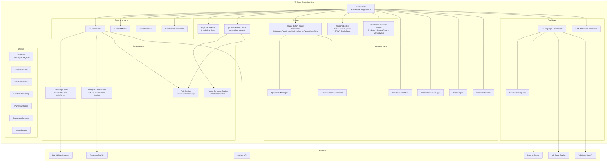

# @Tom VS Code Extension — Architecture Analysis

**Extension:** `tom-ai-extension` v0.1.0  
**Entry Point:** [src/extension.ts](../src/extension.ts)  
**Config File:** `.tom/tom_vscode_extension.json`

---

## Table of Contents

1. [High-Level Architecture](#1-high-level-architecture)
2. [Activation Flow](#2-activation-flow)
3. [Source File Inventory](#3-source-file-inventory)
4. [Explorer Sidebar Views](#4-explorer-sidebar-views)
5. [Bottom Panel Views](#5-bottom-panel-views)
6. [Custom Editors](#6-custom-editors)
7. [Standalone Webview Panels](#7-standalone-webview-panels)
8. [Commands](#8-commands)
9. [Chord Menus & Keybindings](#9-chord-menus--keybindings)
10. [Reusable UI Components](#10-reusable-ui-components)
11. [Manager Singletons](#11-manager-singletons)
12. [LM Tools & Chat Variables](#12-lm-tools--chat-variables)
13. [Bridge & Telegram Communication](#13-bridge--telegram-communication)
14. [Timed Requests & Prompt Queue](#14-timed-requests--prompt-queue)
15. [Configuration System](#15-configuration-system)
16. [Filename Patterns](#16-filename-patterns)
17. [Dependency Map](#17-dependency-map)

---

## 1. High-Level Architecture


```mermaid
graph TB
    subgraph "VS Code Extension Host"
        EXT["extension.ts<br/>Activation & Registration"]
        
        subgraph "UI Layer"
            EXP["Explorer Sidebar<br/>8 webview views"]
            T2["@CHAT Bottom Panel<br/>Accordion notepad"]
            T3["@WS Bottom Panel<br/>Accordion: Guidelines/Docs/Logs/Settings/Issues/Tests/QuestTodo"]
            CE["Custom Editors<br/>YAML Graph, Quest TODO, Trail Viewer"]
            WP["Standalone Webview Panels<br/>8 editors + Status Page + MD Browser"]
        end
        
        subgraph "Command Layer"
            CMD["77 Commands"]
            CHORD["6 Chord Menus"]
            SM["State Machines"]
            COMB["Combined Commands"]
        end
        
        subgraph "Manager Layer"
            CVS["ChatVariablesStore"]
            PQM["PromptQueueManager"]
            TE["TimerEngine"]
            RS["ReminderSystem"]
            QTM["QuestTodoManager"]
            WSTS["WindowSessionTodoStore"]
        end
        
        subgraph "Tool Layer"
            LMT["47 Language Model Tools"]
            CVR["5 Chat Variable Resolvers"]
            STR["SharedToolRegistry"]
        end
        
        subgraph "Infrastructure"
            BRIDGE["DartBridgeClient<br/>JSON-RPC over stdin/stdout"]
            TELE["Telegram Subsystem<br/>Bot API + Command Registry"]
            TRAIL["Trail Service<br/>Raw + Summary logs"]
            PT["Prompt Template Engine<br/>Variable resolution"]
        end
        
        subgraph "Utilities"
            WP_U["WsPaths<br/>Central path registry"]
            PD["ProjectDetector"]
            VR["VariableResolver"]
            STC["SendToChatConfig"]
            PYS["PanelYamlStore"]
            ER["ExecutableResolver"]
            DL["DebugLogger"]
        end
    end
    
    subgraph "External"
        DART["Dart Bridge Process"]
        OLLAMA["Ollama Server"]
        GH["GitHub API"]
        TGAPI["Telegram Bot API"]
        COPILOT["VS Code Copilot"]
        LMAPI["VS Code LM API"]
    end
    
    EXT --> CMD & CHORD & SM & COMB
    EXT --> EXP & T2 & T3 & CE & WP
    EXT --> CVS & PQM & TE & RS
    EXT --> LMT & CVR
    
    T2 --> PT & TRAIL
    T3 --> QTM & WSTS
    
    CMD --> BRIDGE & TELE & TRAIL
    LMT --> STR
    
    BRIDGE --> DART
    TELE --> TGAPI
    LMT --> OLLAMA
    LMT --> COPILOT
    LMT --> LMAPI
    CMD --> GH
```

---

## 2. Activation Flow

```mermaid
flowchart TD
    A["Extension Activates"] --> B["Init Debug Logger"]
    B --> C["Install Global Instrumentation<br/>(wrap registerCommand, registerWebviewViewProvider)"]
    C --> D{"`.tom/` folder exists?"}
    
    D -->|No| MIN["MINIMAL MODE<br/>registerCommands (basic)<br/>registerChordMenuCommands<br/>registerCombinedCommands<br/>registerStateMachineCommands<br/>registerMinimalModePanels"]
    
    D -->|Yes| E["FULL MODE"]
    E --> F["Initialize Bridge Client"]
    F --> G["Register Commands"]
    G --> H["Register Chord Menus (6)"]
    H --> I["Register Commandline Commands"]
    I --> J["Register Combined Commands"]
    J --> K["Register State Machine Commands"]
    K --> L["Register Sidebar Notes Views (8 sidebar views)"]
    L --> M["Register Chat Panel (@CHAT)"]
    M --> N["Register WS Panel (@WS)"]
    N --> O["Register Editor Commands<br/>(ChatVars, Context, Template,<br/>Reusable, Queue, Timed, PromptTemplate)"]
    O --> P["Register Custom Editors<br/>(YAML Graph, Quest TODO, Trail)"]
    P --> Q["Register Trail Viewer Commands"]
    Q --> R["Register TODO Log View"]
    R --> S["Auto-start Bridge"]
    S --> T["Auto-start CLI Server (if configured)"]
    T --> U["Auto-start Telegram (if configured)"]
    U --> V["Init CopilotTemplatesManager"]
    V --> W["Init LocalLlmManager<br/>Register Local LLM context menu cmds"]
    W --> X["Init AIConversationManager"]
    X --> Y["Init ChatVariablesStore<br/>Init WindowSessionTodoStore"]
    Y --> Z["Init PromptQueueManager<br/>Init TimerEngine<br/>Init ReminderSystem"]
    Z --> AA["Register LM Tools (47)<br/>Initialize Tool Descriptions"]
    AA --> AB["Register Chat Variable Resolvers (5)"]
```

---

## 3. Source File Inventory

**98 TypeScript files** organized as:

| Directory | Count | Purpose |
|-----------|-------|---------|
| `src/` | 3 | Entry point, bridge client, tests |
| `src/handlers/` | 61 | UI panels, commands, editors, templates, telegram |
| `src/handlers/chat/` | 3 | Chat channel abstraction (interface + Telegram impl) |
| `src/managers/` | 8 | State singletons (queue, timer, todos, variables) |
| `src/tools/` | 6 | LM tool definitions and registration |
| `src/utils/` | 12 | Shared utilities (paths, config, resolver, logging) |
| `src/services/` | 2 | TrailService, other services |

### Handler Files by Size (lines)

| File | Lines | Purpose |
|------|-------|---------|
| `chatPanel-handler.ts` | 4078 | @CHAT accordion panel |
| `questTodoPanel-handler.ts` | 3797 | Quest/session todo panel (embeddable) |
| `sidebarNotes-handler.ts` | 3375 | 8 sidebar webview providers |
| `statusPage-handler.ts` | 2754 | Status page + embedded status HTML |
| `aiConversation-handler.ts` | 2223 | Multi-turn AI conversation orchestrator |
| `localLlm-handler.ts` | 1916 | Local LLM prompt expansion |
| `trailEditor-handler.ts` | 1766 | Trail custom editor for consolidated files |
| `issuesPanel-handler.ts` | 1636 | GitHub issues panel (embeddable) |
| `trailViewer-handler.ts` | 1417 | Trail viewer commands & exchange parser |
| `tomAiChat-handler.ts` | 1233 | Tom AI Chat (VS Code LM API) |
| `timedRequestsEditor-handler.ts` | 1259 | Timed requests webview editor |
| `queueEditor-handler.ts` | 1230 | Prompt queue webview editor |
| `tomScriptingBridge-handler.ts` | 1160 | Bridge scripting handlers |
| `wsPanel-handler.ts` | 1126 | @WS accordion panel |
| `globalTemplateEditor-handler.ts` | 1068 | Prompt template editor |
| `markdownBrowser-handler.ts` | 1068 | Markdown browser custom viewer |
| `handler_shared.ts` | 990 | Shared utilities (bridge, config, templates) |
| `reusablePromptEditor-handler.ts` | 950 | Reusable prompt .md editor |
| `commandline-handler.ts` | 929 | Custom CLI commandlines |
| `copilotTemplates-handler.ts` | 799 | Template-based send-to-chat |
| `contextSettingsEditor-handler.ts` | 742 | Context & settings webview editor |
| `windowStatusPanel-handler.ts` | 693 | Window status sidebar panel |

### Manager Files

| File | Lines | Purpose |
|---------|------|---------|
| `promptQueueManager.ts` | 1216 | Ordered prompt queue with auto-send |
| `questTodoManager.ts` | 922 | CST-preserving YAML todo CRUD |
| `timerEngine.ts` | ~400 | Timed request scheduling |
| `reminderSystem.ts` | ~300 | Reminder notifications |
| `chatVariablesStore.ts` | ~250 | Chat variable persistence |
| `windowSessionTodoStore.ts` | ~200 | Window-scoped session todos |

---

## 4. Explorer Sidebar Views

| View ID | Name | Handler | Purpose |
|---------|------|---------|---------|
| `tomAi.vscodeNotes` | VS CODE NOTES | `sidebarNotes-handler.ts` | VS Code-level notes |
| `tomAi.questNotes` | QUEST NOTES | `sidebarNotes-handler.ts` | Quest-scoped notes |
| `tomAi.questTodos` | QUEST TODOS | `sidebarNotes-handler.ts` | Quest todo list |
| `tomAi.sessionTodos` | SESSION TODOS | `sidebarNotes-handler.ts` | Window session todos |
| `tomAi.todoLog` | TODO LOG | `todoLogPanel-handler.ts` | Historical todo activity |
| `tomAi.workspaceNotes` | WORKSPACE NOTES | `sidebarNotes-handler.ts` | Workspace-level notes |
| `tomAi.workspaceTodos` | WORKSPACE TODOS | `sidebarNotes-handler.ts` | Workspace todo list |
| `tomAi.windowStatus` | WINDOW STATUS | `windowStatusPanel-handler.ts` | Window state info |

---

## 5. Bottom Panel Views

### @CHAT Panel (`tomAi.chatPanel`)

Handler: `chatPanel-handler.ts`

| Section | Icon | Purpose |
|---------|------|---------|
| Local LLM | `robot` | Send prompts to local Ollama model |
| AI Conversation | `comment-discussion` | Multi-turn AI conversation |
| Copilot | `copilot` | Copilot integration with templates |
| Tom AI Chat | `comment-discussion-sparkle` | Tom AI chat interface |

### @WS Panel (`tomAi.wsPanel`)

Handler: `wsPanel-handler.ts`

| Section | Icon | Purpose |
|---------|------|---------|
| Guidelines | `book` | Copilot guidelines browser with project/quest dropdowns |
| Documentation | `note` | Project documentation browser |
| Logs | `output` | Extension output logs |
| Settings | `settings-gear` | Embedded status page and configuration |
| Issues | `issues` | GitHub issue tracking |
| Tests | `beaker` | Test results |
| Quest TODO | `tasklist` | Quest todo list |

---

## 6. Custom Editors

| Editor | View Type | File Patterns | Priority | Handler |
|--------|-----------|---------------|----------|---------|
| YAML Graph Editor | `tomAi.yamlGraphEditor` | `*.flow.yaml`, `*.state.yaml`, `*.er.yaml` | default | `yamlGraph-handler.ts` |
| Quest TODO Editor | `tomAi.todoEditor` | `*.todo.yaml` | option | `questTodoEditor-handler.ts` |
| Trail Viewer | `tomAi.trailViewer` | `*.prompts.md`, `*.answers.md` | default | `trailEditor-handler.ts` |

---

## 7. Standalone Webview Panels

| Panel | View Type | Command | Handler |
|-------|-----------|---------|---------|
| Status Page | `tomStatusPage` | `tomAi.statusPage` | `statusPage-handler.ts` |
| Markdown Browser | `tomAi.markdownBrowser` | `tomAi.openInMdBrowser` | `markdownBrowser-handler.ts` |
| Prompt Trail Viewer | `tomAi.trailViewer` | `tomAi.editor.rawTrailViewer` | `trailViewer-handler.ts` |
| Prompt Queue | `tomAi.queueEditor` | `tomAi.editor.promptQueue` | `queueEditor-handler.ts` |
| Timed Requests | `tomAi.timedRequestsEditor` | `tomAi.editor.timedRequests` | `timedRequestsEditor-handler.ts` |
| Prompt Template Editor | `tomAi.promptTemplateEditor` | `tomAi.editor.promptTemplates` | `promptTemplateEditor-handler.ts` |
| Global Template Editor | `tomAi.globalTemplateEditor` | `tomAi.editor.globalTemplates` | `globalTemplateEditor-handler.ts` |
| Reusable Prompt Editor | `tomAi.reusablePromptEditor` | `tomAi.editor.reusablePrompts` | `reusablePromptEditor-handler.ts` |
| Context & Settings | `tomAi.contextSettingsEditor` | `tomAi.editor.contextSettings` | `contextSettingsEditor-handler.ts` |
| Chat Variables | `tomAi.chatVariablesEditor` | `tomAi.editor.chatVariables` | `chatVariablesEditor-handler.ts` |
| Quest TODO Pop-out | `tomAi.questTodoEditor` | Pop-out from sidebar | `questTodoPanel-handler.ts` |

---

## 8. Commands

Commands are registered with `@T:` prefix and `@Tom` category.

### AI Interactions

| Command | Purpose |
|---------|---------|
| `tomAi.sendToCopilot` | Send to Copilot |
| `tomAi.sendToCopilot.standard` | Send with default template |
| `tomAi.sendToCopilot.template` | Send with template picker |
| `tomAi.sendToLocalLlm` | Send to Local LLM |
| `tomAi.sendToLocalLlm.template` | Send to Local LLM with template |
| `tomAi.tomAiChat.start` | Start Tom AI Chat |
| `tomAi.tomAiChat.send` | Send Tom AI Chat prompt |
| `tomAi.tomAiChat.interrupt` | Interrupt Tom AI Chat |

### Panels & Editors

| Command | Purpose |
|---------|---------|
| `tomAi.focusChatPanel` | Focus @CHAT panel |
| `tomAi.wsPanel.focus` | Focus @WS panel |
| `tomAi.statusPage` | Open status page |
| `tomAi.editor.promptQueue` | Open prompt queue |
| `tomAi.editor.timedRequests` | Open timed requests |
| `tomAi.editor.rawTrailViewer` | Open raw trail viewer |
| `tomAi.openInMdBrowser` | Open in Markdown Browser |

### Bridge & Runtime

| Command | Purpose |
|---------|---------|
| `tomAi.bridge.restart` | Restart Dart bridge |
| `tomAi.bridge.switchProfile` | Switch bridge profile |
| `tomAi.cliServer.start` | Start CLI server |
| `tomAi.cliServer.stop` | Stop CLI server |
| `tomAi.startProcessMonitor` | Start process monitor |

---

## 9. Chord Menus & Keybindings

### Chord Menus

| Key | Command | Menu |
|-----|---------|------|
| `Ctrl+Shift+C` | `tomAi.chordMenu.copilot` | Copilot operations |
| `Ctrl+Shift+L` | `tomAi.chordMenu.localLlm` | Local LLM operations |
| `Ctrl+Shift+A` | `tomAi.chordMenu.aiConversation` | AI Conversation |
| `Ctrl+Shift+T` | `tomAi.chordMenu.tomAiChat` | Tom AI Chat |
| `Ctrl+Shift+E` | `tomAi.chordMenu.execute` | Execution commands |
| `Ctrl+Shift+X` | `tomAi.chordMenu.favorites` | Favorites |

### Panel & Layout Keybindings

| Key | Command | Description |
|-----|---------|-------------|
| `Ctrl+Shift+0` | `tomAi.focusChatPanel` | Focus @CHAT panel |
| `Ctrl+Shift+9` | `tomAi.wsPanel.focus` | Focus @WS panel |
| `Ctrl+Shift+8` | `tomAi.statusPage` | Open status page |
| `Ctrl+Shift+\`` | `tomAi.layout.maximizeToggle` | Maximize toggle |
| `Ctrl+Shift+5` | `tomAi.editor.rawTrailViewer` | Raw trail viewer |
| `Ctrl+Shift+6` | `tomAi.editor.promptQueue` | Prompt queue |
| `Ctrl+Shift+7` | `tomAi.editor.timedRequests` | Timed requests |

---

## 10. Reusable UI Components

| Component | File | Used By |
|-----------|------|---------|
| AccordionPanel | `accordionPanel.ts` | @CHAT, @WS panels |
| TabPanel | `tabPanel.ts` | Multiple editors |
| DocumentPicker | `documentPicker.ts` | MD Browser, @WS Documentation/Guidelines |
| QueueEntryComponent | `queueEntryComponent.ts` | Queue editor, Prompt template editor |

---

## 11. Manager Singletons

| Manager | File | Purpose |
|---------|------|---------|
| PromptQueueManager | `promptQueueManager.ts` | Prompt queue with file-per-entry storage |
| QuestTodoManager | `questTodoManager.ts` | CST-preserving YAML todo operations |
| TimerEngine | `timerEngine.ts` | Scheduled timed requests |
| ReminderSystem | `reminderSystem.ts` | Reminder notifications |
| ChatVariablesStore | `chatVariablesStore.ts` | Persisted chat variables |
| WindowSessionTodoStore | `windowSessionTodoStore.ts` | Window-scoped session todos |

---

## 12. LM Tools & Chat Variables

### Language Model Tools (47 total)

Tools are registered with `tomAi_` prefix.

| Category | Tools |
|----------|-------|
| Workspace | `tomAi_getWorkspaceInfo`, `tomAi_findFiles`, `tomAi_findTextInFiles`, `tomAi_listDirectory` |
| File Operations | `tomAi_readFile`, `tomAi_createFile`, `tomAi_editFile`, `tomAi_multiEditFile` |
| Diagnostics | `tomAi_getErrors`, `tomAi_runCommand`, `tomAi_runVscodeCommand` |
| Todos | `tomAi_createTodo`, `tomAi_updateTodo`, `tomAi_deleteTodo`, `tomAi_getTodo`, `tomAi_getAllTodos`, `tomAi_listTodos`, `tomAi_manageTodo`, `tomAi_moveTodo` |
| Session Todos | `tomAi_sessionTodo_add`, `tomAi_sessionTodo_update`, `tomAi_sessionTodo_delete`, `tomAi_sessionTodo_list`, `tomAi_sessionTodo_getAll` |
| Queue | `tomAi_queue_list`, `tomAi_queue_update_item`, `tomAi_queue_remove_item`, `tomAi_queue_update_followup`, `tomAi_queue_remove_followup`, `tomAi_queue_send_now`, `tomAi_queue_set_status` |
| Timed | `tomAi_timed_list`, `tomAi_timed_update_entry`, `tomAi_timed_remove_entry`, `tomAi_timed_set_engine_state` |
| Integration | `tomAi_fetchWebpage`, `tomAi_webSearch`, `tomAi_notifyUser`, `tomAi_askBigBrother`, `tomAi_askCopilot` |
| Advanced | `tomAi_reminders_manage`, `tomAi_templates_manage`, `tomAi_readGuideline`, `tomAi_readLocalGuideline` |

### Chat Variable Resolvers (5)

| Variable | Description |
|----------|-------------|
| `quest` | Current quest context |
| `role` | Active AI role |
| `activeProjects` | Active project list |
| `todo` | Current todo context |
| `workspaceName` | Workspace name |

---

## 13. Bridge & Telegram Communication

### Dart Bridge

- Client: `vscode-bridge.ts` (1009 lines)
- Communication: JSON-RPC over stdin/stdout
- Auto-start: Configurable in `.tom/tom_vscode_extension.json`

### Telegram Integration

- Files: `telegram-*.ts` (6 files in handlers/)
- Bot API integration with command registry
- Configurable notifications

---

## 14. Timed Requests & Prompt Queue

### Prompt Queue

- Manager: `promptQueueManager.ts` (1216 lines)
- Storage: File-per-entry in `_ai/queue/` folder
- Features: Auto-send, follow-up prompts, status tracking

### Timed Requests

- Manager: `timerEngine.ts`
- Editor: `timedRequestsEditor-handler.ts` (1259 lines)
- Features: Scheduled prompts, recurring schedules

---

## 15. Configuration System

### Configuration Files

| File | Purpose |
|------|---------|
| `.tom/tom_vscode_extension.json` | Main extension config |
| `workspace.todo.yaml` | Workspace-level todos |
| `_ai/quests/{quest}/todos.{quest}.yaml` | Quest todos |

### Key Configuration Sections

- `templates` — Prompt templates for various AI paths
- `defaultTemplates` — Default template selection per panel
- `localLlm` — Ollama configuration
- `aiConversation` — AI conversation settings
- `trail` — Trail logging configuration
- `bridge` — Dart bridge settings
- `telegram` — Telegram bot configuration

---

## 16. Filename Patterns

| Pattern | Purpose |
|---------|---------|
| `*.flow.yaml` | YAML Graph flow diagrams |
| `*.state.yaml` | YAML Graph state machines |
| `*.er.yaml` | YAML Graph entity-relationship |
| `*.todo.yaml` | Todo files (Quest TODO Editor) |
| `*.prompts.md` | Trail prompt logs |
| `*.answers.md` | Trail answer logs |
| `*.prompt.md` | Reusable prompt templates |

---

## 17. Dependency Map

### Internal Dependencies

```
extension.ts
├── handlers/
│   ├── chatPanel-handler.ts (accordion, AI panels)
│   ├── wsPanel-handler.ts (accordion, utility panels)
│   ├── sidebarNotes-handler.ts (explorer views)
│   └── ... (61 handler files)
├── managers/
│   ├── promptQueueManager.ts
│   ├── questTodoManager.ts
│   └── ... (8 manager files)
├── tools/
│   ├── chat-enhancement-tools.ts
│   ├── tool-executors.ts
│   └── ... (6 tool files)
└── utils/
    ├── wsPaths.ts
    ├── variableResolver.ts
    └── ... (12 utility files)
```

### External Dependencies

- `marked` — Markdown parsing
- `mermaid` — Diagram rendering
- `yaml` — YAML parsing (CST-preserving via yaml package)
- `@vscode/codicons` — VS Code icons
