# Mermaid Diagram Types

> Reference document showing all diagram types supported by Mermaid and their potential for the YAML Graph Editor.

---

## Currently Supported

These diagram types are implemented in the YAML Graph Editor:

### 1. Flowchart

Process flows, decision trees, workflows.

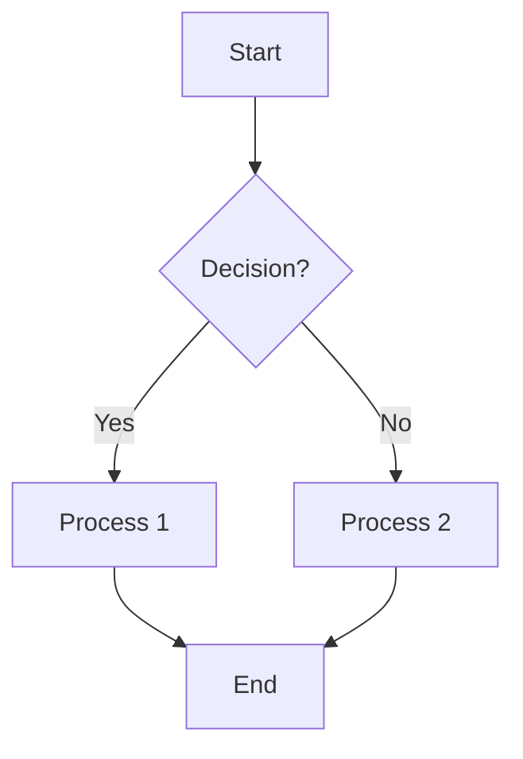

**Shapes:** rectangle, diamond, stadium, subroutine, circle, hexagon, parallelogram, trapezoid, cylinder, asymmetric, double-circle

**Use cases:** Business processes, algorithms, user flows, deployment pipelines

---

### 2. State Diagram

Lifecycle states, finite state machines, object states.

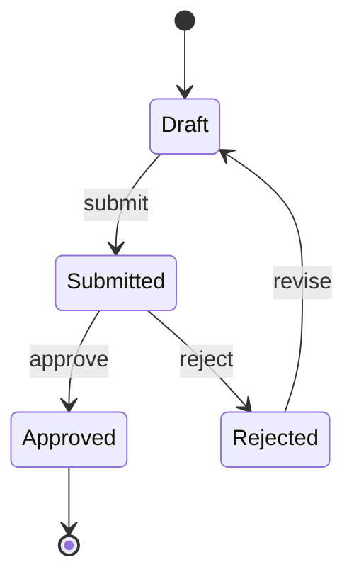

**Special states:** `[*]` for start/end, fork, join, choice

**Use cases:** Order lifecycles, document workflows, UI states, protocol states

---

### 3. ER Diagram

Database schemas, entity relationships.

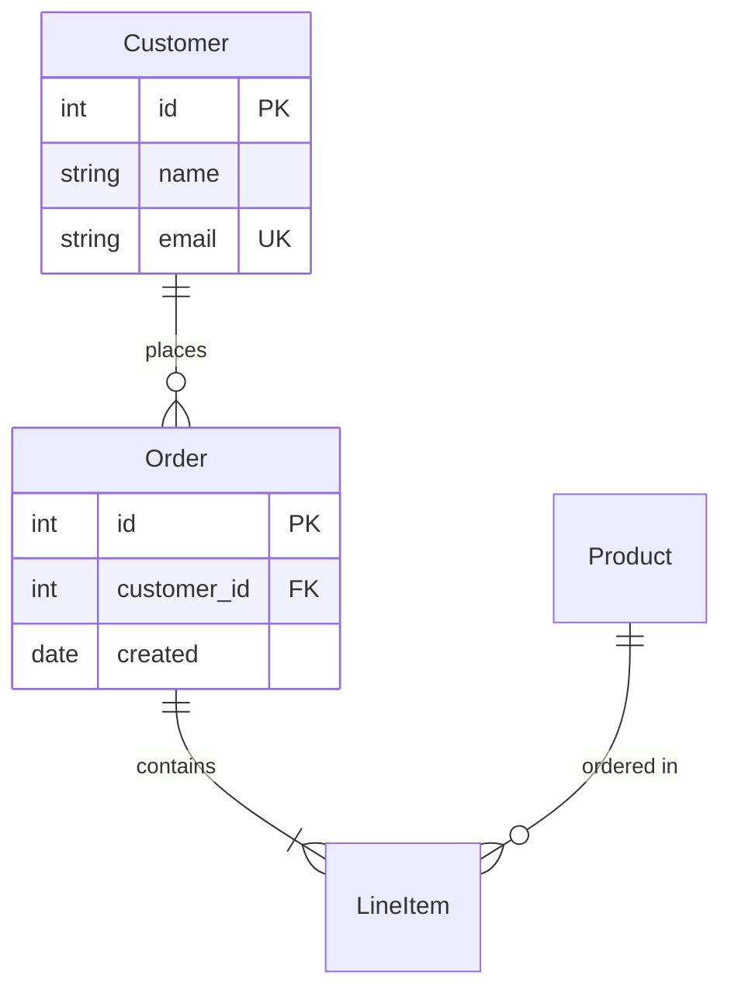

**Cardinalities:** one-to-one (`||--||`), one-to-many (`||--o{`), many-to-many (`}o--o{`)

**Use cases:** Database design, data models, API resource relationships

---

## Potential Future Support

These diagram types could be added to the YAML Graph Editor:

### 4. Gantt Chart

Project timelines, schedules, resource planning.

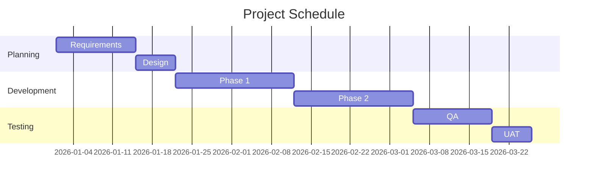

**Key features:** Dependencies, milestones, sections, date ranges

**YAML schema complexity:** Medium — linear task list with dependencies

---

### 5. Sequence Diagram

API calls, message flows, protocol sequences.

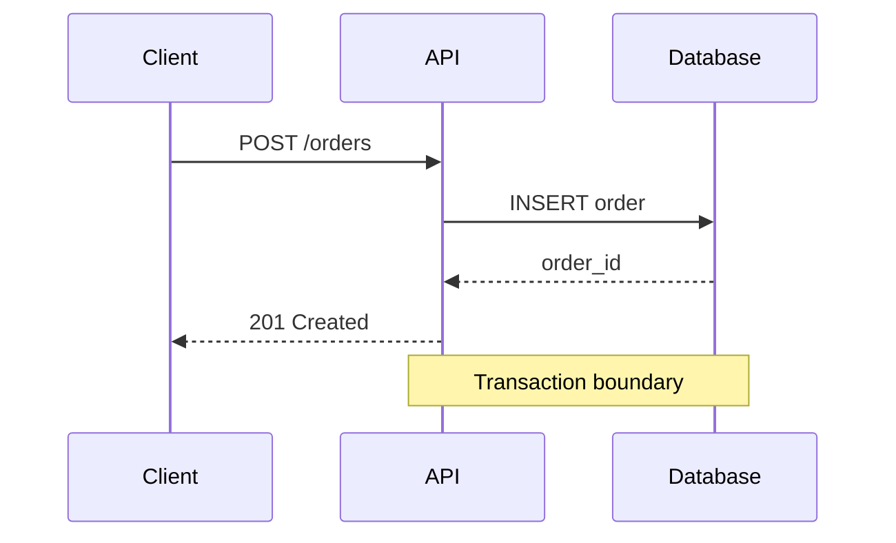

**Key features:** Participants, messages, notes, loops, alternatives

**YAML schema complexity:** High — nested control flow blocks

---

### 6. Class Diagram

OOP design, UML classes, inheritance hierarchies.

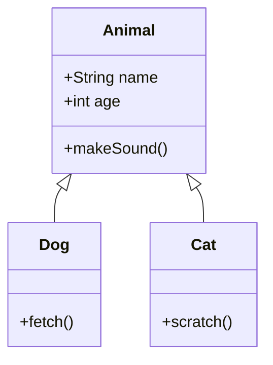

**Key features:** Classes, attributes, methods, relationships (inheritance, composition, aggregation)

**YAML schema complexity:** High — nested class definitions with visibility modifiers

---

### 7. Pie Chart

Simple data visualization.

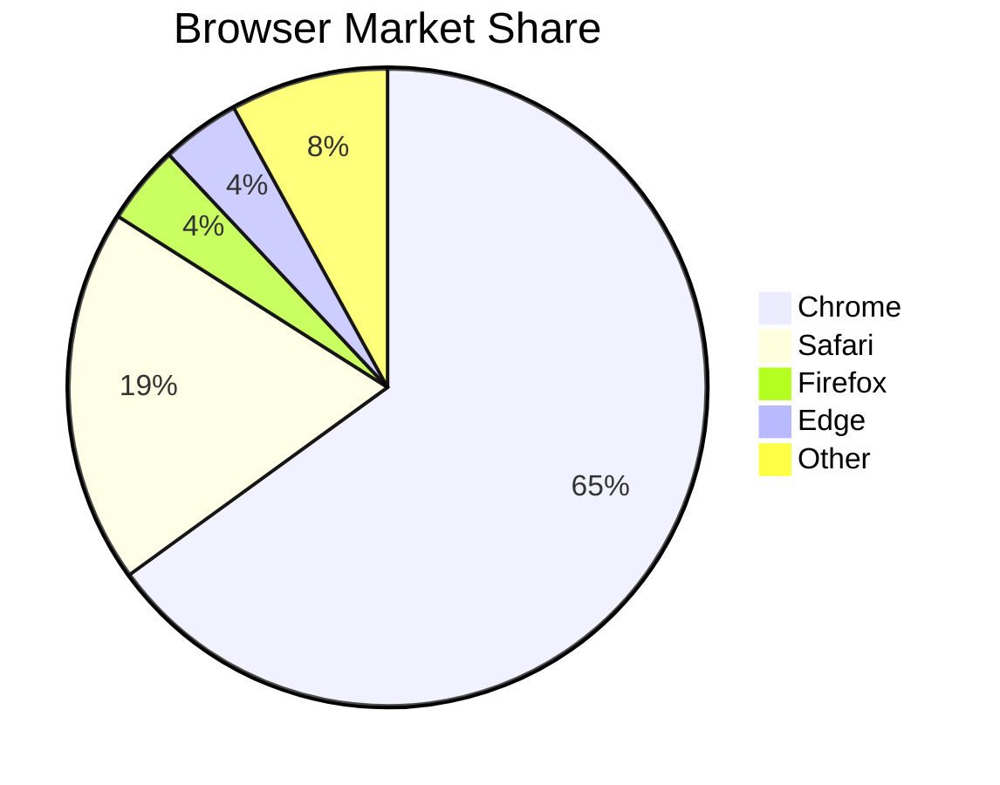

**Key features:** Segments with values, optional title

**YAML schema complexity:** Low — simple key-value list

---

### 8. Mindmap

Hierarchical brainstorming, topic organization.

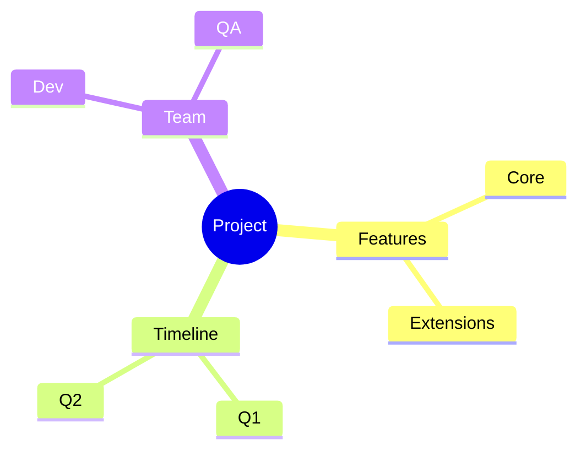

**Key features:** Hierarchical nodes, shapes per level

**YAML schema complexity:** Medium — tree structure with optional shapes

---

### 9. Timeline

Historical events, roadmaps.

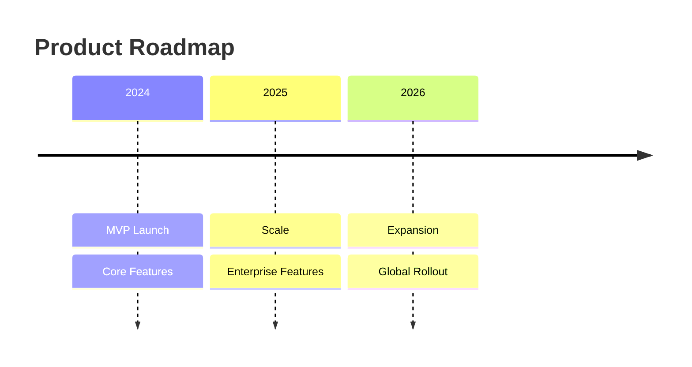

**Key features:** Time periods with events

**YAML schema complexity:** Low — simple period-event mapping

---

### 10. Git Graph

Branch visualization, merge strategies.

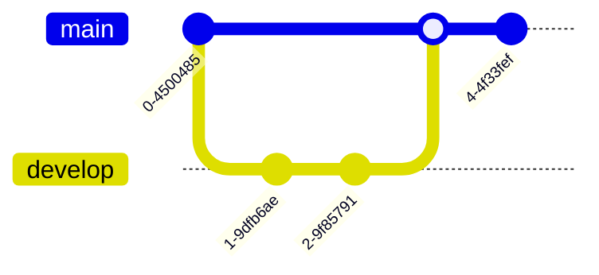

**Key features:** Commits, branches, merges, cherry-picks

**YAML schema complexity:** High — ordered operations with branch context

---

### 11. Quadrant Chart

Strategic positioning, priority matrices.

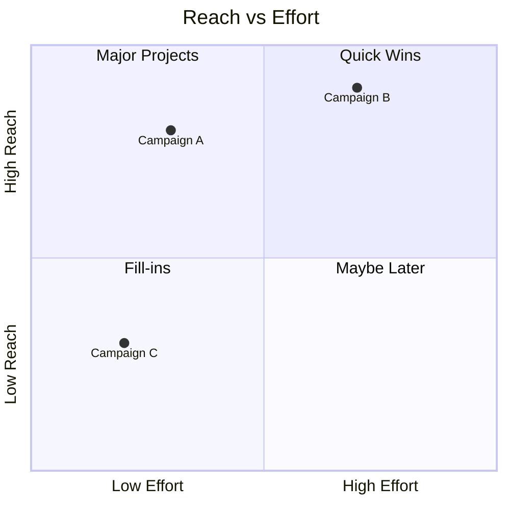

**Key features:** Axis labels, quadrant names, positioned items

**YAML schema complexity:** Medium — coordinate-based positioning

---

### 12. Sankey Diagram

Flow quantities, resource distribution.

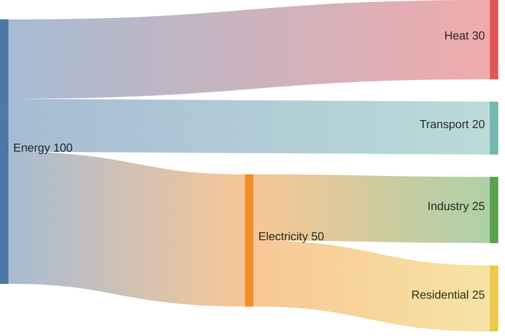

**Key features:** Source → target with quantity

**YAML schema complexity:** Low — simple tuple list

---

### 13. XY Chart

Line/bar charts, data visualization.

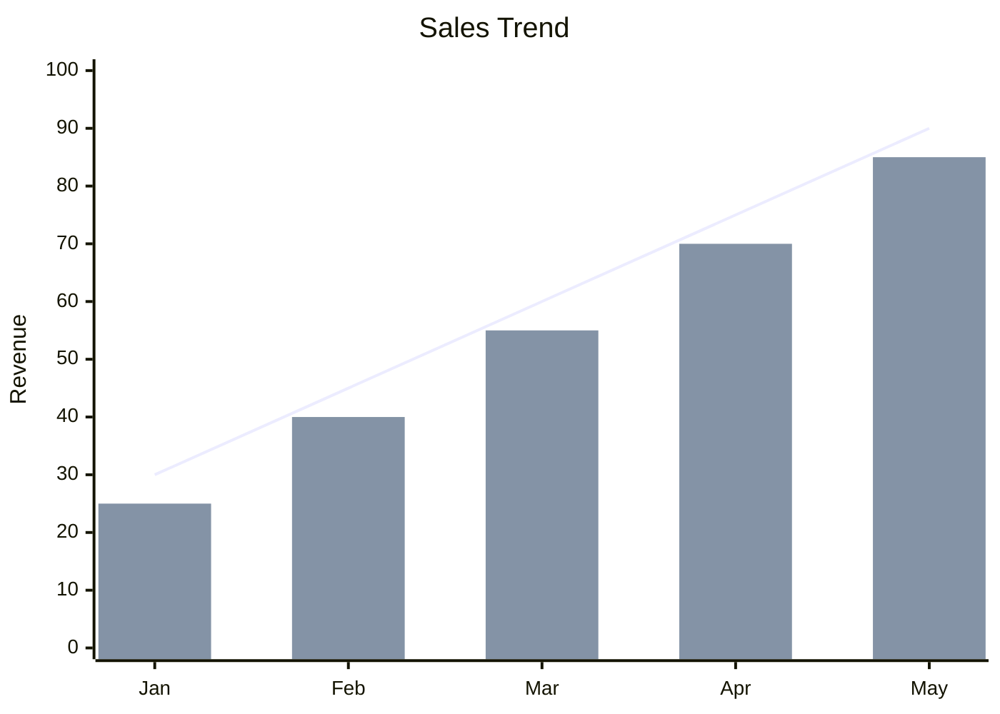

**Key features:** Axes, multiple series, line/bar types

**YAML schema complexity:** Medium — series data with axis configuration

---

### 14. Requirement Diagram

Requirements engineering, traceability.

```mermaid
requirementDiagram

requirement high_availability {
id: REQ-001
text: System must achieve 99.9% uptime
risk: high
verifymethod: test
}

element load_balancer {
type: component
}

load_balancer - satisfies -> high_availability
```

**Key features:** Requirements, elements, relationships (derives, satisfies, verifies)

**YAML schema complexity:** High — typed nodes with semantic relationships

---

### 15. Block Diagram (Beta)

System architecture, component layouts.

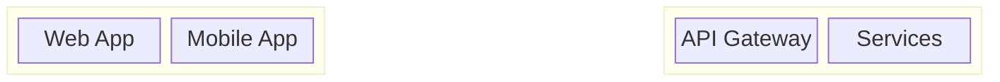

**Key features:** Columns, blocks, nested groups, connections

**YAML schema complexity:** High — nested block structure with layout

---

## Recommended Prioritization

| Priority | Diagram Type | Rationale |
|----------|-------------|-----------|
| **High** | Gantt | Common project use, straightforward schema |
| **High** | Sequence | Essential for API/protocol documentation |
| **Medium** | Class | Useful for OOP design, complex schema |
| **Medium** | Mindmap | Good for brainstorming, simple schema |
| **Low** | Pie/Timeline | Simple but limited use cases |
| **Low** | Git Graph | Niche use, complex rendering |
| **Experimental** | Sankey, XY Chart, Requirement | Beta features, may change |

---

## Schema Pattern Observations

**Simple patterns** (easy to support):
- Key-value lists (Pie, Sankey)
- Linear task lists (Gantt, Timeline)
- Tree structures (Mindmap)

**Complex patterns** (harder to support):
- Nested control flow (Sequence — loops, alternatives)
- Ordered operations (Git Graph)
- Coordinate positioning (Quadrant)
- Attribute visibility modifiers (Class)

**Recommendation:** Start with Gantt and Mindmap as they have the best complexity-to-utility ratio.
